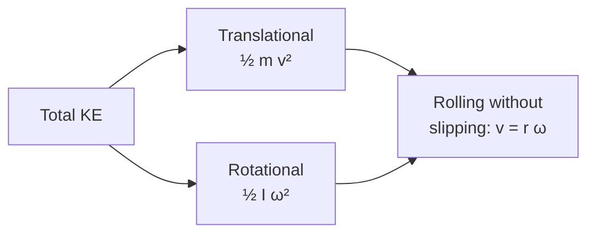

# Rotational Kinetic Energy

## Core Idea

Anything spinning stores kinetic energy in its rotation. For a rigid body rotating about a fixed axis, this energy is

$$
E_k = \tfrac{1}{2} I \omega^{2}
$$

- $E_k$: rotational kinetic energy, in joules (J).
- $I$: [[Moment-of-Inertia]] of the body about the rotation axis, in $\mathrm{kg\,m^2}$.
- $\omega$: [[Angular-Velocity]], in rad s⁻¹ (radians — see [[Radian]]).

This is the rotational analogue of the familiar translational $E_k = \tfrac{1}{2}mv^{2}$: $m \to I$ and $v \to \omega$.

## Meaning

Each mass element of the body moves in a circle with speed $v_i = r_i \omega$. Summing $\tfrac{1}{2}m_i v_i^{2}$ over the body and pulling $\omega^{2}$ outside gives $\tfrac{1}{2}\omega^{2}\sum m_i r_i^{2} = \tfrac{1}{2}I\omega^{2}$. So rotational KE is just the total translational KE of all the little pieces, repackaged.

Because $\omega$ is squared, doubling the spin rate stores **four times** as much energy. Because $I$ depends on how mass sits relative to the axis, putting mass at large radius dramatically increases storage capacity — this is why flywheels are built heavy and wide rather than just heavy.

## Everyday Intuition

A bicycle wheel keeps spinning long after you stop pedalling. A potter's wheel keeps turning while the potter shapes the clay. A spinning top resists being knocked over. All of these store energy in $\tfrac{1}{2}I\omega^{2}$.

## GCSE Foundation

- [[Kinetic-Energy]]
- [[Energy-Transfer]]
- [[Mass]]

## Why It Matters

- **Flywheels** (see [[Flywheels]]) store usable energy mechanically for smoothing engine pulses or for regenerative braking in vehicles and machinery.
- **Rolling objects** share their kinetic energy between translation $\tfrac{1}{2}mv^{2}$ and rotation $\tfrac{1}{2}I\omega^{2}$, which is why a hollow ring rolls down a ramp more slowly than a solid disc of the same mass.
- **Energy conservation** problems extend from linear into rotational form using the same accounting.

## Related Quantities

- [[Moment-of-Inertia]]
- [[Angular-Velocity]]
- [[Kinetic-Energy]]
- [[Angular-Momentum]]

## Related Laws or Results

- [[Conservation-of-Energy]]
- [[Torque-and-Angular-Acceleration]]
- Work–energy: $W = T\theta$, $P = T\omega$ — see [[Solving-Rotational-Dynamics-Problems]].

## Related Models

- [[Constant-Acceleration-Model]] (rotational version with constant $\alpha$).

## Representations

- $E_k$–$\omega^{2}$ graph: straight line through the origin with gradient $\tfrac{1}{2}I$.

## Experiments or Observations

- Flywheel run-down: measure $\omega(t)$, infer stored energy and frictional losses.

## Applications

- [[Flywheels]]
- Regenerative energy storage in vehicles and machine tools.

## Frontier Links

- [[...]]

## Common Mistakes

- Using degrees or revolutions instead of radians for $\omega$. The factor of $\tfrac{1}{2}$ only gives joules when $\omega$ is in rad s⁻¹.
- Forgetting the square: doubling $\omega$ **quadruples** $E_k$.
- Ignoring rotational KE for rolling objects — total KE is $\tfrac{1}{2}mv^{2} + \tfrac{1}{2}I\omega^{2}$.
- Using $I$ about the wrong axis.

## Visuals

### Energy splits in a rolling disc

*Figure: A rolling rigid body carries energy in both translational and rotational form, linked by the rolling condition v = rω.*
*Source: Authored for this vault (CC0). No external copyright.*

## Source Trace

- Source: [[AQA-Physics-7407-7408-Specification]] §3.11.1 (Engineering Physics — Rotational dynamics)
- Section/Page: Public reference — HyperPhysics; OpenStax College Physics
