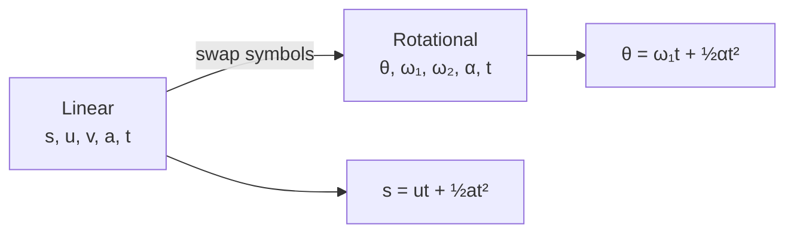

# Rotational Motion

## Core Idea

Rotational motion is the angular version of linear motion. Instead of position, speed, and acceleration along a line, we track **angular displacement**, **angular velocity**, and **angular acceleration** about an axis. Every linear equation has a rotational twin obtained by swapping symbols.

## Meaning

For a rigid body rotating about a fixed axis:

- **Angular displacement** $\theta$ — angle turned, measured in [[Radian]] (rad).
- **Angular velocity** $\omega = \dfrac{\Delta\theta}{\Delta t}$ — rate of change of angle, in rad s⁻¹. See [[Angular-Velocity]].
- **Angular acceleration** $\alpha = \dfrac{\Delta\omega}{\Delta t}$ — rate of change of angular velocity, in rad s⁻².

Every point on the body shares the same $\theta$, $\omega$, $\alpha$, but its linear quantities depend on its radius $r$ from the axis: $v = r\omega$, $a_\text{tangential} = r\alpha$, $a_\text{centripetal} = r\omega^{2}$ (see [[Centripetal-Acceleration]]).

## Everyday Intuition

A vinyl record turns at a steady $\omega$; the outer edge moves faster than the inner edge but completes a revolution in the same time. A spinning bike wheel slowing under brake friction has constant negative $\alpha$ — just like a car decelerating in a straight line.

## GCSE Foundation

- [[Speed]]
- [[Distance]]
- [[Acceleration]]
- [[Circular-Motion]]

## Why It Matters

When $\alpha$ is constant, the rotational SUVAT equations apply — the rotational mirror of [[Using-SUVAT-Equations]]:

$$
\omega_2 = \omega_1 + \alpha t
$$

$$
\theta = \tfrac{1}{2}(\omega_1 + \omega_2)\, t
$$

$$
\theta = \omega_1 t + \tfrac{1}{2}\alpha t^{2}
$$

$$
\omega_2^{2} = \omega_1^{2} + 2\alpha\theta
$$

- $\omega_1$, $\omega_2$: initial and final angular velocities (rad s⁻¹).
- $\theta$: angular displacement during the interval (rad).
- $\alpha$: constant angular acceleration (rad s⁻²).
- $t$: time (s).
- Valid only when $\alpha$ is constant.

### Linear ↔ rotational analogy

| Linear | Rotational |
|---|---|
| $s$ | $\theta$ |
| $u, v$ | $\omega_1, \omega_2$ |
| $a$ | $\alpha$ |
| $m$ | $I$ ([[Moment-of-Inertia]]) |
| $F$ | $T$ (torque) |
| $p = mv$ | $L = I\omega$ ([[Angular-Momentum]]) |
| $E_k = \tfrac{1}{2}mv^{2}$ | $E_k = \tfrac{1}{2}I\omega^{2}$ |

## Related Quantities

- [[Angular-Velocity]]
- [[Moment-of-Inertia]]
- [[Angular-Momentum]]

## Related Laws or Results

- [[Torque-and-Angular-Acceleration]]
- [[Conservation-of-Angular-Momentum]]

## Related Models

- [[Constant-Acceleration-Model]]

## Representations

- $\omega$–$t$ graph: gradient $=\alpha$; area under graph $=\theta$ (see [[Finding-Gradient-from-a-Graph]], [[Finding-Area-Under-a-Graph]]).
- $\theta$–$t$ graph: gradient $=\omega$.

## Experiments or Observations

- Spinning rig with stroboscope or rotary encoder to record $\theta(t)$.

## Applications

- [[Flywheels]]
- Wheel and pulley systems, motors and turbines.

## Frontier Links

- [[...]]

## Common Mistakes

- Using degrees instead of radians — only radians make $v = r\omega$ and $a = r\alpha$ work.
- Applying the rotational SUVAT equations when $\alpha$ is not constant (e.g. when frictional torque depends on $\omega$).
- Confusing tangential acceleration $r\alpha$ with centripetal acceleration $r\omega^{2}$ — they are perpendicular.
- Forgetting that all points on a rigid body share $\omega$, but **not** linear speed.

## Visuals

### Linear vs rotational kinematics

*Figure: Each linear SUVAT relation has an exact rotational twin under the symbol swap s↔θ, u↔ω₁, v↔ω₂, a↔α.*
*Source: Authored for this vault (CC0). No external copyright.*

## Source Trace

- Source: [[AQA-Physics-7407-7408-Specification]] §3.11.1 (Engineering Physics — Rotational dynamics)
- Section/Page: Public reference — HyperPhysics; OpenStax College Physics
