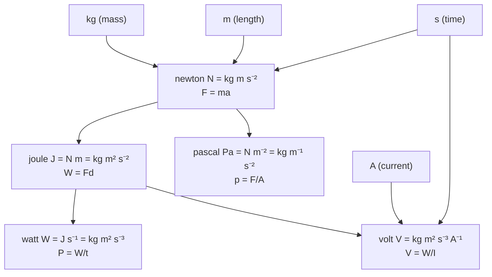

# SI Units

## Core Idea

The SI system is the internationally agreed set of units for physical quantities, built from a small number of base units from which all others are derived.

## Meaning

Every physical quantity is expressed as a number times a unit. The SI system fixes seven **base units**; the five used routinely at A-Level are:

| Quantity | Base unit | Symbol |
|---|---|---|
| Mass | kilogram | kg |
| Length | metre | m |
| Time | second | s |
| Electric current | ampere | A |
| Thermodynamic temperature | kelvin | K |

(The mole, mol, and candela, cd, complete the seven.)

All other units are **derived** as products and powers of base units. For example the newton is $\text{kg m s}^{-2}$ (from $F = ma$), the joule is $\text{kg m}^{2}\,\text{s}^{-2}$ (from [[Work]] $= Fd$), and the pascal is $\text{kg m}^{-1}\,\text{s}^{-2}$. Expressing a derived unit in base units is the basis of **homogeneity / dimensional analysis**: a physically valid equation must have the same base-unit combination on both sides. Checking this catches algebraic errors and helps deduce unknown units.

Prefixes scale units by powers of ten (e.g. $n = 10^{-9}$, $\mu = 10^{-6}$, $m = 10^{-3}$, $k = 10^{3}$, $M = 10^{6}$, $G = 10^{9}$), so quantities can be written compactly across many orders of magnitude. Consistent SI use is required so that equations, measurements and constants combine correctly.

## Everyday Intuition

Just as a recipe fails if you mix grams and ounces, a physics calculation goes wrong unless every quantity is in consistent SI units before substituting numbers.

## GCSE Foundation

- [[Mass]]
- [[Velocity]]

## Why It Matters

SI units make measurements reproducible worldwide, allow dimensional checking of equations, and prevent unit-mismatch errors that are heavily penalised in exams.

## Related Quantities

- [[Mass]]
- [[Force]]
- [[Velocity]]

## Related Laws or Results

- [[Resultant-Force]]

## Related Models

- [[Constant-Acceleration-Model]]

## Representations

- [[Vector-Triangle]]

## Experiments or Observations

- Any practical: recording readings and uncertainties in consistent SI units

## Applications

- Dimensional homogeneity checks across all of [[Physical-Quantities-MOC]]

## Frontier Links

- SI base units are now defined from fixed fundamental constants — see [[Quantum-Mechanics-Map]]

## Common Mistakes

- Substituting non-SI values (g instead of kg, cm instead of m)
- Forgetting to convert prefixes before calculating
- Treating a unit check as optional rather than a validity test

## Visuals

### SI base units → derived units (selected A-Level examples)

*Figure: Five A-Level base units (kg, m, s, A, K) combine to give all derived units. Any derived unit can be re-expressed in base units for dimensional homogeneity checks.*
*Source: Authored for this vault (CC0). No external copyright.*

## Source Trace

- Source: OpenStax College Physics; The Physics Classroom; HyperPhysics — no copied text
- Section/Page: OCR alignment: [[OCR-Physics-A-H556-Specification]] (Module 2, foundations of physics)
