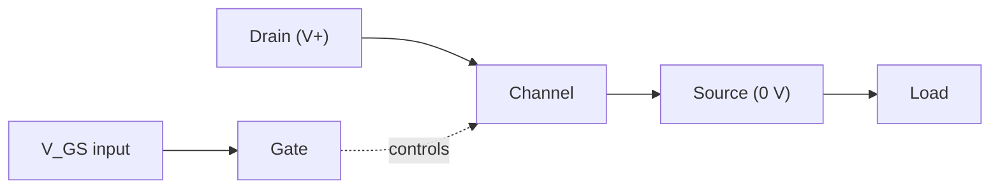

# Semiconductor Devices

## Core Idea

Two semiconductor components — the MOSFET and the Zener diode — let small voltages control or stabilise much larger ones, which is the basis of digital switching and voltage regulation in electronics.

## Meaning

A **MOSFET** (Metal-Oxide-Semiconductor Field-Effect Transistor) is a **voltage-controlled switch**. It has three terminals: gate (G), drain (D), and source (S). The gate is insulated from the channel by a thin oxide layer, so no steady current flows into it. The voltage between gate and source, $V_{GS}$, controls how much current $I_{DS}$ flows from drain to source.

- When $V_{GS}$ is below a threshold $V_{T}$, the channel is "off" and $I_{DS} \approx 0$.
- When $V_{GS} > V_{T}$, the channel conducts and behaves roughly like a small [[Resistance]] between drain and source.

This makes a MOSFET ideal as a logic switch: a logic-level voltage at the gate turns a load on or off without drawing input current.

A **Zener diode** is a diode designed to operate safely in **reverse breakdown**. In forward bias it behaves like a normal diode. In reverse bias, once the applied voltage reaches the **Zener voltage** $V_{Z}$, the diode begins to conduct heavily while the voltage across it stays essentially constant at $V_{Z}$. This clamping action gives a fixed voltage reference used in **voltage regulation**.

Symbols:

- $V_{GS}$: gate-source voltage (V)
- $V_{T}$: threshold voltage (V)
- $I_{DS}$: drain-source current (A)
- $V_{Z}$: Zener (breakdown) voltage (V)

## Everyday Intuition

A MOSFET is like a tap whose handle is operated by a tiny finger-touch: very little effort on the gate controls a large flow through drain-source. A Zener diode is like a pressure-relief valve: once the pressure reaches a set value, the valve opens just enough to hold that pressure constant.

## GCSE Foundation

- [[Resistance]]
- [[Potential-Difference]]
- [[Current]]
- [[Potential-Divider]]

## Why It Matters

MOSFETs are the building block of every modern digital chip; billions of them form CPUs and memory. Zener diodes provide cheap, stable voltage references for power supplies and sensor circuits. Together they show how doped semiconductors deliver both switching and regulation.

## Related Quantities

- [[Resistance]]
- [[Current]]
- [[Potential-Difference]]

## Related Laws or Results

- [[Ohms-Law]] — applies to the on-state channel resistance.

## Related Models

- [[Potential-Divider]] — Zener regulators are designed alongside a series resistor as a divider that clamps the output.

## Representations

- [[Circuit-Diagram]]
- [[IV-Characteristic]] — shows Zener breakdown knee.

## Experiments or Observations

- Measure $I_{DS}$ vs $V_{GS}$ for a small-signal MOSFET.
- Plot reverse $I$-$V$ for a Zener diode and identify $V_{Z}$.

## Applications

- [[Hall-Effect-Sensor]] — Hall sensors often drive MOSFET switching outputs.
- [[Logic-Gates]] — MOSFETs are the active elements in CMOS logic.
- [[Operational-Amplifier-Circuits]] — Zener diodes set internal references.

## Frontier Links

- [[Semiconductor-Physics-Map]]

## Common Mistakes

- Treating the MOSFET gate as drawing current — it draws essentially zero steady current because of the oxide insulator.
- Forgetting that the Zener diode regulates only in **reverse** bias.
- Omitting the series resistor in a Zener regulator, which lets the diode burn out.
- Confusing $V_{T}$ (MOSFET threshold) with $V_{Z}$ (Zener voltage) — different devices, different roles.

## Visuals

### MOSFET as a voltage-controlled switch

*Figure: gate voltage controls whether the drain-source channel conducts.*
*Source: Authored for this vault (CC0). No external copyright.*

### From Wikimedia

<!-- wiki-images: yes -->

#### A real power MOSFET
![[_attachments/04_Concepts/Semiconductor-Devices--wiki-power-mosfet.jpg]]
*Figure: a discrete power MOSFET in a TO-220 package, with its three terminals (gate, drain, source).*
*Source: Wikimedia Commons — [Power MOSFET.jpg](https://commons.wikimedia.org/wiki/File:Power_MOSFET.jpg) — CC BY-SA 4.0 — Suyash.dwivedi. Retrieved 2026-06-27.*

## Source Trace

- Source: [[AQA-Physics-7407-7408-Specification]] §3.13
- Public source: HyperPhysics; All About Circuits
- Section/Page: Electronics — semiconductor devices
