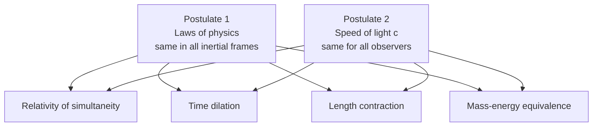

# Special Relativity

## Core Idea

Einstein's 1905 theory built on two simple postulates. Their combination forces space and time themselves to behave differently for observers in relative motion — leading to time dilation, length contraction, and mass-energy equivalence.

## Meaning

Special relativity rests on **two postulates** about inertial frames (frames moving at constant velocity, not accelerating):

1. **Principle of relativity** — the laws of physics take the same form in every inertial frame. No experiment performed inside a sealed laboratory can tell you whether the lab is "really" at rest or moving uniformly.
2. **Invariance of the speed of light** — light in vacuum travels at the same speed $c \approx 3.00 \times 10^{8}\,\text{m s}^{-1}$ for every inertial observer, regardless of how the source or observer moves.

The second postulate is the radical one. Classically, velocities add: a ball thrown at $10\,\text{m s}^{-1}$ from a train moving at $30\,\text{m s}^{-1}$ goes at $40\,\text{m s}^{-1}$ in the ground frame. But a light pulse from the same train still moves at $c$ in the ground frame, not $c + 30\,\text{m s}^{-1}$.

If both postulates hold, then **time and space must stretch and squeeze** between frames to keep $c$ constant.

## Everyday Intuition

Sit on a train and bounce a ball straight up and down. To you it goes up and down; to someone on the platform it traces a zig-zag, so it covers more distance in the same time. With a ball, that's fine — its speed differs between frames. With light, the speed *can't* differ, so the *time* has to.

## GCSE Foundation

- [[Speed]]
- [[Waves]]
- Frames of reference (intuitive)

## Why It Matters

Special relativity replaces Newtonian absolute space and time with a unified **spacetime**. Its consequences are:

- **Relativity of simultaneity** — events simultaneous in one frame need not be in another.
- **[[Time-Dilation]]** — moving clocks run slow.
- **[[Length-Contraction]]** — moving rulers shrink along the direction of motion.
- **[[Relativistic-Mass-and-Energy]]** — mass and energy are interchangeable, $E = mc^{2}$.
- $c$ is the universal speed limit for any object with rest mass.

These effects are tiny at everyday speeds but huge near $c$. They are measured daily in particle accelerators, GPS satellites, and cosmic-ray muon detection.

## Related Quantities

- [[Velocity]]
- [[Energy]]
- [[Momentum]]

## Related Laws or Results

- [[Maxwell-Speed-of-Light]]
- [[Time-Dilation]]
- [[Length-Contraction]]
- [[Relativistic-Mass-and-Energy]]
- [[Mass-Energy-Equivalence]]

## Related Models

- Inertial frame
- Spacetime (Minkowski geometry — orientation only)

## Representations

- Spacetime diagram (qualitative)
- Light-clock thought experiment

## Experiments or Observations

- [[Michelson-Morley-Experiment]]
- Cosmic-ray muon lifetime
- Hafele–Keating atomic-clock flights
- GPS clock corrections

## Applications

- Particle accelerators
- Nuclear binding energy and reactions
- GPS timing
- Relativistic Doppler effect

## Frontier Links

- [[Relativity-Map]]
- General relativity (gravity as curved spacetime — beyond A-Level)

## Common Mistakes

- Confusing **inertial** (constant velocity) frames with accelerating ones — special relativity is about inertial frames only.
- Believing relativity says "everything is relative" — the speed of light is **absolute**, and the spacetime interval between events is **invariant**.
- Adding velocities the classical way at high speed — use the relativistic velocity-addition formula.
- Thinking effects only apply to the moving object — each observer sees the *other's* clocks run slow (symmetry).

## Visuals

### Two postulates and their consequences

*Figure: Two innocent-looking postulates force four major consequences about space, time, mass and energy.*
*Source: Authored for this vault (CC0). No external copyright.*

## Source Trace

- Source: [[AQA-Physics-7407-7408-Specification]] §3.12.3
- Section/Page: Turning Points in Physics — Special Relativity (HyperPhysics; OpenStax University Physics)
