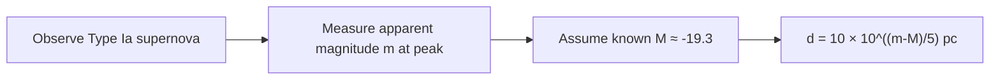

# Standard Candles

## Core Idea

A **standard candle** is an object whose intrinsic [[Luminosity]] (or equivalently [[Absolute-Magnitude]] `M`) is known from astrophysics alone. Measuring its [[Apparent-Magnitude]] `m` then gives its distance via the [[Magnitude-Distance-Equation]].

## Meaning

If `M` is known and `m` is measured, then

`d = 10 × 10^((m − M)/5)` parsec.

For AQA, the headline example is the **Type Ia supernova**: a white dwarf in a binary system that exceeds the Chandrasekhar mass limit (`~1.4 M_☉`) and detonates. The resulting explosions reach a strikingly consistent peak [[Absolute-Magnitude]] (`M ≈ −19.3` in the V band), so their measured apparent brightness directly yields distance — even out to billions of light years.

A Type Ia **light curve** has a characteristic shape: a sharp rise in brightness over about 20 days to a peak, then a slower decline over weeks. Modern analyses correct the peak magnitude using the decline rate ("Phillips relation") to tighten the standard candle.

## Everyday Intuition

A 60 W lightbulb glimpsed at night looks dim if it is far away and bright if it is near. If you *know* it is a 60 W bulb (the standard candle), you can work out the distance from how dim it looks.

## GCSE Foundation

- [[Intensity]] follows an inverse-square law with distance from a point source.
- [[Luminosity]] is the intrinsic power output.

## Why It Matters

- Type Ia supernovae extend the cosmic distance ladder far beyond parallax and Cepheids.
- They are the data that drove the 1998 discovery that the universe's expansion is **accelerating**, leading to the introduction of *dark energy*.
- This conclusion is mainstream cosmology, but the precise nature of dark energy remains debated — competing models include a cosmological constant and time-varying scalar fields.

## Related Quantities

- [[Apparent-Magnitude]]
- [[Absolute-Magnitude]]
- [[Luminosity]]

## Related Laws or Results

- [[Magnitude-Distance-Equation]]
- [[Hubbles-Law]]

## Related Models

- [[Supernovae-Neutron-Stars-and-Black-Holes]] (Type Ia mechanism).

## Representations

- Light curves (apparent magnitude vs time).
- Hubble diagram (`m` or `d` vs [[Redshift]] `z`).

## Experiments or Observations

- Long-term photometric monitoring of distant galaxies.
- Spectroscopic identification of Type Ia signatures (no hydrogen lines; strong Si II).

## Applications

- Measuring cosmological distances at high [[Redshift]].
- Constraining the expansion history of the universe and the [[Big-Bang-Theory]].

## Frontier Links

- Cosmology-Map — dark energy, the accelerating universe.

## Common Mistakes

- Treating *all* supernovae as standard candles — only Type Ia have a tight peak [[Absolute-Magnitude]].
- Forgetting that the [[Magnitude-Distance-Equation]] requires `d` in parsec.
- Ignoring extinction (interstellar dust dims and reddens the light) when applying the simple formula.

## Visuals

### Standard-candle workflow

*Figure: From light curve to distance using the magnitude-distance equation.*
*Source: Authored for this vault (CC0). No external copyright.*

### From Wikimedia

<!-- wiki-images: yes -->

#### A Type Ia supernova in its host galaxy
![[_attachments/04_Concepts/Standard-Candles--wiki-type-ia-supernova.jpg]]
*Figure: Supernova 2012Z, a Type Ia supernova, in the spiral galaxy NGC 1309. Because Type Ia events reach a near-uniform peak absolute magnitude, their apparent brightness gives the galaxy's distance.*
*Source: Wikimedia Commons — [Supernova 2012Z in spiral galaxy NGC 1309, annotated.jpg](https://commons.wikimedia.org/wiki/File:Supernova_2012Z_in_spiral_galaxy_NGC_1309,_annotated.jpg) — CC BY 4.0 — NASA, ESA, C. McCully and S. Jha (Rutgers). Retrieved 2026-06-27.*

## Watch

- [[Distances-and-Standard-Candles-Crash-Course|Distances: Crash Course Astronomy #25]] — CrashCourse

## Source Trace

- Source: [[AQA-Physics-7407-7408-Specification]] §3.9.3
- Section/Page: Type Ia supernovae as standard candles; controversy over accelerating universe.
- Public reference: HyperPhysics "Type Ia Supernovae"; NASA / Hubble Heritage; OpenStax Astronomy Ch. 25.
