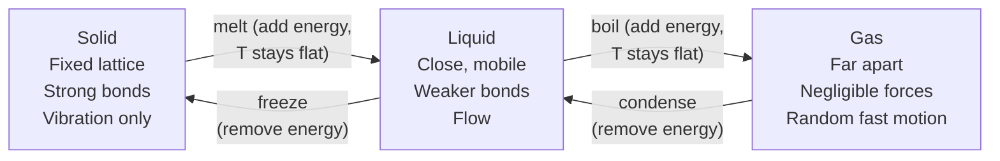

# States of Matter

## Core Idea

Solid, liquid and gas differ in how strongly their particles are bonded and how freely they can move, which is set by the balance between intermolecular potential energy and random kinetic energy.

## Meaning

- **Solid**: particles are held in fixed positions by strong intermolecular forces, vibrating about a mean position. High order, fixed shape and volume, hard to compress.
- **Liquid**: particles are still close together but the bonds are weaker and can break and reform, so particles move past one another. Fixed volume but no fixed shape.
- **Gas**: particles are far apart with negligible intermolecular forces, moving rapidly and randomly. No fixed shape or volume; easily compressed. This is the regime modelled by the [[Ideal-Gas-Model]].

The state is determined by the competition between particle [[Internal-Energy]] (its random kinetic part, set by [[Temperature]]) and the intermolecular potential energy holding particles together.

## Everyday Intuition

Ice, water and steam are the same molecules in different arrangements. Adding energy progressively frees the molecules: rigid lattice → mobile but close → free and far apart.

## GCSE Foundation

- The GCSE particle model: arrangement, separation and motion in each state
- [[Density]]

## Why It Matters

During a **change of state**, energy is supplied but [[Temperature]] does not change, because the energy increases the potential part of internal energy (breaking bonds) rather than the kinetic part. This is quantified by [[Specific-Latent-Heat]]. Within a single state, supplying energy raises the temperature, quantified by [[Specific-Heat-Capacity]]. The much lower [[Density]] of a gas compared with its liquid reflects the large particle separation.

## Related Quantities

- [[Density]]
- [[Internal-Energy]]
- [[Specific-Latent-Heat]]

## Related Laws or Results

- [[Ideal-Gas-Equation]]

## Related Models

- [[Ideal-Gas-Model]]
- [[Kinetic-Theory-of-Gases]]

## Representations

- Heating curve (temperature against energy/time) showing flat plateaus during melting and boiling

## Experiments or Observations

- Brownian motion as evidence for random particle motion in fluids
- [[Measuring-Specific-Heat-Capacity]]

## Applications

- Phase-change materials, refrigeration, materials processing

## Frontier Links

- Plasma and Bose–Einstein condensate as further states (orientation only, beyond A-Level)

## Common Mistakes

- [[Confusing-Heat-and-Temperature]]

## Visuals

### States of matter: particle arrangement and energy transitions

*Figure: Moving right (solid → gas) adds potential energy (breaking bonds) — T does not rise during a change of state. Kinetic energy (and hence T) rises only within a single state.*
*Source: Authored for this vault (CC0). No external copyright.*

## Source Trace

- Source: OpenStax College Physics; HyperPhysics; The Physics Classroom — paraphrased, no copied text
- Section/Page: OCR alignment: [[OCR-Physics-A-H556-Specification]] (Module 5.1.1)
