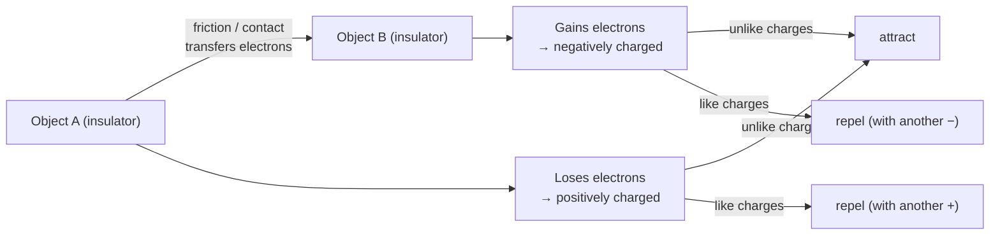

# Static Electricity

## Core Idea

Static electricity is electric charge that has built up on an object and is
not flowing. It arises when electrons are transferred from one object to
another, leaving one object positively charged and the other negatively
charged.

## Meaning

All matter contains positive (proton) and negative (electron) charge.
Rubbing two insulators together can transfer electrons: the material that
gains electrons becomes negatively charged, the one that loses them becomes
positively charged. Protons are fixed in nuclei, so it is always the
electrons that move.

Like charges repel and unlike charges attract. Because the charge is on an
insulator it stays put ("static") until it can leak away or discharge,
sometimes as a small spark.

## Everyday Intuition

A balloon rubbed on hair sticks to a wall; clothes cling from a dryer; a
small shock when touching a metal door handle after walking on carpet.

## GCSE Foundation

- [[Contact-and-Non-Contact-Forces]]

## Why It Matters

It introduces charge, the force between charges, and the idea of an electric
field — the basis for the A-Level study of electric fields, capacitors, and
current as moving charge.

## Related Quantities

- [[Force]]

## Related Laws or Results

- Like charges repel, unlike charges attract (Coulomb's qualitative rule)

## Related Models

- [[Atomic-Structure]]

## Representations

- Field lines pointing away from positive and towards negative charge

## Experiments or Observations

- Charging by friction and testing attraction/repulsion with a charged rod

## Applications

- Inkjet printing, electrostatic spray painting, photocopiers

## Frontier Links

- Quantisation of charge in units of the elementary charge

## Common Mistakes

- Saying protons move during charging — only electrons transfer.
- Confusing static charge with electric current (static is not flowing).

## Visuals

### Static charge: electron transfer by friction

*Figure: Only electrons transfer; protons stay fixed in nuclei. Charge is conserved: total charge on A + B is unchanged after transfer.*
*Source: Authored for this vault (CC0). No external copyright.*

### From Wikipedia

<!-- wiki-images: yes -->

#### Static on the playground (48616367)

![[_attachments/04_Concepts/Static-Electricity--wiki-static-on-the-playground-48616367.jpg]]
*Figure: from Wikipedia article "Static electricity".*
*Source: Wikimedia Commons — [Static_on_the_playground_(48616367).jpg](https://commons.wikimedia.org/wiki/File:Static_on_the_playground_(48616367).jpg). Retrieved 2026-05-20.*

#### Airbus A321-231 - British Airways - G-EUXH - EHAM (5)

![[_attachments/04_Concepts/Static-Electricity--wiki-airbus-a321-231-british-airways-g-euxh-e.jpg]]
*Figure: from Wikipedia article "Static electricity".*
*Source: Wikimedia Commons — [Airbus A321-231 - British Airways - G-EUXH - EHAM (5).jpg](https://commons.wikimedia.org/wiki/File:Airbus_A321-231_-_British_Airways_-_G-EUXH_-_EHAM_(5).jpg). Retrieved 2026-05-20.*

#### AntiStatic-Wrist-Guard

![[_attachments/04_Concepts/Static-Electricity--wiki-antistatic-wrist-guard.jpg]]
*Figure: from Wikipedia article "Static electricity".*
*Source: Wikimedia Commons — [AntiStatic-Wrist-Guard.jpg](https://commons.wikimedia.org/wiki/File:AntiStatic-Wrist-Guard.jpg). Retrieved 2026-05-20.*

## Source Trace

OpenStax College Physics; HyperPhysics; The Physics Classroom — no copied text.

OCR alignment: [[OCR-Physics-A-H556-Specification]]
