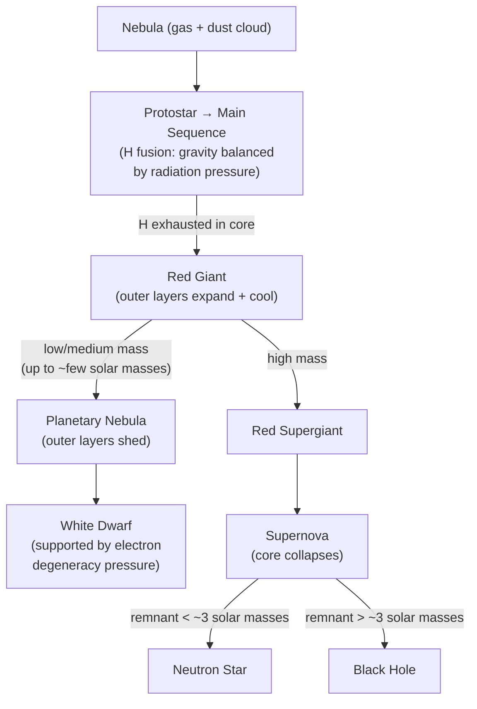

# Stellar Evolution

## Core Idea

Stellar evolution is the life story of a star, set by the balance between
inward gravitational collapse and the outward pressure produced by nuclear
fusion in its core. A star's mass determines its path and final state.

## Meaning

A star forms when a cloud of gas and dust (a nebula) collapses under gravity.
Compression heats the core until hydrogen fusion begins; the star becomes a
**main-sequence** star, where gravity is balanced by radiation and gas
pressure from fusing hydrogen into helium. Stars spend most of their life
here, and their position on the [[Hertzsprung-Russell-Diagram]] reflects this
balance.

When core hydrogen is exhausted, the core contracts and heats while the outer
layers expand and cool, forming a **red giant** (or red supergiant for the
most massive stars). Heavier elements fuse in shells and the core.

The final state depends on mass:

- **Low / medium mass (up to ~ a few solar masses):** outer layers are shed as
  a planetary nebula, leaving a hot, dense **white dwarf** supported by
  electron degeneracy pressure (stable below the Chandrasekhar limit,
  ≈ 1.4 solar masses).
- **High mass:** the core collapses catastrophically, producing a
  **supernova**. The remnant is a **neutron star**, or — if massive enough —
  a **black hole**.

Supernovae disperse heavy elements into space, seeding later stars and
planets.

## Everyday Intuition

A star is like a controlled, self-regulating explosion: it would collapse
under its own gravity if fusion did not push back. When the fuel runs low,
the balance is lost.

## GCSE Foundation

- [[Mass]]
- [[Conservation-of-Energy]]

GCSE describes the star life cycle qualitatively. A-Level adds the
gravity–pressure balance, the H–R diagram and mass-dependent endpoints.

## Why It Matters

Stellar evolution explains the origin of chemical elements, the energy source
of stars, and the meaning of the main sequence on the H–R diagram.

## Related Quantities

- [[Luminosity]]
- [[Mass]]

## Related Laws or Results

- [[Stefans-Law]]
- [[Wiens-Displacement-Law]]

## Related Models

- [[Orbital-Motion]]

## Representations

- [[Hertzsprung-Russell-Diagram]]

## Experiments or Observations

- Stellar spectra and brightness used to place stars on the H–R diagram
- Observation of supernovae and nebulae

## Applications

- Using the H–R diagram to estimate stellar age and type

## Frontier Links

- [[Cosmology-Map]]

## Common Mistakes

- Assuming all stars end as black holes (depends on mass)
- Confusing planetary nebula with a planet
- Thinking the main sequence is a time stage rather than a stable phase

## Visuals

### Stellar evolution: mass-dependent life cycle

*Figure: A star's final state depends on its initial mass. The main sequence is a stable phase, not a time-ordered stage. Supernovae disperse heavy elements seeding future stars.*
*Source: Authored for this vault (CC0). No external copyright.*

### From Wikipedia

<!-- wiki-images: yes -->

#### Triangle of everything - Stellar Evolution

![[_attachments/04_Concepts/Stellar-Evolution--wiki-triangle-of-everything-stellar-evolution.png]]
*Figure: from Wikipedia article "Stellar evolution".*
*Source: Wikimedia Commons — [Triangle_of_everything_-_Stellar_Evolution.png](https://commons.wikimedia.org/wiki/File:Triangle_of_everything_-_Stellar_Evolution.png). Retrieved 2026-05-20.*

#### Black hole - Messier 87

![[_attachments/04_Concepts/Stellar-Evolution--wiki-black-hole-messier-87.jpg]]
*Figure: from Wikipedia article "Stellar evolution".*
*Source: Wikimedia Commons — [Black hole - Messier 87.jpg](https://commons.wikimedia.org/wiki/File:Black_hole_-_Messier_87.jpg). Retrieved 2026-05-20.*

#### Crab Nebula

![[_attachments/04_Concepts/Stellar-Evolution--wiki-crab-nebula.jpg]]
*Figure: from Wikipedia article "Stellar evolution".*
*Source: Wikimedia Commons — [Crab Nebula.jpg](https://commons.wikimedia.org/wiki/File:Crab_Nebula.jpg). Retrieved 2026-05-20.*

## Source Trace

- Source: OpenStax College Physics; HyperPhysics; NASA educational material — no copied text
- OCR alignment: [[OCR-Physics-A-H556-Specification]]
- Section/Page: OCR M5.5 Astrophysics and cosmology
