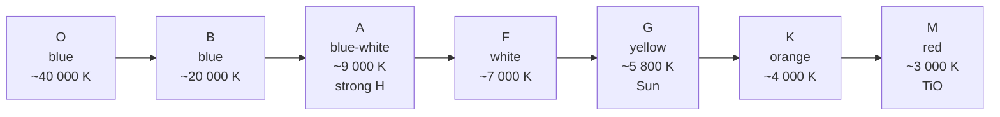

# Stellar Spectral Classes

## Core Idea

Stars are sorted into seven main **spectral classes** — **O, B, A, F, G, K, M** — primarily by surface temperature. The sequence runs from hottest and bluest (O) to coolest and reddest (M), and each class shows a characteristic pattern of absorption lines.

## Meaning

The continuous part of a stellar spectrum comes from [[Black-Body-Radiation]] in the photosphere; the dark absorption lines come from cooler atoms and molecules in the outer atmosphere absorbing specific wavelengths set by their [[Energy-Levels]].

Which lines are strong depends on temperature, because temperature controls how many atoms sit in the right energy level to absorb a given photon. The Balmer series of hydrogen (visible-light transitions ending on `n = 2`) is the key A-level example: it is strongest in **class A** stars, because only at `~10 000 K` is a substantial fraction of hydrogen atoms in the `n = 2` excited state without being mostly ionised.

| Class | Colour | Approx. T (K) | Dominant lines |
|---|---|---|---|
| O | blue | 25 000 – 50 000 | He⁺ (ionised), He, weak H |
| B | blue | 11 000 – 25 000 | He (neutral), H |
| A | blue-white | 7 500 – 11 000 | **Strong H Balmer**, some ionised metals |
| F | white | 6 000 – 7 500 | H weaker, ionised metals (Ca II) |
| G | yellow-white | 5 000 – 6 000 | Ca II strong, neutral metals — **the Sun** |
| K | orange | 3 500 – 5 000 | Neutral metals, some molecular bands |
| M | red | < 3 500 | TiO molecular bands, neutral metals |

Mnemonic: "**O**h **B**e **A** **F**ine **G**uy/Girl, **K**iss **M**e".

## Everyday Intuition

Same principle as a flame test: a hot blue flame and a cool orange flame both glow, but the colours and the precise emission lines depend on what is in the gas and how hot it is.

## GCSE Foundation

- [[Electromagnetic-Spectrum]]
- [[Temperature]]
- [[Atomic-Structure]]

## Why It Matters

- Lets us assign a star a temperature from its spectrum alone.
- Combined with [[Absolute-Magnitude]], spectral class places a star on a [[Hertzsprung-Russell-Diagram]] — the backbone of [[Stellar-Evolution]].
- Class is the first clue to a star's mass, lifetime and likely fate.

## Related Quantities

- [[Wavelength]]
- [[Luminosity]]
- [[Absolute-Magnitude]]

## Related Laws or Results

- [[Wiens-Displacement-Law]] — links peak wavelength to `T`.
- [[Stefans-Law]] — links `T` and radius to luminosity.

## Related Models

- [[Black-Body-Radiation]] continuous spectrum + cooler-atmosphere absorption.

## Representations

- [[Hertzsprung-Russell-Diagram]] axis: spectral class (O → M) = decreasing temperature.

## Experiments or Observations

- Stellar spectroscopy with a [[Diffraction-Grating]] or prism spectrograph.

## Applications

- Classifying surveys of millions of stars.
- Selecting candidate host stars for exoplanet searches — see [[Exoplanet-Detection]].

## Frontier Links

- [[Stellar-Evolution]] — main-sequence position depends on class.

## Common Mistakes

- Thinking the OBAFGKM order is alphabetical — it is not; it is the *historical* Harvard order, retained because it sorts by temperature.
- Saying hydrogen lines are strongest in the hottest stars — at very high `T`, hydrogen is mostly ionised, so Balmer lines are weak; they peak in class A.
- Forgetting that the continuous spectrum is set by [[Black-Body-Radiation]] and only the absorption lines depend on chemistry.

## Visuals

### Temperature sequence

*Figure: OBAFGKM sequence from hottest (left) to coolest (right).*
*Source: Authored for this vault (CC0). No external copyright.*

### From Wikimedia

<!-- wiki-images: yes -->

#### Morgan-Keenan spectral classes
![[_attachments/04_Concepts/Stellar-Spectral-Classes--wiki-obafgkm.svg]]
*Figure: The OBAFGKM spectral classes shown with representative colour and relative size, running from hot blue O-type to cool red M-type stars.*
*Source: Wikimedia Commons — [Morgan-Keenan spectral classification.svg](https://commons.wikimedia.org/wiki/File:Morgan-Keenan_spectral_classification.svg) — CC BY-SA 3.0 — Rursus. Retrieved 2026-06-27.*

## Watch

- [[Stars-and-the-HR-Diagram-Crash-Course|Stars: Crash Course Astronomy #26]] — CrashCourse

## Source Trace

- Source: [[AQA-Physics-7407-7408-Specification]] §3.9.2
- Section/Page: Classification by spectral type; Balmer absorption lines; OBAFGKM.
- Public reference: HyperPhysics "Stellar Spectral Classification"; NASA IMAGINE; OpenStax Astronomy Ch. 17.
