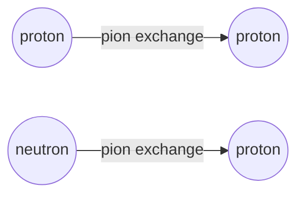

# Strong Nuclear Force

## Core Idea

The strong nuclear force is the short-range attractive force that holds protons and neutrons together inside a nucleus, overcoming the electrostatic repulsion between protons.

## Meaning

Without it, a nucleus containing more than one proton could not exist — the Coulomb repulsion between protons would blow it apart. The strong nuclear force is much stronger than the electromagnetic force at very small distances but switches off very quickly with separation. Its key features:

- It is **attractive** between nucleons (protons and neutrons) at separations from roughly $0.5\ \text{fm}$ out to about $3\ \text{fm}$.
- It becomes **repulsive** at very short range, below about $0.5\ \text{fm}$. This stops the nucleus collapsing.
- It is essentially **zero** beyond about $3\ \text{fm}$, so it acts only between nearest-neighbour nucleons.
- It is **charge-independent**: it acts equally between proton–proton, neutron–neutron, and proton–neutron pairs.

Because the range is so short, adding more nucleons to a large nucleus does not increase the total binding per nucleon indefinitely — the Coulomb force, which has unlimited range, eventually wins and makes very large nuclei unstable.

## Everyday Intuition

Think of stickiness that only works when surfaces are almost touching, but with a hard core: like two strong magnets that snap together at close range yet refuse to be pushed inside one another.

## GCSE Foundation

- [[Atomic-Structure]]
- [[The-Nuclear-Atom]]
- [[Charge]]

## Why It Matters

It explains why nuclei exist at all, why the nuclear radius scales gently with mass number, why binding energy per nucleon peaks near iron, and why fission and fusion can release energy. At a deeper level, it is mediated between hadrons by [[Exchange-Particles]] (pions in this course).

## Related Quantities

- [[Charge]]
- [[Mass]]
- Nuclear radius (typically a few fm).

## Related Laws or Results

- [[Conservation-of-Momentum]]
- [[Conservation-of-Energy]]

## Related Models

- [[The-Nuclear-Atom]]

## Representations

- [[Feynman-Diagram]] — pion exchange between nucleons.
- Force–separation sketch showing repulsive core, attractive well, and rapid decay to zero by ~3 fm.

## Experiments or Observations

- Rutherford scattering shows the nucleus is tiny and dense.
- Existence of stable isotopes with $N \gtrsim Z$ for heavy nuclei is evidence for the strong force.

## Applications

- Nuclear fission and fusion.
- Stability of [[Isotopes]].

## Frontier Links

- [[Particle-Physics-Map]] — at the quark level the strong force is described by quantum chromodynamics; the nucleon-level strong nuclear force is a residual effect.

## Common Mistakes

- Saying the strong force "only attracts" — it has a repulsive core at very short range.
- Confusing range with strength: the strong force is the strongest of the four fundamental interactions but only acts within a few fm.
- Treating it as charge-dependent like the Coulomb force. It is charge-independent.
- Confusing the strong nuclear force (between nucleons) with the weak interaction (responsible for $\beta$ decay).

## Visuals

*Figure: Nucleons interact via pion exchange in the residual strong force.*
*Source: Authored for this vault (CC0). No external copyright.*

## Source Trace

- Source: [[AQA-Physics-7407-7408-Specification]] §3.2.1.2
- Section/Page: Stable and unstable nuclei — short-range strong nuclear force.
- Explanatory reference: HyperPhysics "Nuclear Force"; OpenStax College Physics §31.6 (no text copied).
