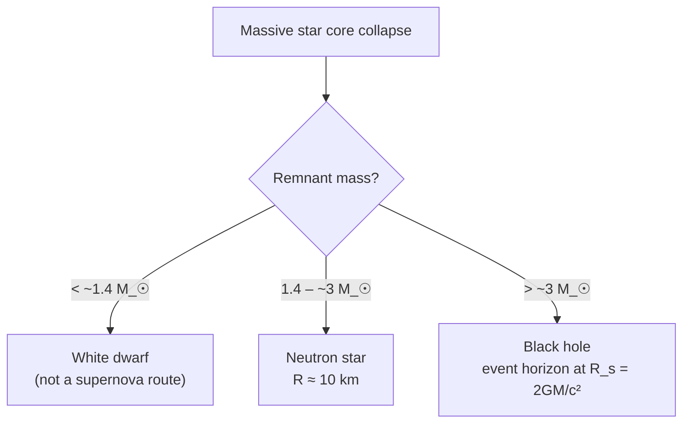

# Supernovae, Neutron Stars and Black Holes

## Core Idea

Massive stars end their lives in violent collapses. The visible explosion is a **supernova**; the compact object left behind is either a **neutron star** or, for the most massive progenitors, a **black hole**. Each of these is described by a small handful of distinctive physical signatures.

## Meaning

### Supernova

A supernova is a sudden, enormous brightening of a star, in which the [[Absolute-Magnitude]] rises by many magnitudes over days. For AQA, two routes are recognised:

- **Type II** — a massive star (`> ~8 M_☉`) collapses when its iron core can no longer sustain fusion; the outer layers rebound off the dense core.
- **Type Ia** — a white dwarf in a binary system accretes mass past the Chandrasekhar limit (`~1.4 M_☉`) and detonates. These have a remarkably uniform peak [[Absolute-Magnitude]] and act as [[Standard-Candles]].

A **gamma-ray burst** can accompany the collapse of a very massive rotating star ("hypernova") into a black hole, producing a brief but intense flash of gamma rays — among the most energetic events in the universe.

### Neutron star

If the collapsing core has mass roughly `1.4 – ~3 M_☉`, electrons are forced into protons (`p + e → n + ν`) and the remnant is a ball of neutrons supported by neutron degeneracy pressure. Typical figures:

- radius `R ≈ 10 km`,
- mass `M ≈ 1.4 – 2 M_☉`,
- density `ρ ≈ 10¹⁷ kg m⁻³` (comparable to an atomic nucleus).

Rapidly rotating, strongly magnetised neutron stars are seen as **pulsars**.

### Black hole

If the remnant exceeds about `3 M_☉`, no known pressure can stop collapse, and a **black hole** forms. Its defining feature is an event horizon at the [[Schwarzschild-Radius]] `R_s = 2GM / c²`, inside which the escape velocity exceeds the speed of light `c`.

## Everyday Intuition

A neutron star is roughly the mass of the Sun squeezed into the size of a small city; a sugar-cube of its material would mass about a billion tonnes. A black hole is a region where gravity is strong enough that not even light can escape from inside its horizon.

## GCSE Foundation

- [[Gravitational-Field-Strength]]
- [[Energy-Transfer]]

## Why It Matters

- Type Ia supernovae are a key rung in the cosmic distance ladder.
- They seed the galaxy with heavy elements — every element heavier than iron in your body was forged in such an event.
- Neutron stars and black holes provide laboratories for extreme physics.

## Related Quantities

- [[Absolute-Magnitude]]
- [[Apparent-Magnitude]]
- [[Mass]]

## Related Laws or Results

- [[Schwarzschild-Radius]]
- [[Newtons-Law-of-Gravitation]]

## Related Models

- [[Stellar-Evolution]] end states.

## Representations

- Light curve of [[Absolute-Magnitude]] against time.

## Experiments or Observations

- Optical photometry of supernovae over weeks.
- Radio pulses from pulsars.
- Gravitational-wave detections (LIGO/Virgo) from merging neutron stars and black holes.

## Applications

- [[Standard-Candles]] for cosmology.
- Nucleosynthesis of heavy elements.

## Frontier Links

- Relativity-Map — black holes are predictions of general relativity.
- Multi-messenger astronomy with gravitational waves.

## Common Mistakes

- Saying a black hole "sucks things in" — outside the horizon its gravity is the same as any equal-mass object.
- Confusing supernova *type* (Ia vs II) with stellar *class* (OBAFGKM).
- Forgetting that the [[Schwarzschild-Radius]] depends only on mass, not the original star's radius.

## Visuals

### End-state decision tree

*Figure: Remnant fate depends on the post-collapse mass.*
*Source: Authored for this vault (CC0). No external copyright.*

## Source Trace

- Source: [[AQA-Physics-7407-7408-Specification]] §3.9.2 – §3.9.3
- Section/Page: Supernovae, neutron stars and black holes; gamma-ray bursts; Type Ia as standard candles.
- Public reference: HyperPhysics "Stellar Endpoints"; NASA Goddard / Imagine the Universe.
