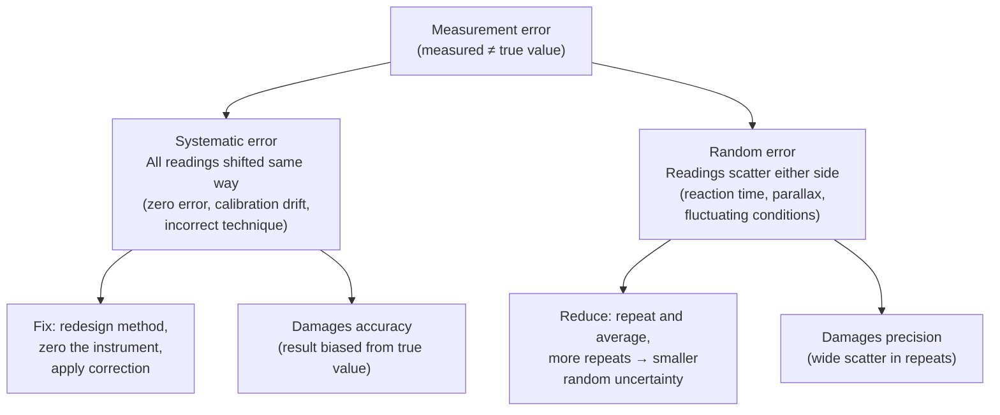

# Systematic and Random Errors

## Core Idea

An **error** is the difference between a measured value and the true value. Errors are either **systematic** (consistent, in one direction) or **random** (unpredictable, scattering either side).

## Meaning

A **systematic error** shifts every reading the same way. A balance that reads 0.2 g with nothing on it adds 0.2 g to every mass (a *zero error*); a stopclock started late shortens every time. Repeating the measurement does **not** remove it — it must be designed out (zeroing instruments, better technique) or corrected.

A **random error** varies between repeats: reaction-time scatter, judging a fluctuating reading, parallax that differs each time. Its effect is reduced by **repeating and averaging**, and it shows up as scatter about a [[Line-of-Best-Fit-Graph|line of best fit]].

## Everyday Intuition

A clock running 5 minutes fast is a systematic error — always 5 minutes out. Guessing the time by glancing at the sky is a random error — sometimes high, sometimes low.

## GCSE Foundation

- [[Resolution-Accuracy-and-Precision]]

## Why It Matters

Systematic error damages **accuracy**; random error damages **precision**. Knowing which is present tells you whether to *average more* (random) or *fix the method* (systematic), and it feeds the estimate in [[Measurement-Uncertainty]].

## Related Quantities

- _None directly._

## Related Laws or Results

- _None directly._

## Related Models

- _None directly._

## Representations

- [[Line-of-Best-Fit-Graph]]
- [[Results-Table]]

## Experiments or Observations

- Identified and reduced in every required practical — see [[Practical-Skills-MOC]].

## Applications

- _None directly._

## Frontier Links

- _Out of scope at A-Level._

## Common Mistakes

- Believing that averaging removes systematic error (it does not).
- Calling a one-off mistake/slip an "error" — that is a *blunder*, not a systematic or random error.

## Visuals

### Systematic vs random errors: cause and remedy

*Figure: Systematic error cannot be averaged away; random error can. Knowing which type is present tells you whether to average more or fix the procedure.*
*Source: Authored for this vault (CC0). No external copyright.*

### From Wikipedia

<!-- wiki-images: yes -->

#### Measurement distribution with systematic and random errors

![[_attachments/04_Concepts/Systematic-and-Random-Errors--wiki-measurement-distribution-with-systematic.svg]]
*Figure: from Wikipedia article "Observational error".*
*Source: Wikimedia Commons — [Measurement distribution with systematic and random errors.svg](https://commons.wikimedia.org/wiki/File:Measurement_distribution_with_systematic_and_random_errors.svg). Retrieved 2026-05-20.*

## Source Trace

- Source: [[OCR-Physics-Practical-Skills-Handbook]]
- Section/Page: Appendix 3 — *Useful terms*, *Errors in procedure* (p30, p37)
