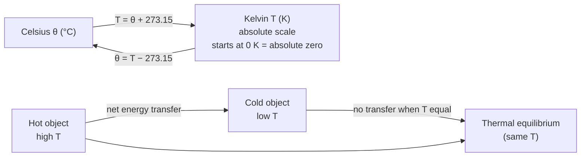

# Temperature

## Core Idea

Temperature is a measure of the average random kinetic energy of the particles in a body — it determines the direction of net thermal energy transfer between objects.

## Meaning

Temperature is not a measure of how much energy an object contains; it is a measure of the *average* kinetic energy per particle due to random motion. Two objects placed in thermal contact reach **thermal equilibrium** when their temperatures are equal, at which point there is no net transfer of energy between them. Energy always flows, on average, from the higher-temperature region to the lower-temperature region.

At A-Level the **thermodynamic (Kelvin) scale** is used. A temperature change of 1 K equals a change of 1 °C, so conversion is purely additive:

$$ T_{(\mathrm{K})} = \theta_{(^{\circ}\mathrm{C})} + 273.15 $$

where $T$ is thermodynamic temperature in kelvin (K) and $\theta$ is Celsius temperature in degrees Celsius (°C). The kelvin scale starts at [[Absolute-Zero]] (0 K), the temperature at which particles have minimum internal energy.

## Everyday Intuition

A cup of tea "feels hot" because its particles vibrate vigorously and transfer energy to the slower particles in your skin. A swimming pool can hold far more energy than the tea yet still feel cold because its particles, on average, move more slowly.

## GCSE Foundation

- [[Energy-Quantity|Energy]]
- Builds on the GCSE idea that heating increases particle motion

## Why It Matters

Temperature is the single quantity that decides which way thermal energy flows. It appears in the [[Ideal-Gas-Equation]], in [[Kinetic-Theory-of-Gases]] (where $\frac{3}{2}kT$ is the mean translational kinetic energy of a gas molecule), and in every calculation involving [[Specific-Heat-Capacity]] and [[Specific-Latent-Heat]].

## Related Quantities

- [[Internal-Energy]]
- [[Boltzmann-Constant]]
- [[Pressure]]

## Related Laws or Results

- [[Ideal-Gas-Equation]]

## Related Models

- [[Ideal-Gas-Model]]
- [[Kinetic-Theory-of-Gases]]

## Representations

- Calibration graphs of a thermometric property (e.g. resistance, emf) against temperature

## Experiments or Observations

- [[Measuring-Specific-Heat-Capacity]]

## Applications

- Thermometry, gas thermometers, thermocouples

## Frontier Links

- Negative absolute temperatures and statistical-mechanics definitions (beyond A-Level)

## Common Mistakes

- [[Confusing-Heat-and-Temperature]]

## Visuals

### Kelvin ↔ Celsius and thermal energy flow

*Figure: The Kelvin scale is the SI thermodynamic temperature. A change of 1 K equals a change of 1 °C. Energy flows from higher T to lower T until equilibrium.*
*Source: Authored for this vault (CC0). No external copyright.*

### From Wikipedia

<!-- wiki-images: yes -->

#### Thermally Agitated Molecule

![[_attachments/04_Concepts/Temperature--wiki-thermally-agitated-molecule.gif]]
*Figure: from Wikipedia article "Temperature".*
*Source: Wikimedia Commons — [Thermally_Agitated_Molecule.gif](https://commons.wikimedia.org/wiki/File:Thermally_Agitated_Molecule.gif). Retrieved 2026-05-20.*

#### A Guide to Cosmic Temperatures (SVS14374 - Cosmic Temperatures Infographic Final Full)

![[_attachments/04_Concepts/Temperature--wiki-a-guide-to-cosmic-temperatures-svs14374-.jpg]]
*Figure: from Wikipedia article "Temperature".*
*Source: Wikimedia Commons — [A Guide to Cosmic Temperatures (SVS14374 - Cosmic Temperatures Infographic Final Full).jpg](https://commons.wikimedia.org/wiki/File:A_Guide_to_Cosmic_Temperatures_(SVS14374_-_Cosmic_Temperatures_Infographic_Final_Full).jpg). Retrieved 2026-05-20.*

#### Body Temp Variation

![[_attachments/04_Concepts/Temperature--wiki-body-temp-variation.svg]]
*Figure: from Wikipedia article "Temperature".*
*Source: Wikimedia Commons — [Body Temp Variation.svg](https://commons.wikimedia.org/wiki/File:Body_Temp_Variation.svg). Retrieved 2026-05-20.*

## Source Trace

- Source: OpenStax College Physics; HyperPhysics; The Physics Classroom — paraphrased, no copied text
- Section/Page: OCR alignment: [[OCR-Physics-A-H556-Specification]] (Module 5.1.1)
