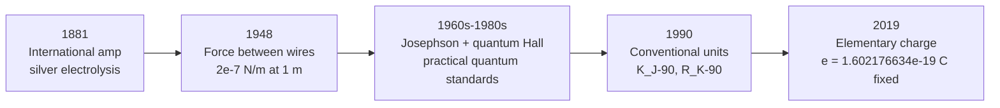

# The Ampere

## Core Idea

The ampere is the SI base unit of [[Current|electric current]]. Since 2019 it has been defined by fixing the **[[Elementary-Charge|elementary charge]] $e$** — so the ampere is now, literally, a count of electrons (or singly-charged carriers) passing a point per second.

## Meaning

The current definition fixes:

$$e = 1.602\,176\,634 \times 10^{-19} \text{ C} \text{ (exactly)}$$

Combined with the [[The-Second|second]], this gives:

$$1 \text{ A} = \frac{1 \text{ C}}{1 \text{ s}} = \frac{1}{1.602\,176\,634 \times 10^{-19}} \text{ elementary charges per second} \approx 6.241 \times 10^{18} \text{ e}^{-}/\text{s}$$

So 1 A is about 6.24 quintillion electrons crossing a wire's cross-section each second.

## Historical Development

The ampere is the only electrical SI base unit, and the most complicated. Its definition has bounced between *electrochemistry*, *mechanical force*, and now *single-electron counting*.

**1. 1820 — Ørsted and Ampère.** Hans Christian Ørsted noticed in 1820 that a compass needle deflected near a current-carrying wire — the first evidence linking electricity and magnetism. André-Marie Ampère immediately formulated the force law between parallel currents (the basis of the next century's amp definition) and gave electric current its name.

**2. 1881 — the "international ampere" (electrochemical).** The first International Electrical Congress in Paris adopted a unit defined by electrolysis: one international ampere was the current that would deposit $1.118 \text{ mg}$ of silver per second from a standard silver-nitrate solution. The current could be realised in any well-equipped chemistry lab.

**3. 1908 — silver coulometer standard formalised.** Refined as the international system of electrical units, used through both World Wars.

**4. 1948 — the force-between-wires definition.** The 9th CGPM replaced the international ampere with a definition rooted in Ampère's force law:

> One ampere is the constant current which, flowing in two parallel straight conductors of infinite length and negligible cross-section, placed 1 m apart in vacuum, produces a force of $2 \times 10^{-7}$ N per metre between them.

This had the side-effect of *fixing* the vacuum permeability:

$$\mu_0 = 4\pi \times 10^{-7} \text{ N A}^{-2} \text{ (exactly, pre-2019)}$$

The unit was logically clean but **practically awful** — no real apparatus can use infinitely long, infinitely thin parallel wires. In practice, labs realised it indirectly through a current balance.

**5. 1960s–1980s — quantum electrical effects.** Two new quantum phenomena gave laboratories far more reproducible electrical standards:

- The **Josephson effect** (1962) ties voltage to frequency: $V = nf/K_J$ with $K_J = 2e/h$.
- The **quantum Hall effect** (1980) ties resistance to fundamental constants: $R_H = h/(ne^2) = R_K/n$ with $R_K = h/e^2$.

Currents were increasingly realised by combining these, even though the *definition* of the amp still mentioned wires and forces.

**6. 1990 — conventional electrical units.** To eliminate the wire-force ambiguity in metrology, conventional values $K_{J\text{-}90}$ and $R_{K\text{-}90}$ were agreed for practical use, while the formal SI definition stayed unchanged. From 1990 to 2019 the "legal" amp and the "lab" amp differed by parts per million.

**7. 2019 — the elementary charge definition.** The 26th CGPM redefined the ampere by fixing $e$. The force-between-wires definition was abandoned. Now:

- $\mu_0$ is no longer exact — it must be measured (its value remains $4\pi \times 10^{-7} \text{ N A}^{-2}$ to about $10^{-10}$, but with experimental uncertainty)
- $K_J$ and $R_K$ become exact, because $h$ and $e$ are now both fixed
- Single-electron pumps (electron-counting devices) become a primary realisation of the amp

## Everyday Intuition

A 60 W LED bulb pulls about 0.25 A from the UK 230 V mains. A car starter motor briefly draws several hundred amps. A USB-C charging port delivers up to 3 A. The ampere is the everyday electrical unit by design — it was scaled to match practical electrical engineering when electrical industries were first being built.

## GCSE Foundation

- [[Current]]
- [[Charge]]
- [[Voltage]]

## Why It Matters

Tying the amp to a count of charges makes the unit independent of any reference resistor, voltage cell, or coulometer. The same definition works for a single-electron pump moving one charge at a time and for a power station's bus-bar.

## Related Quantities

- [[Current]]
- [[Charge]]
- [[Potential-Difference]]
- [[Resistance]]
- [[Magnetic-Flux-Density]]

## Related Laws or Results

- [[Ohms-Law]]
- [[Amperes-Force-Law]]

## Related Models

- [[Drift-Velocity-Model]]

## Representations

- [[Circuit-Diagram]]

## Experiments or Observations

- Current balance (historic primary realisation, 1948–2019)
- Josephson voltage standard
- Quantum Hall resistance standard
- Single-electron pump (post-2019 primary realisation)

## Applications

- All electrical engineering — household appliances, power distribution, electronics
- Electrochemistry (electroplating, electrolysis) — Faraday's laws relate current to chemical change
- Medical (defibrillators, nerve stimulators)

## Frontier Links

- See [[Quantum-Mechanics-Map]] — the Josephson and quantum Hall effects are macroscopic quantum phenomena that now anchor the entire electrical SI

## Common Mistakes

- Confusing current (A) with charge (C) — current is charge **per unit time**
- Treating the pre-2019 definition (force between wires) as still current
- Believing $\mu_0$ is still exactly $4\pi \times 10^{-7}$ — since 2019 it must be measured

## Visuals

### Ampere redefinitions timeline

*Figure: The amp moved from electrochemistry, through a mechanical force law, to a count of elementary charges per second.*
*Source: Authored for this vault (CC0). No external copyright.*

### From Wikipedia

<!-- wiki-images: yes -->

#### Analogue ammeter

![[_attachments/04_Concepts/The-Ampere--wiki-amperemeter-hg.jpg]]
*Figure: an analogue moving-coil ammeter — the practical instrument that realises the unit named after Ampère.*
*Source: Wikimedia Commons — [Amperemeter_hg.jpg](https://commons.wikimedia.org/wiki/File:Amperemeter_hg.jpg). Retrieved 2026-05-20.*

## Source Trace

- Source: BIPM SI Brochure 9th edition (2019); NPL electrical metrology notes; Wikipedia "Ampere" and "International System of Electrical and Magnetic Units" (navigation only) — no copied text
- Section/Page: OCR alignment: [[OCR-Physics-A-H556-Specification]] (Module 2, foundations of physics)
