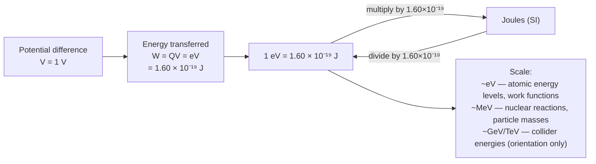

# The Electronvolt

## Core Idea

The electronvolt is a small, convenient unit of energy used for atomic and particle physics, equal to the kinetic energy gained by an electron accelerated through a [[Potential-Difference]] of one volt.

## Meaning

If a charge $Q$ moves through a potential difference $V$, the energy transferred is $W = QV$. For one electron ($Q = e = 1.60 \times 10^{-19}\ \text{C}$) through $1\ \text{V}$:

$$1\ \text{eV} = 1.60 \times 10^{-19}\ \text{J}$$

To convert: multiply electronvolts by $1.60 \times 10^{-19}$ to get joules; divide joules by the same factor to get electronvolts. The MeV ($10^6$ eV) is common in nuclear and particle physics.

## Everyday Intuition

Joules are clumsy for single particles, like measuring a grain of sand in tonnes; the electronvolt is a "right-sized" unit at the atomic scale.

## GCSE Foundation

- [[Potential-Difference]]
- [[Charge]]

## Why It Matters

Atomic [[Energy-Levels]], [[Work-Function]] values, [[Photon-Energy]] in spectra, and particle rest energies are all quoted in eV or MeV. Using eV avoids unwieldy powers of ten and links energy directly to accelerating voltages.

## Related Quantities

- [[Potential-Difference]]
- [[Charge]]

## Related Laws or Results

- [[Photoelectric-Equation]]

## Related Models

- Energy-conversion model $W = QV$.

## Representations

- Annotated conversion line between joules and electronvolts.

## Experiments or Observations

- [[Measuring-the-Planck-Constant]]

## Applications

- [[X-ray-Imaging]]
- [[PET-Scanning]]

## Frontier Links

- GeV and TeV scales at particle accelerators; orientation only.

## Common Mistakes

- Treating the electronvolt as a unit of charge or voltage rather than energy.
- Forgetting to convert eV to J before substituting into SI equations.

## Visuals

### Electronvolt: energy conversion and scale

*Figure: The electronvolt is the energy gained by one electron charge e accelerated through 1 V. Always convert to joules (multiply by 1.60 × 10⁻¹⁹) before substituting into SI equations.*
*Source: Authored for this vault (CC0). No external copyright.*

## Source Trace

- Source: OpenStax College Physics; HyperPhysics; IOPSpark
- OCR alignment: [[OCR-Physics-A-H556-Specification]]
