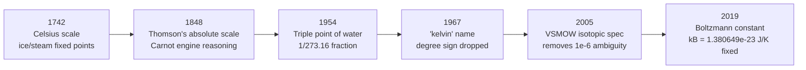

# The Kelvin

## Core Idea

The kelvin is the SI base unit of [[Thermodynamic-Temperature|thermodynamic temperature]]. Since 2019 it has been defined by fixing the **[[Boltzmann-Constant|Boltzmann constant]] $k_B$** — tying temperature directly to the average kinetic energy of particles, with no reference to water, ice, or any specific substance.

## Meaning

The current definition fixes:

$$k_B = 1.380\,649 \times 10^{-23} \text{ J K}^{-1} \text{ (exactly)}$$

Because the joule is built from kg, m, s, and the joule-per-kelvin is built from $k_B$, the kelvin is the temperature change that corresponds to a thermal energy change of $k_B$ per degree of freedom of a particle:

$$1 \text{ K} \leftrightarrow k_B \text{ joules per particle per degree of freedom}$$

The kelvin uses the same *size* of degree as the Celsius scale, so $\Delta T$ in K equals $\Delta T$ in °C; only the zero point differs ($0 \text{ K} = -273.15\,^\circ\text{C}$).

## Historical Development

The kelvin's history is bound up with the discovery that temperature has an **absolute zero** — a lowest possible value — and with the realisation that temperature is fundamentally a measure of microscopic energy.

**1. Early 18th century — empirical thermometry.** Fahrenheit (1724) and Celsius (1742) built thermometers using two reproducible fixed points (ice/water and water/steam) and linearly interpolated between them. Temperature was a purely empirical quantity — different thermometric materials gave different scales.

**2. 1848 — Lord Kelvin's absolute scale.** William Thomson (later Lord Kelvin) argued that Carnot's analysis of ideal heat engines implied a temperature scale independent of any substance:

$$\frac{Q_H}{Q_C} = \frac{T_H}{T_C}$$

This thermodynamic scale extrapolated linearly down to a true zero, where a Carnot engine extracts no heat. The numerical scale was anchored so that the kelvin degree matched the Celsius degree in size.

**3. 1859 — extrapolating to absolute zero.** Combining Charles's and Gay-Lussac's gas laws, an ideal gas at constant pressure has volume going linearly to zero at about $-273\,^\circ\text{C}$. This gave a practical experimental route to absolute zero — though no real gas reaches it (real gases liquefy first).

**4. 1954 — the triple-point definition.** The 10th CGPM chose a single fixed point on the thermodynamic scale: the **triple point of water** (where ice, liquid water, and water vapour coexist), at a defined pressure. The kelvin was defined as:

$$1 \text{ K} = \frac{1}{273.16} \text{ of the thermodynamic temperature of the triple point of water}$$

The triple point is sharper than the ice point or boiling point because it occurs at a unique pressure (611.657 Pa) and temperature (273.16 K = 0.01 °C) — no calibration of pressure is needed.

**5. 1967 — "kelvin" replaces "degree Kelvin".** The CGPM dropped the "degree" and the ° sign, so temperatures are now written as $300 \text{ K}$, not $300\,^\circ\text{K}$.

**6. 2005 — isotopic specification of water.** Even purified water has slightly different triple-point temperatures depending on its isotopic composition (the ratio of $^{1}\text{H}$, $^{2}\text{H}$, $^{16}\text{O}$, $^{17}\text{O}$, $^{18}\text{O}$). The CIPM specified Vienna Standard Mean Ocean Water (VSMOW) as the reference, removing a $10^{-6}$-level ambiguity.

**7. 2019 — the Boltzmann constant definition.** The 26th CGPM redefined the kelvin by fixing $k_B$. The triple point of water is no longer the definition — it becomes a **measured** quantity (still very close to 273.16 K, but with experimental uncertainty). Temperature is now tied directly to energy.

The realisation path went through several primary thermometers:

- **Acoustic gas thermometry** — measures the speed of sound in argon to extract $k_B$
- **Dielectric-constant gas thermometry** — uses helium's polarisability
- **Johnson noise thermometry** — measures thermal voltage noise across a resistor
- **Radiation thermometry** — uses Planck's law for blackbody radiation

## Everyday Intuition

Room temperature is about 293 K (20 °C); ice melts at 273.15 K; water boils at 373.15 K; the cosmic microwave background is at 2.73 K. The kelvin is *the same size* as the Celsius degree — they only differ in where they call zero.

## GCSE Foundation

- [[Temperature]]
- [[Internal-Energy]]

## Why It Matters

Tying the kelvin to $k_B$ links temperature directly to **energy per particle**, the way temperature actually appears in statistical mechanics and chemistry ($E \sim k_B T$, $pV = Nk_BT$). It also makes very low and very high temperature ranges accessible: at low temperatures the triple-point realisation becomes useless, but Johnson noise and radiation thermometry remain meaningful.

## Related Quantities

- [[Thermodynamic-Temperature]]
- [[Internal-Energy]]
- [[Pressure]]
- [[Boltzmann-Constant]]

## Related Laws or Results

- [[Ideal-Gas-Equation]]
- [[Stefan-Boltzmann-Law]]
- [[Wien-Displacement-Law]]

## Related Models

- [[Ideal-Gas-Model]]
- [[Kinetic-Theory]]

## Representations

- [[Pressure-Temperature-Graph]]
- [[PV-Diagram]]

## Experiments or Observations

- Triple-point-of-water cell (still a standard realisation)
- Acoustic gas thermometer
- Johnson noise thermometer
- Radiation thermometry — see [[Blackbody-Radiation]]

## Applications

- All thermodynamics — pressure, volume, temperature relationships
- Climate science (global mean temperature anomalies of ~1 K matter enormously)
- Cryogenics (superconductors, liquid helium at 4.2 K)
- Astrophysics — stellar temperatures, CMB at 2.73 K

## Frontier Links

- See [[Quantum-Mechanics-Map]] — at very low temperatures (mK and below) quantum effects dominate; Bose-Einstein condensates and superfluids appear
- See [[Cosmology-Map]] — the cosmic microwave background temperature of 2.73 K is one of the most precisely measured numbers in cosmology

## Common Mistakes

- Using °C in equations that require K (e.g. ideal gas, Stefan-Boltzmann) — these need absolute temperature
- Writing $300\,^\circ\text{K}$ — kelvin has no degree sign since 1967
- Believing the kelvin is still defined by the triple point of water (it has not been since 2019)
- Treating absolute zero as a temperature that can be reached (it cannot — third law of thermodynamics)

## Visuals

### Kelvin redefinitions timeline

*Figure: The kelvin moved from empirical fixed points to a single triple-point reference and finally to the energy–temperature relation through Boltzmann's constant.*
*Source: Authored for this vault (CC0). No external copyright.*

### From Wikipedia

<!-- wiki-images: yes -->

#### Temperature scales compared

![[_attachments/04_Concepts/The-Kelvin--wiki-temperature-scales-comparison.svg]]
*Figure: comparison of Kelvin, Celsius, Fahrenheit and Rankine — the kelvin shares the Celsius degree size but is offset so its zero is absolute zero.*
*Source: Wikimedia Commons — [Temperature-scales-comparison.svg](https://commons.wikimedia.org/wiki/File:Temperature-scales-comparison.svg). Retrieved 2026-05-20.*

#### William Thomson, Baron Kelvin

![[_attachments/04_Concepts/The-Kelvin--wiki-baron-kelvin-1906.jpg]]
*Figure: William Thomson (Lord Kelvin), the unit's eponym, who derived the absolute temperature scale from Carnot's analysis of heat engines in 1848.*
*Source: Wikimedia Commons — [Baron Kelvin 1906.jpg](https://commons.wikimedia.org/wiki/File:Baron_Kelvin_1906.jpg). Retrieved 2026-05-20.*

#### Celsius and Kelvin scales side-by-side

![[_attachments/04_Concepts/The-Kelvin--wiki-celsiuskelvinthermometer.jpg]]
*Figure: a thermometer showing both scales — the kelvin's zero (absolute zero) sits at -273.15 °C; the degree size is identical.*
*Source: Wikimedia Commons — [CelsiusKelvinThermometer.jpg](https://commons.wikimedia.org/wiki/File:CelsiusKelvinThermometer.jpg). Retrieved 2026-05-20.*

## Source Trace

- Source: BIPM SI Brochure 9th edition (2019); NPL temperature standards notes; Wikipedia "Kelvin" and "International Temperature Scale of 1990" (navigation only) — no copied text
- Section/Page: OCR alignment: [[OCR-Physics-A-H556-Specification]] (Module 5, Newtonian world and astrophysics — thermal physics)
