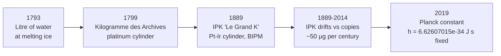

# The Kilogram

## Core Idea

The kilogram is the SI base unit of [[Mass]]. Since 2019 it has been defined by fixing the numerical value of the [[Plancks-Constant|Planck constant]] $h$, ending more than a century in which the kilogram was a single physical object kept in a vault near Paris.

## Meaning

The current (post-2019) definition fixes:

$$h = 6.626\,070\,15 \times 10^{-34} \text{ J s} = 6.626\,070\,15 \times 10^{-34} \text{ kg m}^{2}\,\text{s}^{-1} \text{ (exactly)}$$

Because the joule-second contains a kilogram, fixing $h$ — together with the already-fixed [[The-Metre|metre]] and [[The-Second|second]] — fixes the kilogram. The kilogram is now the mass that, when combined with the defined values of $h$, $c$, and $\Delta\nu_\text{Cs}$, gives the correct value of $h$ in SI units.

The kilogram is the only base unit whose ordinary multiple (the gram) is *smaller* than the named unit. This is a fossil of its history.

## Historical Development

The kilogram's story is unusual: for 130 years it was defined by **a single lump of metal**, and physicists tolerated this only because no better realisation existed.

**1. 1793 — the *grave* and the litre of water.** The first revolutionary French definition tied mass to length: one kilogram was the mass of one cubic decimetre ($1 \text{ dm}^3 = 1 \text{ L}$) of pure water at the temperature of melting ice. This locked the kilogram to the [[The-Metre|metre]].

**2. 1799 — the *Kilogramme des Archives*.** A platinum cylinder was made whose mass equalled, as accurately as could then be measured, the mass of one litre of water at $4\,^\circ\text{C}$ (the temperature of maximum density). This solid artefact replaced the water definition in practice — water is hard to keep pure and at the right temperature.

**3. 1889 — the International Prototype of the Kilogram (IPK).** Under the *Mètre Convention*, a new cylinder of 90% platinum / 10% iridium, 39 mm tall and 39 mm in diameter, was declared *the* kilogram. Forty official copies were sent to member states. The IPK — affectionately "Le Grand K" — was sealed under three nested bell jars at the BIPM in Sèvres.

**4. 1889–2019 — a worrying drift.** When the IPK was compared with its copies in 1889, 1948, 1989, and 2014, the copies appeared to gain mass (or the IPK to lose mass) by roughly $50 \text{ μg}$ over a century — equivalent to about $5 \times 10^{-8}$ of the kilogram. Whether the prototype was losing material to outgassing or the copies were absorbing contaminants, no one could be sure. The base unit of mass for the whole world was provably drifting against itself.

**5. The watt balance / Kibble balance route.** Beginning in the 1970s, Bryan Kibble at NPL (UK) developed a device that compares mechanical power $mgv$ to electrical power $UI$, both measurable in terms of quantum electrical standards (Josephson and quantum Hall effects). This let physicists measure $h$ in terms of a chosen mass — or, run backwards, *fix* $h$ and derive the mass.

**6. The silicon-sphere / X-ray crystal density route.** A parallel project (the Avogadro Project) machined nearly perfect single-crystal silicon spheres and counted the atoms in them via X-ray crystallography. This gave an independent path to the same redefinition.

**7. 2019 — the SI redefinition.** On 20 May 2019 (World Metrology Day), the kilogram was redefined by fixing $h$. The IPK was retired as the defining standard. For the first time in 130 years, the kilogram no longer depends on a particular object.

## Everyday Intuition

A litre of water has a mass of very nearly 1 kg (the original definition); a bag of sugar is typically 1 kg; an apple is about 0.1 kg. The kilogram was chosen at human scale because it had to be physically handled, weighed, and copied.

## GCSE Foundation

- [[Mass]]
- [[Weight]]

## Why It Matters

A drifting prototype meant the SI mass scale was tied to one physical object. Now, any lab with a Kibble balance or a silicon sphere can realise the kilogram from first principles, traceable to $h$. This matters for pharmaceuticals, semiconductor manufacturing, and any field where milligram or microgram accuracy is required.

## Related Quantities

- [[Mass]]
- [[Force]]
- [[Weight]]
- [[Density]]

## Related Laws or Results

- [[Newton-Second-Law]]
- [[Plancks-Constant]]

## Related Models

- [[Point-Mass-Model]]

## Representations

- [[Free-Body-Diagram]]

## Experiments or Observations

- Kibble (watt) balance — compares mechanical and electrical power
- X-ray crystal density method on $^{28}\text{Si}$ spheres

## Applications

- Pharmaceutical dosing
- Semiconductor process control
- Trade and commerce — every weighing scale is ultimately calibrated against the SI kilogram

## Frontier Links

- See [[Quantum-Mechanics-Map]] — the Josephson and quantum Hall effects underpin modern electrical standards that now realise the kilogram

## Common Mistakes

- Calling mass "weight" — mass is in kg, [[Weight]] is in newtons
- Believing the kilogram is still a lump of metal in Paris (it has not been since 2019)
- Confusing the prototype mass change with the *unit* changing — until 2019, *by definition* the IPK was exactly 1 kg; the copies appeared to change

## Visuals

### Kilogram redefinitions timeline

*Figure: For 130 years the kilogram was a single platinum-iridium cylinder; the 2019 redefinition replaced it with a fixed numerical value of the Planck constant.*
*Source: Authored for this vault (CC0). No external copyright.*

### From Wikipedia

<!-- wiki-images: yes -->

#### International Prototype of the Kilogram (Le Grand K)

![[_attachments/04_Concepts/The-Kilogram--wiki-international-prototype-of-the-kilogram-.jpg]]
*Figure: the IPK — a 90% Pt / 10% Ir cylinder kept under three nested bell jars at the BIPM in Sèvres. From 1889 until 2019, *this* was, by definition, one kilogram.*
*Source: Wikimedia Commons — [International prototype of the kilogram aka Le Grand K.jpg](https://commons.wikimedia.org/wiki/File:International_prototype_of_the_kilogram_aka_Le_Grand_K.jpg). Retrieved 2026-05-20.*

#### Historic cast-iron commercial weights

![[_attachments/04_Concepts/The-Kilogram--wiki-poids-fonte-5-kg-a-2-hg-02.jpg]]
*Figure: 19th-century French commercial weights (5 kg down to 2 hg) — descendants of the original metric system rolled out alongside the metre and the kilogram.*
*Source: Wikimedia Commons — [Poids_fonte_5_kg_à_2_hg_02.jpg](https://commons.wikimedia.org/wiki/File:Poids_fonte_5_kg_à_2_hg_02.jpg). Retrieved 2026-05-20.*

## Source Trace

- Source: BIPM SI Brochure 9th edition (2019); NIST Kibble Balance documentation; Wikipedia "Kilogram" and "International Prototype of the Kilogram" (navigation only) — no copied text
- Section/Page: OCR alignment: [[OCR-Physics-A-H556-Specification]] (Module 2, foundations of physics)
