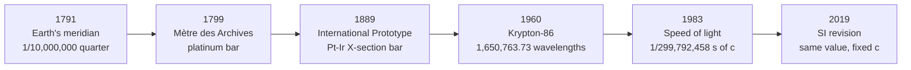

# The Metre

## Core Idea

The metre is the SI base unit of length. Since 1983 it has been defined by fixing the [[Speed-of-Light]] in vacuum, so the metre is now the distance light travels in a tiny, exact fraction of a second.

## Meaning

The current (post-2019) definition fixes $c = 299\,792\,458 \text{ m s}^{-1}$ **exactly**. The metre is then the length such that this number works out:

$$1 \text{ m} = \text{distance light travels in vacuum in } \frac{1}{299\,792\,458}\text{ s}$$

Because the metre is now derived from the [[Second]], any improvement in time-keeping automatically improves length measurement. Length is no longer tied to a physical object that can be lost, damaged, or drift over time.

## Historical Development

The metre's definition has been re-built several times, each time tying it more tightly to a stable physical phenomenon and away from human-scale artefacts.

**1. Pre-1791 — local units.** Before the French Revolution, length units (the *toise*, *pied du roi*, English foot, Spanish *vara*) varied from town to town and depended on locally kept reference bars. Trade, science, and surveying all suffered.

**2. 1791 — the meridian definition.** The French Academy of Sciences proposed a unit derived from the Earth itself: **one ten-millionth of the distance from the North Pole to the equator, along the meridian passing through Paris**:

$$1 \text{ m} = \frac{1}{10\,000\,000} \times \text{(quarter of Earth's meridian)}$$

Astronomers Jean-Baptiste Delambre and Pierre Méchain spent seven years (1792–1799) triangulating the meridian arc between Dunkirk and Barcelona to fix the value.

**3. 1799 — the *Mètre des Archives*.** A platinum bar cut to the surveyed length was deposited in the French National Archives. This was the first physical "standard metre". Later, more careful geodesy showed that the Earth's quadrant is closer to $10\,002\,290$ m — the surveyors had been very slightly off, but the bar's length was kept fixed.

**4. 1889 — the International Prototype Metre.** With the 1875 *Mètre Convention*, an updated bar made of 90% platinum and 10% iridium, with an X-shaped cross-section to resist bending, was adopted. The metre was the distance between two scratch marks on this bar at $0\,^\circ\text{C}$. Identical copies were distributed to member states; the master lived (and still lives) at the BIPM near Paris.

**5. 1960 — the krypton-86 definition.** Atomic spectroscopy gave a more reproducible standard than any metal bar. The metre was redefined as:

$$1 \text{ m} = 1\,650\,763.73 \text{ wavelengths of the orange-red line of }^{86}\text{Kr}$$

This freed length from a single artefact: any well-equipped lab could now realise the metre with a krypton lamp.

**6. 1983 — the speed-of-light definition.** As lasers and atomic clocks made time measurement extraordinarily precise, the most stable strategy was to *fix* the speed of light and derive the metre from it:

$$1 \text{ m} = \text{distance light travels in } \tfrac{1}{299\,792\,458} \text{ s}$$

**7. 2019 — SI redefinition.** The metre's definition was re-worded for consistency with the other base units, but the numerical value of $c$ and the practical realisation are unchanged. Length is now permanently anchored to the [[Second]] and a fixed [[Fundamental-Constants|fundamental constant]].

## Everyday Intuition

A door is about 2 m tall; a stride is roughly 1 m; a credit card is about 0.085 m wide. The metre was deliberately chosen to be a human-scale unit — small enough for everyday objects, large enough for buildings and short journeys.

## GCSE Foundation

- [[Distance]]
- [[Length]]

## Why It Matters

Defining the metre from a fundamental constant means **every laboratory in the world realises the same metre to within experimental uncertainty, without comparing bars**. Modern technologies — GPS, semiconductor lithography, gravitational-wave interferometry — all rely on metre realisations traceable to $c$.

## Related Quantities

- [[Distance]]
- [[Displacement]]
- [[Wavelength]]
- [[Speed-of-Light]]

## Related Laws or Results

- [[Wave-Equation]]

## Related Models

- [[Constant-Acceleration-Model]]

## Representations

- [[Metric-Prefixes]]

## Experiments or Observations

- Time-of-flight laser ranging (lunar laser ranging realises the metre to millimetre precision)
- Optical frequency comb metrology
- Michelson interferometry — see [[Michelson-Interferometer]]

## Applications

- GPS positioning depends on light-travel-time measurements
- LIGO detects displacements far smaller than a proton's diameter using the same speed-of-light anchor
- Semiconductor chip features (now a few nm) require metre realisations stable to many decimal places

## Frontier Links

- See [[Quantum-Mechanics-Map]] — atomic clocks and optical lattice clocks push the precision behind today's metre
- See [[Relativity-Map]] — fixing $c$ as a constant is a deep consequence of special relativity

## Common Mistakes

- Believing the metre is still a bar in Paris (it has not been since 1960)
- Confusing the *definition* (light in vacuum) with the *realisation* (lasers, interferometers, optical combs)
- Forgetting that "fixing $c$" means $c$ is now defined, not measured — so its uncertainty is zero by convention

## Visuals

### Metre redefinitions timeline

*Figure: Each redefinition moved the metre further from a single physical artefact and closer to a reproducible natural constant.*
*Source: Authored for this vault (CC0). No external copyright.*

### From Wikipedia

<!-- wiki-images: yes -->

#### Metric standards Rijksmuseum

![[_attachments/04_Concepts/The-Metre--wiki-metric-standards-rijksmuseum.jpg]]
*Figure: early national metric standards (metre and kilogram references) displayed at the Rijksmuseum, Amsterdam.*
*Source: Wikimedia Commons — [Metric_standards_Rijksmuseum.jpg](https://commons.wikimedia.org/wiki/File:Metric_standards_Rijksmuseum.jpg). Retrieved 2026-05-20.*

## Source Trace

- Source: BIPM SI Brochure 9th edition (2019); Wikipedia "Metre" and "History of the metre" (navigation only) — no copied text
- Section/Page: OCR alignment: [[OCR-Physics-A-H556-Specification]] (Module 2, foundations of physics)
