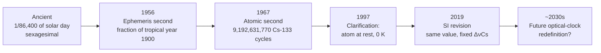

# The Second

## Core Idea

The second is the SI base unit of [[Time]]. Since 1967 it has been defined by **counting microwave oscillations of caesium-133 atoms** — making the second the most precisely realised quantity in all of science.

## Meaning

The current definition fixes the caesium hyperfine frequency exactly:

$$\Delta\nu_\text{Cs} = 9\,192\,631\,770 \text{ Hz} \text{ (exactly)}$$

So:

$$1 \text{ s} = 9\,192\,631\,770 \text{ periods of the radiation from the }^{133}\text{Cs hyperfine transition (in the ground state, at rest, at 0 K)}$$

Modern caesium fountain clocks realise the second to about $1$ part in $10^{16}$; optical lattice clocks reach $10^{-18}$ — they would gain or lose less than a second over the age of the universe.

## Historical Development

The second is the oldest base unit conceptually (it goes back to ancient astronomy), but the *modern* second is one of the youngest — and the most precise.

**1. Ancient — sexagesimal subdivisions of the day.** Babylonian and Egyptian astronomers divided day and night into 12 hours each. The hour was later subdivided into 60 *minutes* ("first small parts") and the minute into 60 *seconds* ("second small parts"). Hence the name. The second was at first a purely numerical idea, not something a clock could actually display.

**2. 17th–19th century — the mean solar second.** Pendulum clocks (Huygens, 1656) and later marine chronometers could keep time to seconds across hours and days. The second was understood as:

$$1 \text{ s} = \frac{1}{86\,400} \text{ of a mean solar day}$$

with $86\,400 = 24 \times 60 \times 60$. This was the definition adopted into the SI system at its founding.

**3. The Earth turns out to be a bad clock.** From the late 19th century, careful comparison of astronomical observations with the best pendulum and quartz clocks revealed that the Earth's rotation is **not** uniform: it slows down due to tidal friction, wobbles seasonally, and jumps unpredictably. A unit of time tied to the solar day inherits all this noise.

**4. 1956 — the ephemeris second.** The CGPM redefined the second using the Earth's *orbit* (slower-changing than its spin):

$$1 \text{ s} = \frac{1}{31\,556\,925.9747} \text{ of the tropical year 1900}$$

This was more uniform but required astronomers to fit decades of planetary observations to realise.

**5. 1967 — the atomic second.** Caesium beam clocks built by Louis Essen at NPL (1955) and refined through the 1960s could outperform any astronomical determination. The 13th CGPM redefined the second as:

$$1 \text{ s} = 9\,192\,631\,770 \text{ periods of the }^{133}\text{Cs hyperfine transition}$$

The number was chosen to match the ephemeris second as closely as could then be measured, so existing time series remained continuous.

**6. 1997 — refinement.** The definition was clarified to require the caesium atom to be **at rest** and at **0 K** (i.e. extrapolated to remove thermal motion and blackbody radiation shifts), formalising what laboratories were already doing.

**7. 2019 — SI revision.** The wording was harmonised with the other base units by stating $\Delta\nu_\text{Cs}$ as a fixed numerical value. Practically, nothing changed; conceptually, the second now sits as the **anchor** of the SI: the metre and the kilogram are both defined through it.

**8. Now and next — optical clocks.** Strontium and ytterbium optical-lattice clocks have already surpassed caesium by two orders of magnitude. The CGPM is preparing a future redefinition of the second based on an optical transition — likely some time in the 2030s.

## Everyday Intuition

A heartbeat is about 1 s; a slow breath is about 4 s; the second hand of an analogue clock advances once per second. Humans evolved to perceive event durations on roughly this scale, which is why the unit feels natural.

## GCSE Foundation

- [[Time]]
- [[Frequency]]

## Why It Matters

The second is the most accurately realised quantity in physics — by a wide margin. GPS, the internet, financial trading, electrical-grid synchronisation, and gravitational-wave detection all depend on disseminated atomic time. Because the [[The-Metre|metre]] is now defined through the second, time precision sets length precision.

## Related Quantities

- [[Time]]
- [[Period]]
- [[Frequency]]
- [[Angular-Velocity]]

## Related Laws or Results

- [[Speed-Equation]]

## Related Models

- [[Simple-Harmonic-Oscillator]]

## Representations

- [[Displacement-Time-Graph]]
- [[Velocity-Time-Graph]]

## Experiments or Observations

- Caesium fountain clock (NPL CsF2, NIST-F2)
- Optical lattice clock (strontium, ytterbium)
- Pulsar timing — uses millisecond pulsars as natural clocks for tests of general relativity

## Applications

- GPS satellites carry atomic clocks; positioning errors scale with timing errors
- Network Time Protocol (NTP) and PTP keep global computer systems synchronised
- VLBI radio astronomy combines telescopes worldwide using common time references
- LIGO timestamps strain data to nanosecond precision to localise gravitational-wave sources

## Frontier Links

- See [[Relativity-Map]] — atomic clocks at different altitudes tick at measurably different rates (gravitational time dilation)
- See [[Quantum-Mechanics-Map]] — the caesium hyperfine transition is a quantum mechanical resonance; future optical clocks exploit narrower atomic lines

## Common Mistakes

- Saying "one second is 1/60 of a minute" — circular, since the minute is defined as 60 s
- Believing the second is still defined astronomically (it has not been since 1967)
- Confusing the **definition** (a count of caesium oscillations) with **realisation** (the actual physical clock, which has its own uncertainties)

## Visuals

### Second redefinitions timeline

*Figure: Each redefinition moved from astronomy toward atomic and now optical resonances, gaining several orders of magnitude in precision each time.*
*Source: Authored for this vault (CC0). No external copyright.*

### From Wikipedia

<!-- wiki-images: yes -->

#### Pendulum clock escapement

![[_attachments/04_Concepts/The-Second--wiki-clock-pendulum.gif]]
*Figure: animation of a pendulum clock escapement — the mechanism that defined "one second" for nearly three centuries before atomic clocks.*
*Source: Wikimedia Commons — [Clock-pendulum.gif](https://commons.wikimedia.org/wiki/File:Clock-pendulum.gif). Retrieved 2026-05-20.*

#### Marine sandglass

![[_attachments/04_Concepts/The-Second--wiki-marine-sandglass-mmm.jpg]]
*Figure: a marine sandglass — early sailors timed events in fractions of a watch using sandglasses of fixed flow time.*
*Source: Wikimedia Commons — [Marine sandglass MMM.jpg](https://commons.wikimedia.org/wiki/File:Marine_sandglass_MMM.jpg). Retrieved 2026-05-20.*

## Source Trace

- Source: BIPM SI Brochure 9th edition (2019); NPL "History of the second"; Wikipedia "Second" and "History of timekeeping devices" (navigation only) — no copied text
- Section/Page: OCR alignment: [[OCR-Physics-A-H556-Specification]] (Module 2, foundations of physics)
