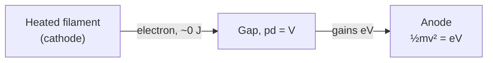

# Thermionic Emission

## Core Idea

Thermionic emission is the release of electrons from a hot metal surface. Heating supplies enough energy to overcome the metal's [[Work-Function]], freeing conduction electrons into the surrounding vacuum.

## Meaning

In an electron gun, a small filament is heated by a current; nearby electrons gain enough thermal energy to escape the metal. An anode at a positive potential V relative to the filament then accelerates the freed electrons. If an electron starts essentially at rest and the tube is evacuated, the work done by the electric field equals the kinetic energy gained:

$$\tfrac{1}{2}\,m v^{2} = e V$$

so

$$v = \sqrt{\dfrac{2 e V}{m}}.$$

Symbols and units:

- e = elementary charge ≈ 1.60 × 10⁻¹⁹ C
- V = accelerating potential difference between cathode and anode, in volts (V)
- m = electron mass ≈ 9.11 × 10⁻³¹ kg
- v = final speed of the electron, in metres per second (m s⁻¹)

Conditions: vacuum, single electron at rest at the cathode, non-relativistic (V ≲ 10 kV so v ≪ c).

For example, V = 1.0 kV gives v ≈ 1.9 × 10⁷ m s⁻¹ — about 6 % of the speed of light.

## Everyday Intuition

Think of a saucepan of water: only the most energetic molecules at the surface have enough energy to evaporate. In a hot metal, only the most energetic electrons escape into the vacuum.

## GCSE Foundation

- [[Energy-Transfer]]
- [[Static-Electricity]]

## Why It Matters

Thermionic emission gave Thomson, and later experimenters, a reliable source of electron beams to study. Combined with deflection in an [[Electric-Field]] and a [[Magnetic-Field]], it underpins the measurement of [[Specific-Charge]] e/m. Electron guns based on thermionic emission are still used in cathode-ray tubes and [[Electron-Microscopes]].

## Related Quantities

- [[Work-Function]]
- [[Specific-Charge]]
- [[The-Electronvolt]]
- [[Kinetic-Energy]]

## Related Laws or Results

- [[Photoelectric-Equation]] (analogous energy-balance idea using light instead of heat)

## Related Models

- [[The-Nuclear-Atom]]

## Representations

- Sketch of filament, cylindrical anode with hole, and emerging electron beam.

## Experiments or Observations

- [[Cathode-Rays]]
- [[Millikan-Oil-Drop-Experiment]]

## Applications

- [[Electron-Microscopes]]
- Vacuum tubes, old CRT televisions, X-ray tubes.

## Frontier Links

- [[Quantum-Mechanics-Map]]

## Common Mistakes

- Treating the filament current as the beam current — the filament heats the cathode; the **beam** is the accelerated electrons.
- Forgetting to convert kV to V before substituting.
- Using ½mv² = eV at very high V where relativistic effects matter.
- Confusing thermionic emission (energy from heat) with photoemission (energy from photons in the [[Photoelectric-Effect]]).

## Visuals

### Electron gun energy balance

*Figure: An electron released from the hot cathode gains kinetic energy eV crossing the accelerating gap.*
*Source: Authored for this vault (CC0). No external copyright.*

### From Wikimedia

<!-- wiki-images: yes -->

#### Thermionic vacuum tube
![[_attachments/04_Concepts/Thermionic-Emission--wiki-vacuum-tube-diode.jpg]]
*Figure: A thermionic vacuum diode — a current through the internal filament heats the cathode so electrons are emitted into the evacuated glass envelope.*
*Source: Wikimedia Commons — [EA52 vacuum tube diode.jpg](https://commons.wikimedia.org/wiki/File:EA52_vacuum_tube_diode.jpg) — CC BY-SA 4.0 — Mister rf. Retrieved 2026-06-27.*

## Source Trace

- Source: [[AQA-Physics-7407-7408-Specification]] §3.12.1
- Public reference: HyperPhysics; OpenStax College Physics
