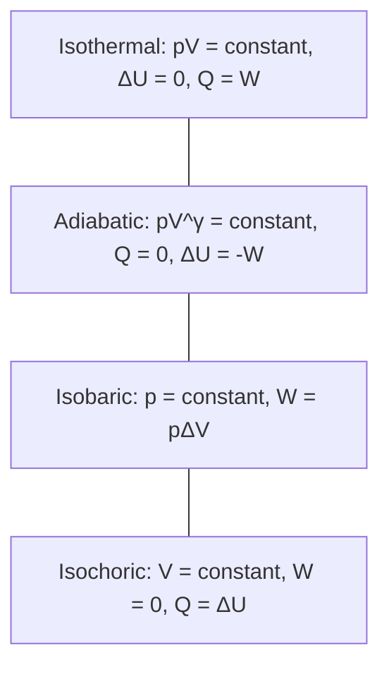

# Thermodynamic Processes

## Core Idea

A thermodynamic process is a way a gas can change state from one set of $(p, V, T)$ values to another. Four idealised processes — isothermal, adiabatic, constant-pressure (isobaric) and constant-volume (isochoric) — let you decompose any real engine cycle into stages you can analyse with the [[First-Law-of-Thermodynamics]].

## Meaning

Each process pins down one variable or one energy flow, so the [[First-Law-of-Thermodynamics]] $Q = \Delta U + W$ simplifies.

### Isothermal (constant $T$)

- $pV = \text{constant}$ (from [[Ideal-Gas-Equation]]).
- $\Delta U = 0$ because internal energy of an ideal gas depends only on temperature.
- First law: $Q = W$. All heat flows in as expansion work, or all compression work leaves as heat.
- Must be slow so the gas stays in thermal contact with its surroundings.

### Adiabatic (no heat exchange)

- $pV^{\gamma} = \text{constant}$, where $\gamma = c_p / c_V$ is the ratio of specific heat capacities (about 1.40 for air).
- $Q = 0$ because the gas is insulated or the change is fast.
- First law: $\Delta U = -W$. If the gas expands ($W > 0$) it cools; if compressed, it heats up — that's how a diesel engine ignites fuel without a spark.

### Constant pressure (isobaric)

- $V/T = \text{constant}$.
- $W = p\Delta V$ — the expansion work is simply pressure times volume change.
- First law: $Q = \Delta U + p\Delta V$. Some of the supplied heat goes into raising temperature, the rest into pushing the piston.

### Constant volume (isochoric)

- $p/T = \text{constant}$.
- $W = 0$ — no piston movement, no work done.
- First law: $Q = \Delta U$. All heat goes into internal energy and temperature.

## Everyday Intuition

Pumping up a bicycle tyre quickly is roughly adiabatic — the pump barrel feels warm because compression work has nowhere to go but internal energy. Letting the tyre slowly leak overnight is closer to isothermal — pressure drops while the gas stays at room temperature.

## GCSE Foundation

- [[Energy-Transfer]] — heating, working, and conservation of energy.
- [[Pressure]] and [[Volume]] of gases.
- [[Temperature]] and the absolute scale.

## Why It Matters

Every real engine, fridge, and heat pump is built from sequences of these four processes (or smooth versions of them). To predict efficiency, work output, or heat rejection, you analyse each leg of the cycle as one of these idealised processes, then add the results.

## Related Quantities

- [[Pressure]]
- [[Volume]]
- [[Temperature]]
- [[Internal-Energy]]
- [[Work]]

## Related Laws or Results

- [[First-Law-of-Thermodynamics]]
- [[Ideal-Gas-Equation]]
- [[Second-Law-of-Thermodynamics]]

## Related Models

- [[Ideal-Gas-Model]]
- [[Kinetic-Theory-of-Gases]]

## Representations

- [[pV-Diagram]]

## Experiments or Observations

- Bicycle pump warming during fast compression (adiabatic).
- Slow expansion of gas in a syringe with a thermometer reading.

## Applications

- [[Engine-Cycles]]
- [[Reversed-Heat-Engines]]

## Frontier Links

- Real processes are irreversible — entropy increases, a topic explored in statistical mechanics.

## Common Mistakes

- Thinking "adiabatic" means "constant temperature". It means no heat flow — temperature usually changes.
- Forgetting $\Delta U = 0$ for isothermal processes, leading to wrong work calculations.
- Using $W = p\Delta V$ for non-isobaric processes — pressure must be constant for that formula.
- Confusing $\gamma$ with $\gamma$ from gravitation or other contexts.

## Visuals

### Four idealised processes on a pV diagram

*Figure: The four reference processes and the simplified first law for each.*
*Source: Authored for this vault (CC0). No external copyright.*

## Source Trace

- Source: [[AQA-Physics-7407-7408-Specification]] §3.11.2 (Engineering Physics — Thermodynamics)
- Public source: HyperPhysics (thermodynamic processes); OpenStax College Physics §15.2–15.5.
- Section/Page: AQA specification §3.11.2.1
