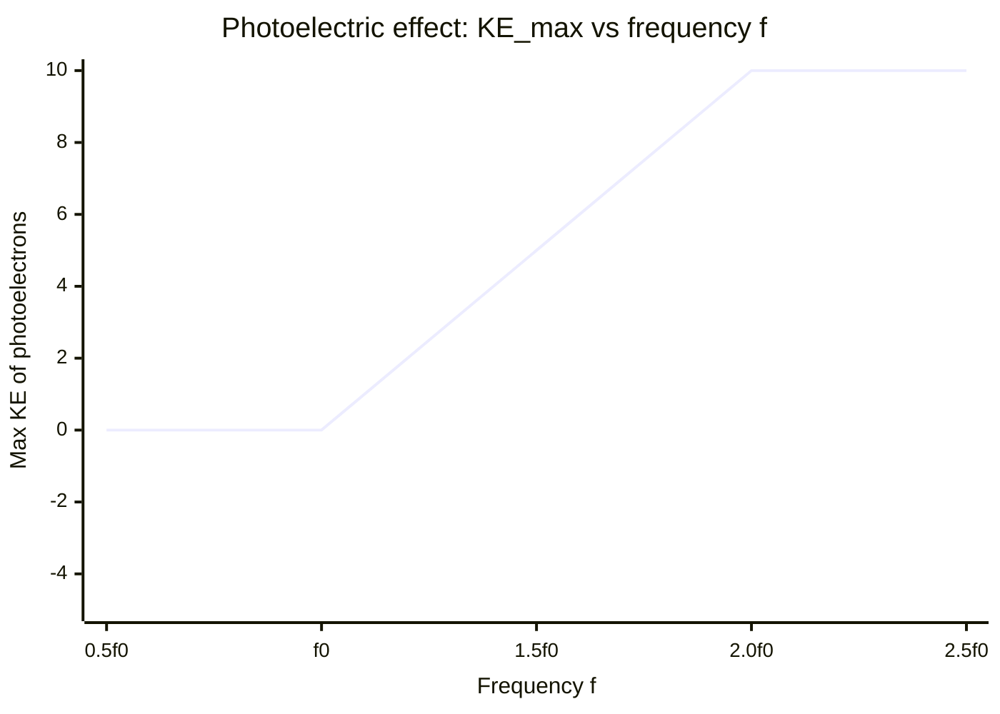

# Threshold Frequency

## Core Idea

The threshold frequency is the lowest frequency of electromagnetic radiation that can just release electrons from a given metal surface by the [[Photoelectric-Effect]].

## Meaning

Photoemission needs each photon to carry at least the [[Work-Function]] energy $\phi$. The threshold frequency $f_0$ is where photon energy exactly equals the work function:

$$hf_0 = \phi \quad\Rightarrow\quad f_0 = \frac{\phi}{h}$$

Below $f_0$ no electrons are emitted, no matter how intense the light or how long it shines. At or above $f_0$ emission is essentially instantaneous, and any extra energy appears as electron kinetic energy via the [[Photoelectric-Equation]].

## Everyday Intuition

A coin-operated machine ignores any coin below a set value; many small coins still will not work. Only a coin of sufficient value triggers it — like a photon at or above threshold frequency.

## GCSE Foundation

- [[Frequency]]

## Why It Matters

The existence of a sharp threshold frequency, independent of intensity, was direct evidence for the photon model and against the classical wave model of light. Each metal has its own $f_0$ set by its [[Work-Function]].

## Related Quantities

- [[Frequency]]
- [[Photon-Energy]]

## Related Laws or Results

- [[Photoelectric-Equation]]

## Related Models

- Photon model of light.

## Representations

- Graph of maximum kinetic energy against frequency: the $x$-intercept is $f_0$.

## Experiments or Observations

- [[Measuring-the-Planck-Constant]]

## Applications

- [[Medical-Imaging]]

## Frontier Links

- Photodetector and solar-cell spectral response; orientation only.

## Common Mistakes

- Believing low-frequency light eventually frees electrons if bright enough (it never does).
- Confusing threshold frequency with the work function (one is a frequency, the other an energy).

## Visuals

### Maximum KE vs frequency graph: threshold frequency f₀

*Figure: Below f₀ (threshold frequency) no electrons are emitted regardless of intensity. At and above f₀, KE_max rises linearly with f; the gradient equals the Planck constant h. The x-intercept is f₀ = φ/h.*
*Source: Authored for this vault (CC0). No external copyright.*

## Source Trace

- Source: OpenStax College Physics; HyperPhysics; IOPSpark
- OCR alignment: [[OCR-Physics-A-H556-Specification]]
