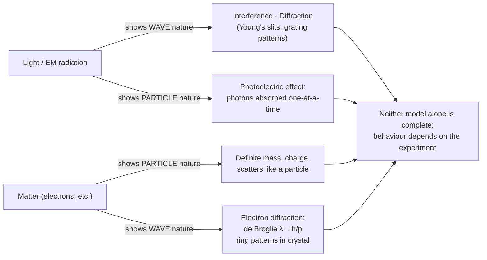

# Wave-Particle Duality

## Core Idea

Wave-particle duality is the principle that both light and matter exhibit wave-like and particle-like behaviour, depending on how they are observed, and neither picture alone is complete.

## Meaning

Classical physics treated light as a wave and electrons as particles. But the [[Photoelectric-Effect]] and the photon model show light behaving as discrete particles, while [[Interference]] and [[Diffraction]] show it behaving as a wave. Light is therefore both — its nature depends on the experiment.

Louis de Broglie proposed that this duality is universal: any particle with momentum $p$ has an associated wavelength given by the [[De-Broglie-Equation]] $\lambda = h/p$, where $h$ is the Planck constant. This prediction was confirmed by electron diffraction: a beam of electrons passed through a thin crystal produces a diffraction pattern just like X-rays, demonstrating that matter has wave properties.

The de Broglie wavelength is extremely small for everyday objects (because their momentum is huge), which is why we never notice the wave nature of a thrown ball. It becomes significant only for very small particles such as electrons. Whether wave or particle behaviour shows up depends on the scale and the measurement — a deep idea that points towards quantum mechanics.

## Everyday Intuition

There is no everyday object that obviously behaves both as a wave and a particle, which is exactly why this idea feels strange — duality only reveals itself at the atomic scale, far from human-sized experience.

## GCSE Foundation

- [[Waves-GCSE|Waves]]
- [[Atomic-Structure]]
- [[Electromagnetic-Spectrum]]

## Why It Matters

Duality is the conceptual gateway to quantum mechanics, explains the electron microscope, and reframes what "particle" and "wave" mean in modern physics.

## Related Quantities

- [[Momentum]]
- [[Wavelength]]
- [[Photon-Energy]]

## Related Laws or Results

- [[De-Broglie-Equation]]
- [[Photoelectric-Equation]]

## Related Models

- [[Photon-Model]]

## Representations

- Electron diffraction ring pattern.

## Experiments or Observations

- Electron diffraction tube showing rings whose size depends on accelerating voltage.

## Applications

- Electron microscopes.
- Particle-wave behaviour in semiconductor and quantum devices.

## Frontier Links

- The central idea of the [[Quantum-Mechanics-Map]]; connects to the [[Particle-Physics-Map]].

## Common Mistakes

- Thinking an object is wave and particle at the same instant in the same measurement.
- Applying the de Broglie wavelength to macroscopic objects expecting visible effects.
- Confusing photon energy $E = hf$ with de Broglie wavelength $\lambda = h/p$.

## Visuals

### Wave–particle duality: dual evidence chain

*Figure: Wave and particle behaviours are complementary, not contradictory. The de Broglie wavelength λ = h/p is negligible for macroscopic objects, significant only at atomic/sub-atomic scale.*
*Source: Authored for this vault (CC0). No external copyright.*

### From Wikipedia

<!-- wiki-images: yes -->

#### BachEtAl Interference

![[_attachments/04_Concepts/Wave-Particle-Duality--wiki-bachetal-interference.png]]
*Figure: from Wikipedia article "Wave–particle duality".*
*Source: Wikimedia Commons — [BachEtAl Interference.png](https://commons.wikimedia.org/wiki/File:BachEtAl_Interference.png). Retrieved 2026-05-20.*

#### Electron buildup movie from "Controlled double-slit electron diffraction" Roger Bach et al 2013 New J. Phys. 15 033018

![[_attachments/04_Concepts/Wave-Particle-Duality--wiki-electron-buildup-movie-from-controlled-d.gif]]
*Figure: from Wikipedia article "Wave–particle duality".*
*Source: Wikimedia Commons — [Electron buildup movie from "Controlled double-slit electron diffraction" Roger Bach et al 2013 New J. Phys. 15 033018.gif](https://commons.wikimedia.org/wiki/File:Electron_buildup_movie_from_"Controlled_double-slit_electron_diffraction"_Roger_Bach_et_al_2013_New_J._Phys._15_033018.gif). Retrieved 2026-05-20.*

#### Inclinedthrow

![[_attachments/04_Concepts/Wave-Particle-Duality--wiki-inclinedthrow.gif]]
*Figure: from Wikipedia article "Wave–particle duality".*
*Source: Wikimedia Commons — [Inclinedthrow.gif](https://commons.wikimedia.org/wiki/File:Inclinedthrow.gif). Retrieved 2026-05-20.*

## Source Trace

- Source: OpenStax College Physics; The Physics Classroom; IOPSpark; Physics LibreTexts — paraphrased, no copied text.
- OCR alignment: [[OCR-Physics-A-H556-Specification]]
