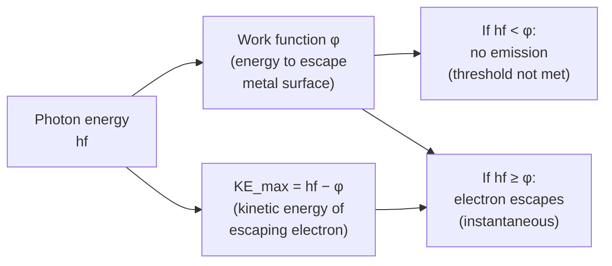

# Work Function

## Core Idea

The work function is the minimum energy needed to remove an electron from the surface of a metal. It sets the threshold for the [[Photoelectric-Effect]].

## Meaning

Conduction electrons in a metal are bound to it; escaping requires a minimum energy $\phi$, the work function, characteristic of the metal. A single photon of energy $hf$ ([[Photon-Energy]]) is absorbed by one electron. Photoemission occurs only if $hf \ge \phi$. Any surplus energy becomes the electron's maximum kinetic energy, as expressed by the [[Photoelectric-Equation]]:

$$hf = \phi + KE_{\max}$$

Work functions are typically a few electronvolts (see [[The-Electronvolt]]).

## Everyday Intuition

Like a ball in a bowl, an electron must be given at least enough energy to reach the rim before it can roll out; less than that and it stays trapped.

## GCSE Foundation

- [[Frequency]]

## Why It Matters

The work function explains why photoemission depends on frequency, not brightness, and why each metal has its own [[Threshold-Frequency]]. It is the property that made the photoelectric effect impossible to explain with the wave model alone.

## Related Quantities

- [[Photon-Energy]]

## Related Laws or Results

- [[Photoelectric-Equation]]

## Related Models

- Photon model of light.

## Representations

- Energy diagram: photon energy split into work function plus electron kinetic energy.

## Experiments or Observations

- [[Measuring-the-Planck-Constant]]

## Applications

- [[Medical-Imaging]]

## Frontier Links

- Surface engineering of low-work-function emitters; orientation only.

## Common Mistakes

- Thinking a more intense beam can overcome the work function below threshold (it cannot).
- Forgetting to convert $\phi$ from eV to joules in calculations.

## Visuals

### Work function: photon energy partition diagram

*Figure: The work function φ is the minimum energy to remove one electron. Any photon energy above φ appears as electron kinetic energy. φ = hf₀ where f₀ is the threshold frequency.*
*Source: Authored for this vault (CC0). No external copyright.*

## Source Trace

- Source: OpenStax College Physics; HyperPhysics; IOPSpark
- OCR alignment: [[OCR-Physics-A-H556-Specification]]
