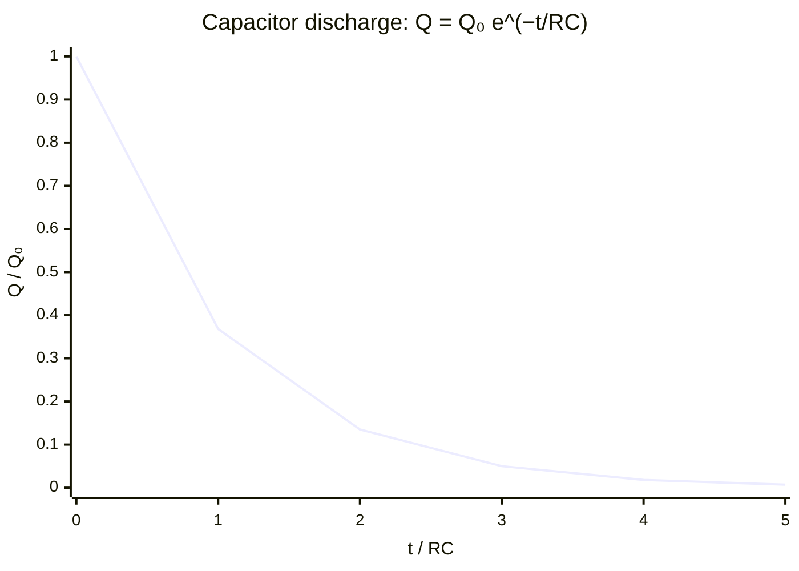

# Capacitor Discharge Equation

## Statement

When a charged capacitor discharges through a resistor, its charge, voltage, and current all decay exponentially with time. The rate of decay is governed by the time constant, the product of resistance and capacitance.

## Equation

$$Q = Q_0 e^{-t / RC}$$

with $V = V_0 e^{-t/RC}$ and $I = I_0 e^{-t/RC}$ (same time constant)

## Symbols and Units

- `Q`: charge on the capacitor at time `t`, coulombs `C`
- `Q₀`: initial charge at `t = 0`, coulombs `C`
- `t`: time since discharge began, seconds `s`
- `R`: resistance of the discharge path, ohms `Ω`
- `C`: capacitance, farads `F`
- `RC`: time constant `τ`, seconds `s`
- `V`: potential difference, volts `V`; `I`: current, amperes `A`

## Conditions

- The resistor is ohmic and `R`, `C` are constant.
- No emf source in the discharge loop (pure discharge).
- The time constant $\tau = RC$; after one `τ` the charge falls to about 37% (`1/e`) of its initial value.

## Physical Meaning

As the capacitor discharges, the current depends on the remaining charge (through $V = Q/C$ and [[Ohms-Law]]), so the more it discharges the slower it discharges — a self-limiting process that gives exponential decay. The same exponential form, with the same time constant, governs charge, voltage, and current. The time constant sets the natural timescale of the circuit.

## Foundation Link

GCSE introduces capacitors as charge stores. A-Level adds the exponential discharge model, the time constant, the logarithmic-graph method for finding `RC`, and the analogy with [[Radioactive-Decay-Law]] (both are exponential decay with a constant fractional rate).

## How to Use

1. Identify `R`, `C`, and the initial value (`Q₀`, `V₀`, or `I₀`).
2. Substitute into the exponential equation for the chosen quantity.
3. To find `RC` from data, plot $\ln(Q)$ against `t`; the gradient is $-1/RC$.
4. Use $\tau = RC$ to estimate how long the circuit takes to "settle".

## Derivation or Explanation

For the discharge loop, $Q/C = IR$ and $I = -\frac{dQ}{dt}$, giving $\frac{dQ}{dt} = -\frac{Q}{RC}$. Solving this first-order equation yields $Q = Q_0 e^{-t/RC}$.

## Related Quantities

- [[Charge]]
- [[Potential-Difference]]
- [[Current]]
- [[Resistance]]

## Related Models

- [[Ohmic-Conductor-Model]]

## Applications

- Timing and delay circuits
- Smoothing in power supplies
- Camera flash and defibrillator energy storage

## Frontier Links

- [[Quantum-Mechanics-Map]] — exponential decay also describes quantum tunnelling probabilities and radioactive decay.

## Common Mistakes

- Confusing the time constant with a half-life (they differ by a factor of $\ln 2$)
- Forgetting that `V` and `I` decay with the same `RC` as `Q`
- Plotting `Q` vs `t` and expecting a straight line instead of using `ln Q`

## Visuals

### Exponential discharge curve (Q vs t)

*Figure: Charge falls exponentially. After one time constant RC, charge is about 37% of Q₀. Voltage and current follow identical curves with the same time constant.*
*Source: Authored for this vault (CC0). No external copyright.*

## Source Trace

- Source: OpenStax College Physics; HyperPhysics; Physics LibreTexts — paraphrased, no copied text
- OCR alignment: [[OCR-Physics-A-H556-Specification]]
