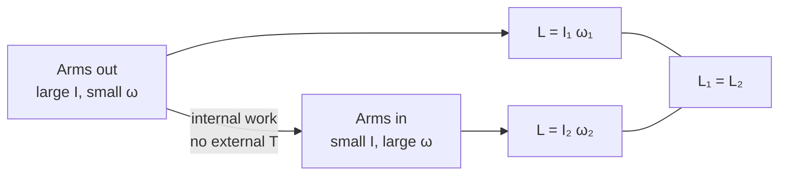

# Conservation of Angular Momentum

## Statement

If the **net external torque** on a system about a chosen axis is zero, the total angular momentum of the system about that axis is constant:

$$
L_\text{before} = L_\text{after}
$$

This is the rotational counterpart of [[Conservation-of-Momentum]].

## Equation

For a single rigid body whose moment of inertia changes from $I_1$ to $I_2$:

$$
I_1 \omega_1 = I_2 \omega_2
$$

For a system of bodies sharing an axis, sum signed $I\omega$ on each side. The angular impulse–angular momentum relation (for constant torque) is

$$
T\,\Delta t = \Delta(I\omega)
$$

## Symbols and Units

- $L$: [[Angular-Momentum]], $\mathrm{kg\,m^{2}\,s^{-1}}$.
- $I$, $I_1$, $I_2$: [[Moment-of-Inertia]], $\mathrm{kg\,m^{2}}$.
- $\omega$, $\omega_1$, $\omega_2$: [[Angular-Velocity]], rad s⁻¹.
- $T$: net external torque, N m.
- $\Delta t$: time over which $T$ acts, s.

## Conditions

- Net external torque about the chosen axis is zero (internal torques between parts of the system always cancel by [[Newton-Third-Law]]).
- The axis must be the same on both sides of the equation.
- Use radians for $\omega$.

If a small external torque acts (e.g. air drag, bearing friction), conservation is only approximate; treat the system as nearly isolated over short times.

## Physical Meaning

Internal rearrangements that change $I$ must be compensated by an opposite change in $\omega$ so that $I\omega$ stays constant. Pulling mass closer to the axis (smaller $I$) speeds up the rotation; pushing mass outward slows it.

Note that rotational kinetic energy $\tfrac{1}{2}I\omega^{2}$ is generally **not** conserved during such rearrangements, because internal forces do work. An ice skater pulling their arms in does positive work against the centripetal direction, increasing their rotational KE.

## Foundation Link

You already meet conservation of linear [[Momentum]] in collisions: total $p$ is unchanged when there are no external forces. The rotational version replaces "no external force" with "no external torque" and $p$ with $L$.

## How to Use

1. Choose an axis.
2. Identify all external torques about that axis. If they sum to zero (or are negligible over the time considered), $L$ is conserved.
3. Write $I_1\omega_1 = I_2\omega_2$ (single body) or $\sum I_i\omega_i\,|_\text{before} = \sum I_i\omega_i\,|_\text{after}$ (system).
4. Solve for the unknown.

If a known external torque $T$ acts for time $\Delta t$, use $T\,\Delta t = \Delta(I\omega)$.

## Derivation or Explanation

From [[Torque-and-Angular-Acceleration]], $T = I\alpha = \dfrac{\mathrm{d}(I\omega)}{\mathrm{d}t}$ for fixed $I$, and more generally $T_\text{ext} = \dfrac{\mathrm{d}L}{\mathrm{d}t}$. If $T_\text{ext} = 0$ then $\dfrac{\mathrm{d}L}{\mathrm{d}t} = 0$, so $L$ is constant.

## Related Quantities

- [[Angular-Momentum]]
- [[Moment-of-Inertia]]
- [[Angular-Velocity]]

## Related Models

- [[Constant-Acceleration-Model]] (used when external torque is constant rather than zero).

## Applications

- **Ice skater spin-up**: arms drawn in $\Rightarrow$ smaller $I$ $\Rightarrow$ larger $\omega$.
- **Diving and gymnastics**: tucking reduces $I$ to speed rotation, then opening up slows for a clean entry.
- **Spinning office chair with weights**: classic lab demo of the same principle.
- **Astrophysics**: spinning protostars contracting form fast-spinning neutron stars.

## Frontier Links

- [[...]]

## Common Mistakes

- Applying conservation when there is a clear external torque (bearing friction, gravity offset from the axis).
- Mixing up axes between "before" and "after".
- Assuming rotational kinetic energy is conserved as well — it usually is **not**.
- Forgetting sign: opposite spins must be treated as opposite signs.

## Visuals

### Skater pulling arms in

*Figure: Internal rearrangement changes I and ω together, leaving L = Iω unchanged when no external torque acts.*
*Source: Authored for this vault (CC0). No external copyright.*

### From Wikimedia

<!-- wiki-images: yes -->

#### A figure skater spinning

![[_attachments/05_Laws-and-Results/Conservation-of-Angular-Momentum--wiki-figure-skater-spin.jpg]]
*Figure: A skater in a fast spin — drawing the arms and leg towards the axis lowers the moment of inertia, so the angular velocity rises to keep L = Iω constant.*
*Source: Wikimedia Commons — [Cup of Russia 2010 - Yuko Kawaguti (2).jpg](https://commons.wikimedia.org/wiki/File:Cup_of_Russia_2010_-_Yuko_Kawaguti_(2).jpg) — CC0 — deerstop. Retrieved 2026-06-27.*

## Source Trace

- Source: [[AQA-Physics-7407-7408-Specification]] §3.11.1 (Engineering Physics — Rotational dynamics)
- Section/Page: Public reference — HyperPhysics; OpenStax College Physics
