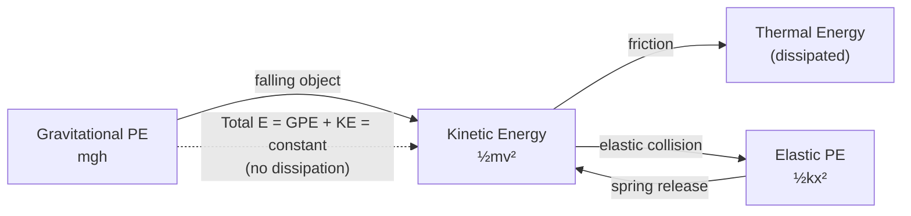

# Conservation of Energy

## Statement

Energy cannot be created or destroyed; it can only be transferred from one store to another or transformed from one form to another. The total energy of an isolated system stays constant. This is one of the most fundamental principles in physics and underlies the whole of mechanics and thermodynamics.

## Equation

For a closed mechanical system with no resistive losses:

`E_total = KE + PE = constant`

With dissipation (e.g. friction, drag):

`E_input = useful_output + wasted (often thermal)`

## Symbols and Units

- `E_total`: total energy of the system, joules `J` (scalar)
- `KE`: kinetic energy, `½mv²`, joules `J`
- `PE`: potential energy (gravitational `mgh`, elastic `½kx²`), joules `J`
- `m`: mass, kilograms `kg`
- `v`: speed, metres per second `m s⁻¹`
- `g`: gravitational field strength, newtons per kilogram `N kg⁻¹`
- `h`: height change, metres `m`

## Conditions

- The principle is universal, but the simple "KE + PE constant" form requires **no energy lost to resistive forces**.
- For a real system, account for energy transferred to thermal stores by friction or drag.
- Mass–energy equivalence (`E = mc²`) extends the principle to nuclear and particle processes.

## Physical Meaning

Energy is a conserved bookkeeping quantity. In a falling object, gravitational potential energy is steadily converted to kinetic energy; the *total* never changes. When friction acts, mechanical energy is not lost from the universe — it is transferred to thermal energy. This lets us solve problems without tracking forces and time, by simply equating energy before and after.

## Foundation Link

GCSE teaches energy "stores and transfers" and that energy is conserved overall. A-Level makes this quantitative with `½mv²` and `mgh`, and adds elastic, electrical, and nuclear forms, plus the idea of efficiency and dissipation.

## How to Use

1. Define the system and the start and end states.
2. List the energy in each store at each state.
3. Set total initial energy equal to total final energy (add a dissipation term if needed).
4. Solve for the unknown. See [[Applying-Conservation-of-Energy]].

## Derivation or Explanation

For a constant force doing work `W = Fd`, the work–energy theorem gives `W = ΔKE`. Integrating conservative forces defines potential energy, so their sum is constant when only conservative forces act.

## Related Quantities

- [[Energy-Quantity|Energy]]
- [[Work]]
- [[Force]]
- [[Mass]]

## Related Models

- [[Constant-Acceleration-Model]]

## Applications

- Roller coasters, pendulums, projectile speeds
- Hydroelectric and power-station energy chains
- [[Applying-Conservation-of-Energy]]

## Frontier Links

- [[Relativity-Map]] — mass–energy equivalence `E = mc²` unifies mass and energy.
- [[Quantum-Mechanics-Map]] — energy conservation holds for photon emission and absorption.

## Common Mistakes

- Forgetting energy transferred to thermal stores by friction
- Mixing units (heights in cm, speeds in km h⁻¹)
- Treating energy as a vector

## Visuals

### Energy transfer chain

*Figure: Conservation of energy: energy transfers between stores; the total is unchanged in an isolated system.*
*Source: Authored for this vault (CC0). No external copyright.*

## Source Trace

- Source: OpenStax College Physics; HyperPhysics; Physics LibreTexts — paraphrased, no copied text
- OCR alignment: [[OCR-Physics-A-H556-Specification]]
