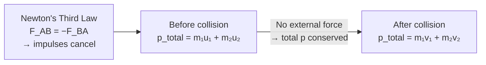

# Conservation of Momentum

## Statement

The total momentum of a system of interacting objects stays constant, provided no external resultant force acts on the system. In a collision or explosion, total momentum before the interaction equals total momentum after.

## Equation

For two bodies:

`m₁u₁ + m₂u₂ = m₁v₁ + m₂v₂`

Vector form: `Σp_before = Σp_after`

## Symbols and Units

- `m₁, m₂`: masses of the objects, kilograms `kg` (scalar)
- `u₁, u₂`: velocities before interaction, metres per second `m s⁻¹` (vector)
- `v₁, v₂`: velocities after interaction, metres per second `m s⁻¹` (vector)
- `p`: momentum `= mv`, kilogram metres per second `kg m s⁻¹` (vector)

## Conditions

- The system must be **isolated**: no resultant *external* force (internal forces between the bodies are allowed).
- Momentum is conserved as a **vector** — handle each direction (or component) separately.
- Holds for both elastic and inelastic collisions; only kinetic energy differs between them.
- Valid below relativistic speeds; relativistic momentum is used near light speed.

## Physical Meaning

Because internal forces obey [[Newton-Third-Law]] (equal and opposite), the impulses they exert on each other cancel, so the total momentum of the pair cannot change from within. Only an outside push can alter the system's total momentum. This makes momentum a powerful conserved quantity for analysing collisions, recoil, and propulsion without knowing the detailed forces during contact.

## Foundation Link

GCSE introduces momentum `p = mv` and conservation in simple collisions. A-Level adds full vector treatment (2-D collisions, components), the elastic/inelastic distinction, and the link to impulse `Δp = FΔt`.

## How to Use

1. Define the system and a positive direction.
2. Write total momentum before and after, with correct signs.
3. Set them equal and solve. For 2-D, do x and y separately.
4. Check kinetic energy to classify the collision. See [[Applying-Conservation-of-Momentum]].

## Derivation or Explanation

From [[Newton-Second-Law]] in momentum form, `F_ext = Δp_total/Δt`. If `F_ext = 0`, then `Δp_total = 0`, so total momentum is constant. Internal forces cancel in pairs by [[Newton-Third-Law]].

## Related Quantities

- [[Momentum]]
- [[Impulse]]
- [[Force]]
- [[Mass]]
- [[Energy-Quantity|Energy]]

## Related Models

- [[Constant-Acceleration-Model]]

## Applications

- Collisions, recoil of guns, rocket and jet propulsion
- Particle-physics interaction analysis
- [[Applying-Conservation-of-Momentum]]

## Frontier Links

- [[Relativity-Map]] — relativistic momentum replaces `mv` at high speeds.
- [[Quantum-Mechanics-Map]] — momentum conservation governs particle scattering and the [[De-Broglie-Equation]].

## Common Mistakes

- Ignoring direction signs (momentum is a vector)
- Assuming kinetic energy is always conserved (only elastic collisions)
- Forgetting an external force such as friction over the interaction time

## Visuals

### Collision momentum balance

*Figure: Conservation of momentum follows from Newton's Third Law — internal forces cancel, leaving total momentum unchanged.*
*Source: Authored for this vault (CC0). No external copyright.*

## Source Trace

- Source: OpenStax College Physics; HyperPhysics; Physics LibreTexts — paraphrased, no copied text
- OCR alignment: [[OCR-Physics-A-H556-Specification]]
