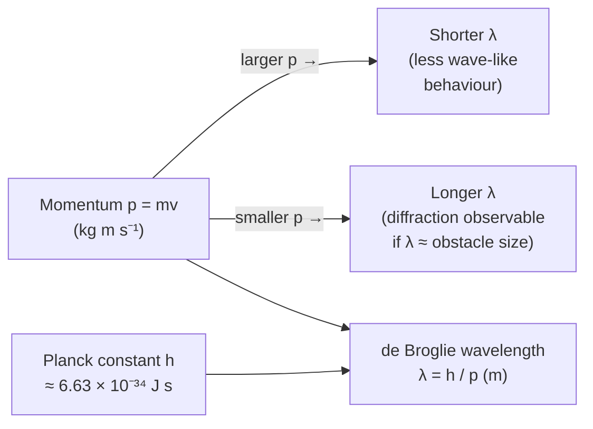

# De Broglie Equation

## Statement

Any moving particle has an associated wavelength, equal to the Planck constant divided by the particle's momentum. Matter, like light, exhibits both particle and wave behaviour.

## Equation

`λ = h / p`

equivalently `λ = h / (mv)` for a non-relativistic particle

## Symbols and Units

- `λ`: de Broglie wavelength, metres `m`
- `h`: Planck constant, `≈ 6.63 × 10⁻³⁴`, joule seconds `J s`
- `p`: momentum of the particle, kilogram metres per second `kg m s⁻¹`
- `m`: particle mass, kilograms `kg`; `v`: particle speed, `m s⁻¹`

## Conditions

- The simple form `λ = h/mv` is non-relativistic; relativistic momentum is needed near light speed.
- Wave behaviour is only observable when `λ` is comparable to the size of obstacles or gaps (e.g. atomic spacing for electrons).
- For everyday objects `λ` is far too small to detect, so they appear purely particle-like.

## Physical Meaning

De Broglie proposed that the wave–particle duality seen for light (via the [[Photon-Model]]) applies to all matter. A particle's momentum sets a wavelength; the larger the momentum, the shorter the wavelength. Electron diffraction through a thin crystal — producing rings like X-ray diffraction — is the classic experimental confirmation. This idea underpins the wave nature of electrons in atoms and the operation of the electron microscope.

## Foundation Link

GCSE treats electrons strictly as particles. A-Level introduces the radical idea that particles also diffract and interfere, building on the photon energy idea `E = hf` and momentum `p = mv` to unify waves and particles.

## How to Use

1. Find the particle's momentum `p = mv` (or from kinetic energy: `p = √(2mE_k)`).
2. Divide the Planck constant by `p` to get `λ`.
3. For electrons accelerated through a potential difference `V`, use `E_k = eV` then `p = √(2mE_k)`.
4. Compare `λ` with the obstacle size to judge whether diffraction is observable.

## Derivation or Explanation

By analogy with the photon, for which `p = h/λ` (from `E = hf` and `E = pc`), de Broglie postulated the same relation for matter, giving `λ = h/p`.

## Related Quantities

- [[Momentum]]
- [[Wavelength]]
- [[Energy]]
- [[Mass]]

## Related Models

- [[Photon-Model]]

## Applications

- Electron diffraction experiments
- The electron microscope (short `λ` gives high resolution)
- Crystallography with electron and neutron beams

## Frontier Links

- [[Quantum-Mechanics-Map]] — matter waves lead to wavefunctions, the uncertainty principle, and quantum mechanics proper.

## Common Mistakes

- Using speed instead of momentum
- Forgetting to convert kinetic energy to momentum via `p = √(2mE_k)`
- Expecting macroscopic objects to show measurable wave behaviour

## Visuals

### Momentum–wavelength relationship

*Figure: de Broglie equation: wavelength shortens as momentum increases. Diffraction is only observable when λ is comparable to the gap or crystal spacing.*
*Source: Authored for this vault (CC0). No external copyright.*

## Source Trace

- Source: OpenStax College Physics; HyperPhysics; Physics LibreTexts — paraphrased, no copied text
- OCR alignment: [[OCR-Physics-A-H556-Specification]]
