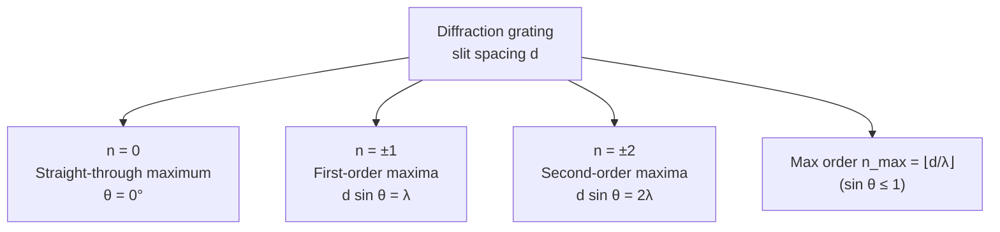

# Diffraction Grating Equation

## Statement

For monochromatic light normally incident on a [[Diffraction-Grating]], bright maxima occur at angles where the [[Path-Difference]] between adjacent slits is a whole number of wavelengths.

## Equation

$$d\sin\theta = n\lambda$$

## Symbols and Units

- $d$ — slit (line) spacing, distance between adjacent slits — unit: metre (m). If the grating has $N$ lines per metre, $d = 1/N$.
- $\theta$ — angle of the $n$th order maximum from the straight-through (zero-order) direction — unit: degree or radian.
- $n$ — order of the maximum, an integer $0, 1, 2, \dots$ — dimensionless.
- $\lambda$ — [[Wavelength]] of the light — unit: metre (m).

## Conditions

- Light is monochromatic and incident normally on the grating.
- Slits are equally spaced and the source is effectively at infinity (parallel light).
- $\sin\theta \le 1$, so the maximum observable order is $n_{\max} = \lfloor d/\lambda \rfloor$.

## Physical Meaning

Constructive [[Interference]] from many equally spaced coherent sources occurs only when each slit's contribution is in phase with its neighbours, i.e. the path difference $d\sin\theta$ equals an integer number of wavelengths. Many slits make these maxima very sharp and bright.

## Foundation Link

- Builds on the GCSE idea of [[Wave-Refraction]] and waves overlapping to add or cancel.

## How to Use

Measure $d$ from the lines per millimetre, measure $\theta$ for a chosen order $n$, then compute $\lambda = d\sin\theta / n$. White light gives a spectrum per order because $\theta$ depends on $\lambda$.

## Derivation or Explanation

Adjacent slits separated by $d$ emit rays at angle $\theta$; the extra path of one ray is $d\sin\theta$. Reinforcement requires this to equal $n\lambda$, giving the equation.

## Related Quantities

- [[Wavelength]]

## Related Models

- [[Diffraction-Grating]]

## Applications

- [[Medical-Imaging]]

## Frontier Links

- Stellar spectroscopy and redshift measurement; orientation only.

## Common Mistakes

- Using lines per metre as $d$ instead of its reciprocal.
- Forgetting the equation fails once $\sin\theta$ would exceed 1.

## Visuals

### Order maxima positions

*Figure: A diffraction grating produces sharp maxima at angles given by d sin θ = nλ. Higher orders appear at larger angles.*
*Source: Authored for this vault (CC0). No external copyright.*

### From Wikipedia

<!-- wiki-images: yes -->

#### Diffraction grating

![[_attachments/05_Laws-and-Results/Diffraction-Grating-Equation--wiki-diffraction-grating.jpg]]
*Figure: from Wikipedia article "Diffraction grating".*
*Source: Wikimedia Commons — [Diffraction_grating.jpg](https://commons.wikimedia.org/wiki/File:Diffraction_grating.jpg). Retrieved 2026-05-20.*

#### "Lines made with light" - diffraction gratings at the UK ATC (15555795912)

![[_attachments/05_Laws-and-Results/Diffraction-Grating-Equation--wiki-lines-made-with-light-diffraction-gratin.jpg]]
*Figure: from Wikipedia article "Diffraction grating".*
*Source: Wikimedia Commons — ["Lines made with light" - diffraction gratings at the UK ATC (15555795912).jpg](https://commons.wikimedia.org/wiki/File:"Lines_made_with_light"_-_diffraction_gratings_at_the_UK_ATC_(15555795912).jpg). Retrieved 2026-05-20.*

#### An incandescent light-bulb viewed through a transmissive diffraction grating

![[_attachments/05_Laws-and-Results/Diffraction-Grating-Equation--wiki-an-incandescent-light-bulb-viewed-throug.jpg]]
*Figure: from Wikipedia article "Diffraction grating".*
*Source: Wikimedia Commons — [An incandescent light-bulb viewed through a transmissive diffraction grating.jpg](https://commons.wikimedia.org/wiki/File:An_incandescent_light-bulb_viewed_through_a_transmissive_diffraction_grating.jpg). Retrieved 2026-05-20.*

## Source Trace

- Source: OpenStax College Physics; HyperPhysics; IOPSpark
- OCR alignment: [[OCR-Physics-A-H556-Specification]]
