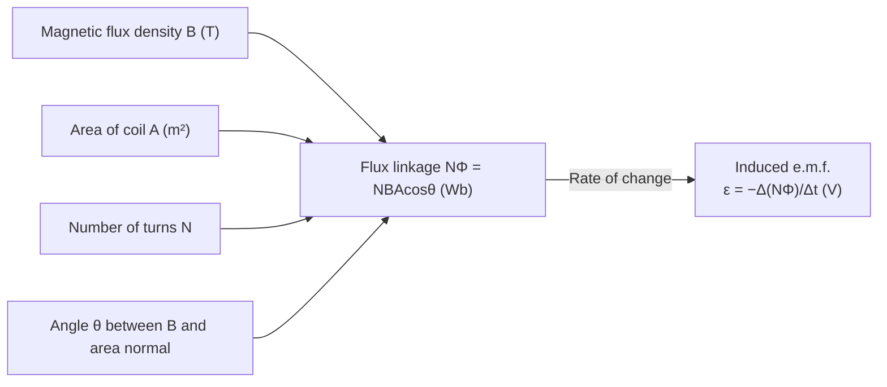

# Faradays Law

## Statement

The magnitude of the induced electromotive force (e.m.f.) in a circuit is directly proportional to the rate of change of magnetic flux linkage through that circuit.

## Equation

ε = −d(NΦ)/dt

The magnitude is |ε| = |Δ(NΦ)/Δt| for an average over a time interval.

## Symbols and Units

- Symbol: ε — Meaning: induced e.m.f. ([[Potential-Difference]] when no current flows) — Unit: volt (V)
- Symbol: N — Meaning: number of turns in the coil — Unit: dimensionless
- Symbol: Φ — Meaning: [[Magnetic-Flux]] through one turn — Unit: weber (Wb)
- Symbol: NΦ — Meaning: [[Magnetic-Flux-Linkage]] — Unit: weber (Wb)
- Symbol: t — Meaning: time — Unit: second (s)

## Conditions

- A change in flux linkage must occur (steady flux gives zero e.m.f.).
- The flux is the same through every turn of the coil (uniform linkage).
- Holds for any cause of flux change: moving magnet, moving conductor, rotating coil, or changing current.

## Physical Meaning

It is the *rate of change* of flux linkage — not the flux itself — that drives the induced e.m.f. The minus sign expresses [[Lenzs-Law]]: the induced effect opposes the change producing it, which is required by [[Conservation-of-Energy]]. Larger fields, faster motion, larger areas, and more turns all increase the induced e.m.f.

## Foundation Link

Builds on the GCSE generator effect (moving a wire in a field induces a voltage) by quantifying it through flux linkage.

## How to Use

Express NΦ = B A N cos θ; differentiate (or take Δ over Δt) the quantity that changes — B, A, or θ; the result's magnitude is the induced e.m.f. See [[Applying-Faradays-Law]].

## Derivation or Explanation

For a conductor of length L moving at speed v perpendicular to a field B, the area swept per second is Lv, so dΦ/dt = BLv and ε = BLv — consistent with the motional e.m.f. picture and with [[Force-on-a-Moving-Charge]] acting on carriers in the rod.

## Related Quantities

- [[Magnetic-Flux]]
- [[Magnetic-Flux-Linkage]]
- [[Magnetic-Flux-Density]]
- [[Potential-Difference]]

## Related Models

- [[Electromagnetic-Induction]]
- [[Magnetic-Field]]

## Applications

- [[Transformers]]
- [[The-DC-Motor]]

## Frontier Links

- Faraday's law is one of Maxwell's equations; combined with Ampère's law it predicts electromagnetic waves.

## Common Mistakes

- Using flux Φ instead of flux linkage NΦ (forgetting the factor N).
- Forgetting the minus sign / direction from [[Lenzs-Law]].
- Computing total flux instead of *rate of change* of flux.

## Visuals

### Flux linkage and induced EMF

*Figure: Faraday's Law — the induced e.m.f. equals the rate of change of flux linkage NΦ. Any of B, A, N, or θ can be varied.*
*Source: Authored for this vault (CC0). No external copyright.*

## Source Trace

OpenStax College Physics; HyperPhysics; Physics LibreTexts — no copied text.

OCR alignment: [[OCR-Physics-A-H556-Specification]]

- Source: public physics reference pool
- Section/Page: OCR M6.3 Electromagnetism
