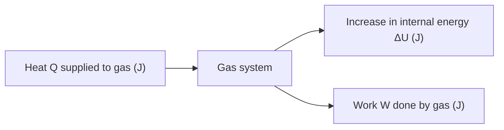

# First Law of Thermodynamics

## Statement

When heat is supplied to a gas, the energy goes two places: it raises the gas's internal energy and/or it lets the gas do work on its surroundings. Energy is conserved — the first law is simply [[Conservation-of-Energy]] written in the language of gases.

## Equation

$$Q = \Delta U + W$$

## Symbols and Units

- $Q$ — heat energy supplied **to** the gas, joules (J).
- $\Delta U$ — increase in [[Internal-Energy]] of the gas, joules (J).
- $W$ — work done **by** the gas on its surroundings, joules (J).

## Sign Conventions

The AQA convention follows the equation literally:

- $Q > 0$ — heat flows into the gas.
- $Q < 0$ — heat flows out of the gas.
- $\Delta U > 0$ — gas gets hotter (internal energy rises).
- $\Delta U < 0$ — gas cools (internal energy falls).
- $W > 0$ — gas expands and pushes outward (does work on the surroundings).
- $W < 0$ — gas is compressed (surroundings do work on the gas).

Be careful: some textbooks write $\Delta U = Q + W$ where $W$ is work done **on** the gas. Same physics, opposite sign of $W$. Stick to the AQA form.

## Conditions

- The system is a fixed mass of gas (usually treated as an [[Ideal-Gas-Model]]).
- The gas is in (or close to) equilibrium so [[Pressure]], [[Volume]], and [[Temperature]] are well defined.
- Energy lost or gained as kinetic or potential energy of the container is ignored.

## Physical Meaning

[[Internal-Energy]] depends only on [[Temperature]] for an ideal gas. So if you heat a gas:

- and stop it expanding, all of $Q$ becomes $\Delta U$ — it gets hotter.
- and let it expand against a piston, some of $Q$ becomes $W$ — the gas does work and gets less hot than you'd expect.

It is impossible to "use" heat without paying attention to whether the gas expanded, compressed, or stayed put. This is the bookkeeping rule that engineers apply to every stage of an engine cycle.

## Foundation Link

At GCSE you meet "energy is conserved" and "heating a gas makes it expand". The first law makes both quantitative: heat in equals temperature rise plus expansion work. It is the bridge between [[Energy-Transfer]] and [[Thermodynamic-Processes]].

## How to Use

1. Identify the process (heat added/removed, gas expanding/compressed).
2. Decide the signs of $Q$ and $W$.
3. Solve for the unknown — typically $\Delta U$, then convert to temperature change using internal energy formulas.

Worked sketch: 200 J of heat is supplied to a gas which expands and does 60 J of work. Then $\Delta U = Q - W = 200 - 60 = 140$ J — internal energy (and temperature) rises.

## Related Quantities

- [[Internal-Energy]]
- [[Work]]
- [[Temperature]]
- [[Pressure]]
- [[Volume]]

## Related Models

- [[Ideal-Gas-Model]]
- [[Kinetic-Theory-of-Gases]]

## Applications

- [[Thermodynamic-Processes]]
- [[Engine-Cycles]]
- [[Reversed-Heat-Engines]]

## Frontier Links

- Statistical mechanics reframes $Q$ and $W$ in terms of microstates and entropy flow.

## Common Mistakes

- Forgetting the AQA sign convention and treating compression work as positive.
- Confusing [[Temperature]] with [[Internal-Energy]] — they only track each other for an ideal gas.
- Assuming $Q = \Delta U$ always (only true at constant volume).
- Assuming $W = Q$ always (only true in an isothermal process).

## Visuals

### Energy flow in the first law

*Figure: Heat supplied to a gas splits between raising internal energy and doing work on the surroundings.*
*Source: Authored for this vault (CC0). No external copyright.*

## Source Trace

- Source: [[AQA-Physics-7407-7408-Specification]] §3.11.2 (Engineering Physics — Thermodynamics)
- Public source: HyperPhysics (first law of thermodynamics); OpenStax College Physics §15.1.
- Section/Page: AQA specification §3.11.2.1
