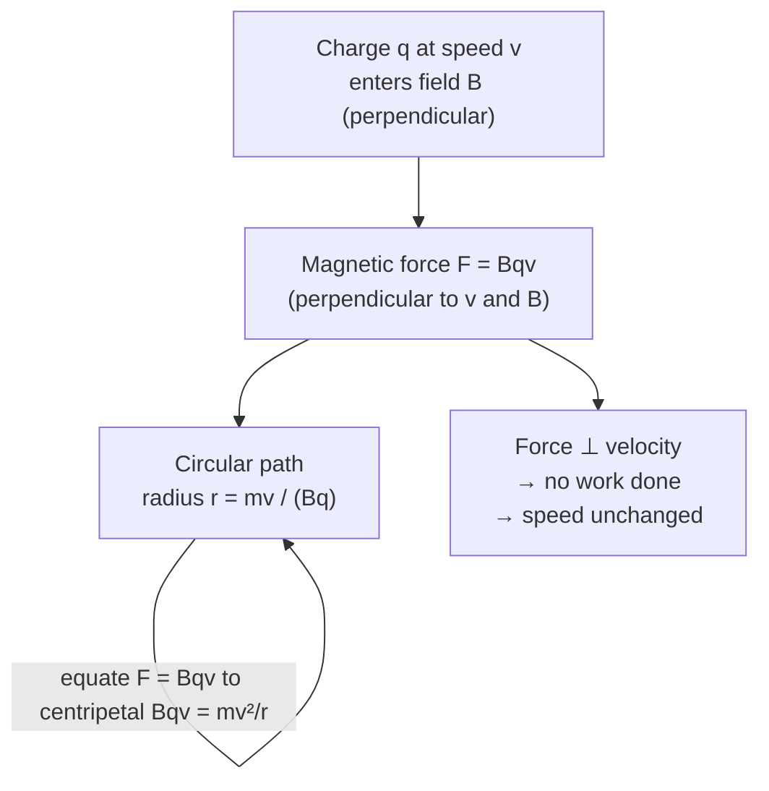

# Force on a Moving Charge

## Statement

A charged particle moving through a magnetic field experiences a force perpendicular to both its velocity and the field. The force is maximum when the velocity is perpendicular to the field and zero when it moves parallel to the field.

## Equation

$$F = B q v \sin\theta$$

For motion perpendicular to the field ($\theta = 90^\circ$): $F = B q v$

## Symbols and Units

- Symbol: F — Meaning: magnetic force on the charge — Unit: newton (N)
- Symbol: B — Meaning: [[Magnetic-Flux-Density]] — Unit: tesla (T)
- Symbol: q — Meaning: magnitude of [[Charge]] — Unit: coulomb (C)
- Symbol: v — Meaning: speed of the charge ([[Velocity]]) — Unit: m s⁻¹
- Symbol: θ — Meaning: angle between velocity and field — Unit: degree or radian

## Conditions

- The charge is moving (a stationary charge feels no magnetic force).
- B is the field at the particle's location.
- θ is the angle between **v** and **B**; force is zero when they are parallel.

## Physical Meaning

The force is always perpendicular to the velocity, so it does no work and cannot change the particle's speed — only its direction. A charge entering a uniform field perpendicular to it therefore moves in a circle of radius $r = \frac{mv}{Bq}$, where the magnetic force provides the centripetal force: $Bqv = \frac{mv^2}{r}$. This is the principle of cyclotrons, mass spectrometers, and the deflection of cosmic rays.

## Foundation Link

Extends the GCSE idea that magnets affect currents: a current is just moving charge, so individual charges feel the same kind of force.

## How to Use

Identify q, v, B and the angle θ; apply $F = Bqv \sin\theta$. For circular motion equate $Bqv = \frac{mv^2}{r}$ to find radius, period $T = \frac{2\pi m}{Bq}$, or speed. Direction from Fleming's left-hand rule (treat conventional current as the direction of positive charge motion).

## Derivation or Explanation

This is the magnetic part of the Lorentz force. Summing this single-charge force over all carriers in a wire gives the macroscopic [[Force-on-a-Current-Carrying-Conductor]], $F = BIL \sin\theta$.

## Related Quantities

- [[Magnetic-Flux-Density]]
- [[Charge]]
- [[Velocity]]
- [[Force]]

## Related Models

- [[Magnetic-Field]]

## Applications

- [[The-DC-Motor]]

## Frontier Links

- Underlies cyclotron and synchrotron design and the magnetic confinement of plasma in fusion reactors (tokamaks).

## Common Mistakes

- Thinking the magnetic force does work or changes speed (it only changes direction).
- Forgetting that a *stationary* charge feels no magnetic force.
- For negative charges, forgetting to reverse the conventional-current direction in Fleming's rule.

## Visuals

### Circular motion of a charge in a magnetic field

*Figure: A charge moving perpendicular to a uniform magnetic field follows a circle. The magnetic force provides centripetal acceleration without changing the speed.*
*Source: Authored for this vault (CC0). No external copyright.*

### From Wikipedia

<!-- wiki-images: yes -->

#### Lorentz force on charged particles in bubble chamber - HD.6D.635 (12000265314)

![[_attachments/05_Laws-and-Results/Force-on-a-Moving-Charge--wiki-lorentz-force-on-charged-particles-in-bu.svg]]
*Figure: from Wikipedia article "Lorentz force".*
*Source: Wikimedia Commons — [Lorentz_force_on_charged_particles_in_bubble_chamber_-_HD.6D.635_(12000265314).svg](https://commons.wikimedia.org/wiki/File:Lorentz_force_on_charged_particles_in_bubble_chamber_-_HD.6D.635_(12000265314).svg). Retrieved 2026-05-20.*

#### Aharonov–Bohm effect apparatus

![[_attachments/05_Laws-and-Results/Force-on-a-Moving-Charge--wiki-aharonovbohm-effect-apparatus.svg]]
*Figure: from Wikipedia article "Lorentz force".*
*Source: Wikimedia Commons — [Aharonov–Bohm effect apparatus.svg](https://commons.wikimedia.org/wiki/File:Aharonov–Bohm_effect_apparatus.svg). Retrieved 2026-05-20.*

#### Alternator 1

![[_attachments/05_Laws-and-Results/Force-on-a-Moving-Charge--wiki-alternator-1.svg]]
*Figure: from Wikipedia article "Lorentz force".*
*Source: Wikimedia Commons — [Alternator 1.svg](https://commons.wikimedia.org/wiki/File:Alternator_1.svg). Retrieved 2026-05-20.*

## Source Trace

OpenStax College Physics; HyperPhysics; Physics LibreTexts — no copied text.

OCR alignment: [[OCR-Physics-A-H556-Specification]]

- Source: public physics reference pool
- Section/Page: OCR M6.3 Electromagnetism
