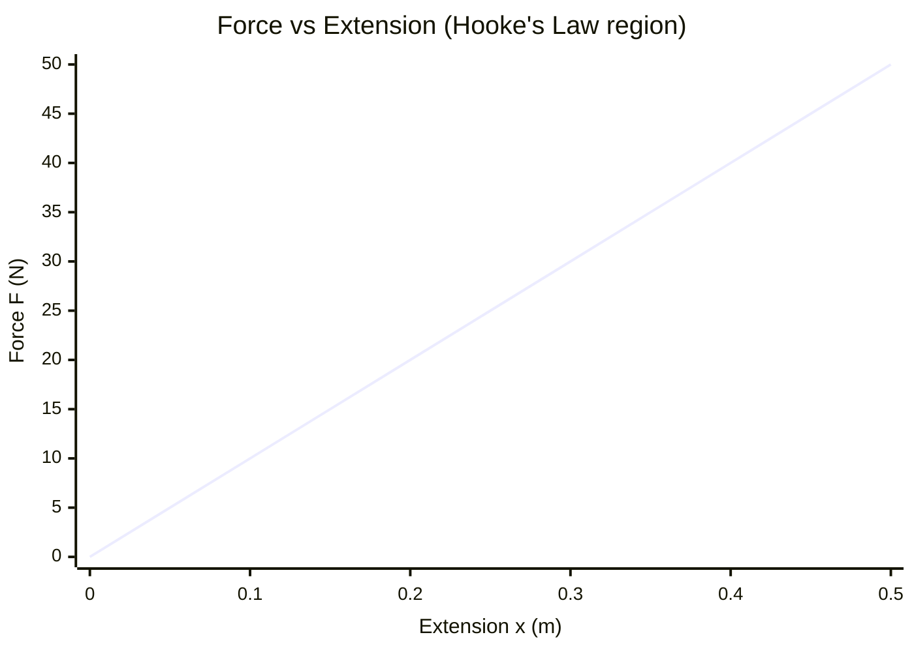

# Hookes Law

## Statement

For an elastic object such as a spring or wire, the extension is directly proportional to the applied force, provided the limit of proportionality is not exceeded. Equivalently, the restoring force is proportional to the displacement from the natural length.

## Equation

$$F = kx$$

## Symbols and Units

- `F`: applied (or restoring) force, newtons `N` (vector along the spring axis)
- `k`: spring (force) constant, newtons per metre `N m⁻¹` (scalar)
- `x`: extension or compression from natural length, metres `m`

## Conditions

- Valid only **below the limit of proportionality**; beyond it, force and extension are no longer proportional.
- Beyond the **elastic limit** the object does not return to its original shape (plastic deformation).
- Assumes the material is loaded gradually and is not heated or fatigued.

## Physical Meaning

A stiffer spring (large `k`) needs more force per unit extension. The constant `k` is the gradient of a force–extension graph in the linear region. The energy stored in stretching is the area under that graph, $E = \frac{1}{2}kx^2$, which is the elastic potential energy recovered when the spring relaxes. Hooke's law is the basis of the [[Simple-Harmonic-Oscillator]] model because the restoring force is proportional to displacement.

## Foundation Link

GCSE shows that springs stretch more with more weight and introduces "force = spring constant × extension". A-Level adds the limit of proportionality, elastic limit, elastic strain energy $\frac{1}{2}kx^2$, and the link to material properties through stress, [[Strain]], and the [[Young-Modulus]].

## How to Use

1. Plot force against extension and check the line is straight.
2. Find `k` from the gradient in the linear region.
3. Use $F = kx$ for forces or $E = \frac{1}{2}kx^2$ for stored energy.
4. Combine spring constants: series springs are softer, parallel springs are stiffer.

## Derivation or Explanation

For a uniform wire, $F = kx$ follows from the material relation $\text{stress} = \text{Young modulus} \times \text{strain}$ with stiffness $k = \frac{EA}{L}$, where `A` is cross-sectional area and `L` is original length.

## Related Quantities

- [[Force]]
- [[Strain]]
- [[Young-Modulus]]
- [[Energy-Quantity|Energy]]
- [[Work]]

## Related Models

- [[Constant-Acceleration-Model]]

## Applications

- Spring balances and force meters
- Vehicle suspension and energy storage
- Simple harmonic motion of mass–spring systems

## Frontier Links

- [[Quantum-Mechanics-Map]] — the quantum harmonic oscillator extends the spring model to atoms and molecules.

## Common Mistakes

- Using the law beyond the limit of proportionality
- Confusing extension `x` with total length
- Forgetting the ½ in elastic energy $\frac{1}{2}kx^2$

## Visuals

### Force–extension graph

*Figure: Linear region of a force–extension graph. The gradient equals the spring constant k. Beyond the limit of proportionality the line curves.*
*Source: Authored for this vault (CC0). No external copyright.*

## Source Trace

- Source: OpenStax College Physics; HyperPhysics; Physics LibreTexts — paraphrased, no copied text
- OCR alignment: [[OCR-Physics-A-H556-Specification]]
