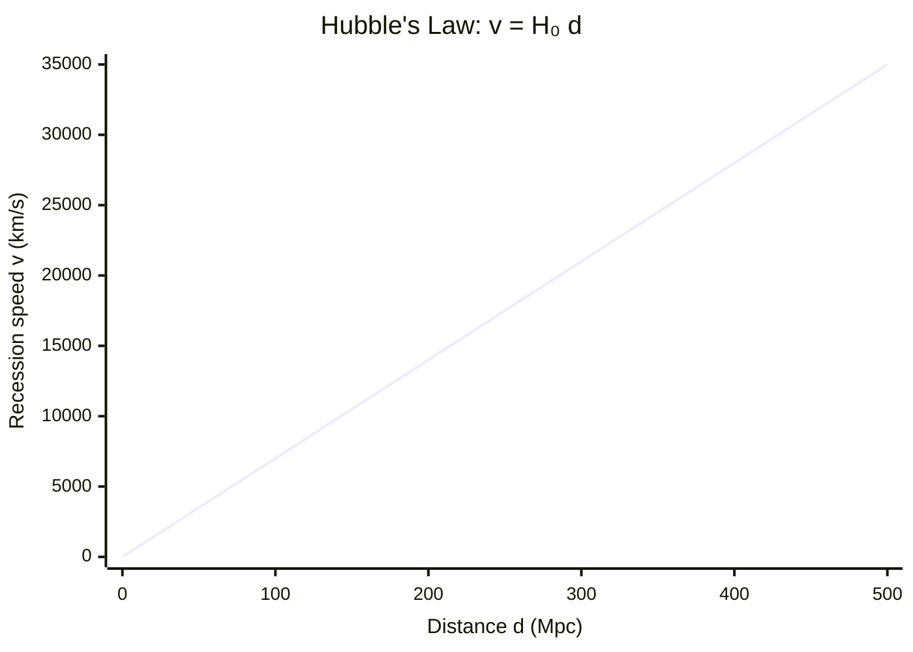

# Hubble's Law

## Statement

The recession speed of a distant galaxy is directly proportional to its
distance from us: more distant galaxies recede faster.

## Equation

$$v = H_0 d$$

## Symbols and Units

- v: recession speed of the galaxy — m s⁻¹ (often km s⁻¹)
- d: distance to the galaxy — m (often Mpc)
- H₀: Hubble constant — s⁻¹ (often km s⁻¹ Mpc⁻¹)

## Conditions

- Applies on large (cosmological) scales, not to gravitationally bound local
  groups
- Speeds small compared with c, so v can be obtained from
  [[Redshift]] as $v \approx cz$
- Assumes uniform large-scale expansion

## Physical Meaning

Every galaxy recedes from every other, with speed proportional to separation.
This is the signature of a uniformly expanding Universe with no special
centre. Reversing the expansion implies a hot, dense origin, supporting the
[[Big-Bang-Theory]]. The reciprocal $1/H_0$ gives a rough estimate of the age of
the Universe.

## Foundation Link

Builds on the GCSE observation that galactic light is red-shifted, made
quantitative as a linear speed–distance relation.

## How to Use

Measure [[Redshift]] z to get $v \approx cz$, find d independently (standard candles
or other ladder steps — see [[Astronomical-Distances]]), then $H_0 = v/d$. Or use
H₀ to estimate distance, recession speed, or age ($\approx 1/H_0$, with H₀ in s⁻¹).

## Derivation or Explanation

Empirical: a plot of recession speed against distance for many galaxies is a
straight line through the origin whose gradient is H₀.

## Related Quantities

- [[Wavelength]]
- [[Luminosity]]

## Related Models

- [[Big-Bang-Theory]]

## Applications

- Estimating the age of the Universe
- Measuring cosmological distances from redshift

## Frontier Links

- [[Cosmology-Map]]

## Common Mistakes

- Applying it to nearby bound galaxies (e.g. Andromeda, which blueshifts)
- Inconsistent units for H₀ (km s⁻¹ Mpc⁻¹ vs s⁻¹) when finding age
- Treating $1/H_0$ as the exact, not approximate, age

## Visuals

### Recession speed vs distance (Hubble plot)

*Figure: Recession speed increases linearly with distance. The gradient of the best-fit line equals the Hubble constant H₀.*
*Source: Authored for this vault (CC0). No external copyright.*

### From Wikipedia

<!-- wiki-images: yes -->

#### Raisinbread

![[_attachments/05_Laws-and-Results/Hubbles-Law--wiki-raisinbread.gif]]
*Figure: from Wikipedia article "Hubble's law".*
*Source: Wikimedia Commons — [Raisinbread.gif](https://commons.wikimedia.org/wiki/File:Raisinbread.gif). Retrieved 2026-05-20.*

#### 1-s2.0-S221268642500158X-gr1 lrg

![[_attachments/05_Laws-and-Results/Hubbles-Law--wiki-1-s20-s221268642500158x-gr1-lrg.jpg]]
*Figure: from Wikipedia article "Hubble's law".*
*Source: Wikimedia Commons — [1-s2.0-S221268642500158X-gr1 lrg.jpg](https://commons.wikimedia.org/wiki/File:1-s2.0-S221268642500158X-gr1_lrg.jpg). Retrieved 2026-05-20.*

#### Bridge diagram showing different measurements of the Hubble constant (bridge-info CORRECTED4)

![[_attachments/05_Laws-and-Results/Hubbles-Law--wiki-bridge-diagram-showing-different-measure.jpg]]
*Figure: from Wikipedia article "Hubble's law".*
*Source: Wikimedia Commons — [Bridge diagram showing different measurements of the Hubble constant (bridge-info CORRECTED4).jpg](https://commons.wikimedia.org/wiki/File:Bridge_diagram_showing_different_measurements_of_the_Hubble_constant_(bridge-info_CORRECTED4).jpg). Retrieved 2026-05-20.*

## Source Trace

- Source: OpenStax College Physics; HyperPhysics; NASA educational material — no copied text
- OCR alignment: [[OCR-Physics-A-H556-Specification]]
- Section/Page: OCR M5.5 Astrophysics and cosmology
