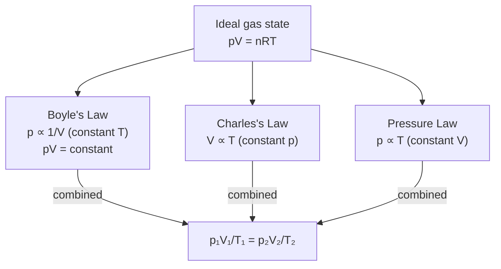

# Ideal Gas Equation

## Statement

For a fixed amount of an ideal gas, pressure, volume and thermodynamic temperature are related by a single equation of state, combining Boyle's law, Charles's law and the pressure law.

## Equation

$$ pV = nRT \qquad \text{equivalently} \qquad pV = NkT $$

## Symbols and Units

- $p$ — pressure — Pa
- $V$ — volume — m³
- $n$ — amount of substance — mol
- $R$ — molar gas constant — J mol⁻¹ K⁻¹ (≈ 8.31)
- $T$ — thermodynamic temperature — K (**always kelvin**)
- $N$ — number of molecules — dimensionless
- $k$ — [[Boltzmann-Constant]] — J K⁻¹ (≈ 1.38 × 10⁻²³)

with $N = n N_A$ and $k = R/N_A$.

## Conditions

Valid for an **ideal gas**: molecules of negligible volume, no intermolecular forces except elastic collisions, large number of molecules. A good approximation for real gases at low pressure and temperatures well above the boiling point. Temperature **must** be in kelvin and pressure must be absolute (not gauge) pressure.

## Physical Meaning

The state of a fixed mass of ideal gas is fully fixed by any two of $p$, $V$, $T$. Heating at constant volume raises pressure; compressing at constant temperature raises pressure. It expresses, at the macroscopic level, what [[Kinetic-Theory-of-Gases]] derives from molecular motion.

## Foundation Link

Builds on the GCSE observation that gases are squashable and expand on heating, made quantitative through the combined gas laws.

## How to Use

Identify which quantities are fixed, convert temperatures to kelvin and pressures/volumes to SI, then apply the equation or the constant-amount ratio $\dfrac{p_1V_1}{T_1} = \dfrac{p_2V_2}{T_2}$. See [[Applying-the-Ideal-Gas-Equation]].

## Derivation or Explanation

Combining $p \propto 1/V$ (Boyle, constant $T$), $V \propto T$ (Charles, constant $p$) and $p \propto T$ (pressure law, constant $V$) gives $pV/T = \text{constant} = nR$. Comparison with the kinetic theory result $pV = \frac{1}{3}Nm\overline{c^{2}}$ yields the molecular form $pV = NkT$.

## Related Quantities

- [[Pressure]]
- [[Temperature]]
- [[Density]]
- [[Boltzmann-Constant]]

## Related Models

- [[Ideal-Gas-Model]]
- [[Kinetic-Theory-of-Gases]]

## Applications

- [[Applying-the-Ideal-Gas-Equation]]

## Frontier Links

- Van der Waals equation for real gases (orientation only, beyond A-Level)

## Common Mistakes

- [[Confusing-Heat-and-Temperature]]
- Using °C instead of K for $T$
- Mixing molar form ($nR$) with molecular form ($Nk$)
- Forgetting to use absolute pressure

## Visuals

### pV–T state relationships

*Figure: The ideal gas equation unifies Boyle's, Charles's, and the pressure law. The combined ratio is constant for a fixed amount of gas.*
*Source: Authored for this vault (CC0). No external copyright.*

### From Wikipedia

<!-- wiki-images: yes -->

#### Ideal gas isotherms

![[_attachments/05_Laws-and-Results/Ideal-Gas-Equation--wiki-ideal-gas-isotherms.svg]]
*Figure: from Wikipedia article "Ideal gas law".*
*Source: Wikimedia Commons — [Ideal_gas_isotherms.svg](https://commons.wikimedia.org/wiki/File:Ideal_gas_isotherms.svg). Retrieved 2026-05-20.*

#### Carnot heat engine 2

![[_attachments/05_Laws-and-Results/Ideal-Gas-Equation--wiki-carnot-heat-engine-2.svg]]
*Figure: from Wikipedia article "Ideal gas law".*
*Source: Wikimedia Commons — [Carnot heat engine 2.svg](https://commons.wikimedia.org/wiki/File:Carnot_heat_engine_2.svg). Retrieved 2026-05-20.*

#### Ideal Gas Law

![[_attachments/05_Laws-and-Results/Ideal-Gas-Equation--wiki-ideal-gas-law.jpg]]
*Figure: from Wikipedia article "Ideal gas law".*
*Source: Wikimedia Commons — [Ideal Gas Law.jpg](https://commons.wikimedia.org/wiki/File:Ideal_Gas_Law.jpg). Retrieved 2026-05-20.*

## Source Trace

- Source: OpenStax College Physics; HyperPhysics; The Physics Classroom — paraphrased, no copied text
- Section/Page: OCR alignment: [[OCR-Physics-A-H556-Specification]] (Module 5.1.3)
