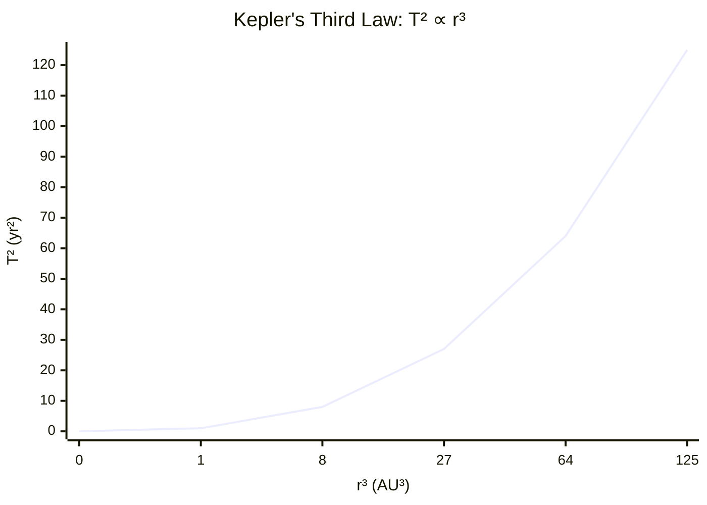

# Kepler's Third Law

## Statement

For a body in circular orbit around a central mass, the square of the orbital
period is proportional to the cube of the orbital radius.

## Equation

T² = (4π² / G M) r³

equivalently T² ∝ r³ for a fixed central mass M.

## Symbols and Units

- T: orbital period — s
- r: orbital radius (centre-to-centre) — m
- M: mass of the central body — kg
- G: gravitational constant, 6.67 × 10⁻¹¹ — N m² kg⁻²

## Conditions

- Circular (or near-circular) orbit
- Central mass M much greater than the orbiting mass m
- Single dominant gravitational source

## Physical Meaning

The orbital period depends only on the orbit size and the central mass, not
on the orbiting body's mass. Larger orbits are slower; a more massive central
body speeds all orbits up. This is why outer planets take far longer to circle
the Sun than inner ones.

## Foundation Link

Builds on the GCSE idea that gravity keeps satellites and planets in orbit,
made quantitative through [[Circular-Motion]] and [[Newtons-Law-of-Gravitation]].

## How to Use

Equate gravitational force to centripetal force, GMm/r² = mv²/r, substitute
v = 2πr/T, and rearrange to T² = (4π²/GM) r³. Use it to find M from an orbit,
or to compare two orbits with T₁²/r₁³ = T₂²/r₂³.

## Derivation or Explanation

From GMm/r² = mω²r with ω = 2π/T: GM/r² = (4π²/T²) r, giving
T² = (4π²/GM) r³. The mass m cancels, which is why the law is universal for
all satellites of the same central body.

## Related Quantities

- [[Gravitational-Field-Strength]]
- [[Mass]]

## Related Models

- [[Orbital-Motion]]
- [[Circular-Motion]]
- [[Centripetal-Force]]

## Applications

- [[Satellites-and-Geostationary-Orbits]]
- [[Using-Keplers-Third-Law]]

## Frontier Links

- [[Cosmology-Map]]

## Common Mistakes

- Using orbital height above the surface instead of radius from the centre
- Forgetting period is independent of the satellite's mass
- Mixing units (period not in seconds, radius not in metres)

## Visuals

### T² vs r³ relationship

*Figure: A plot of T² against r³ for planets orbiting the same star is a straight line through the origin. The gradient equals 4π²/(GM).*
*Source: Authored for this vault (CC0). No external copyright.*

## Source Trace

- Source: OpenStax College Physics; HyperPhysics; NASA educational material — no copied text
- OCR alignment: [[OCR-Physics-A-H556-Specification]]
- Section/Page: OCR M5.4 Gravitational fields
