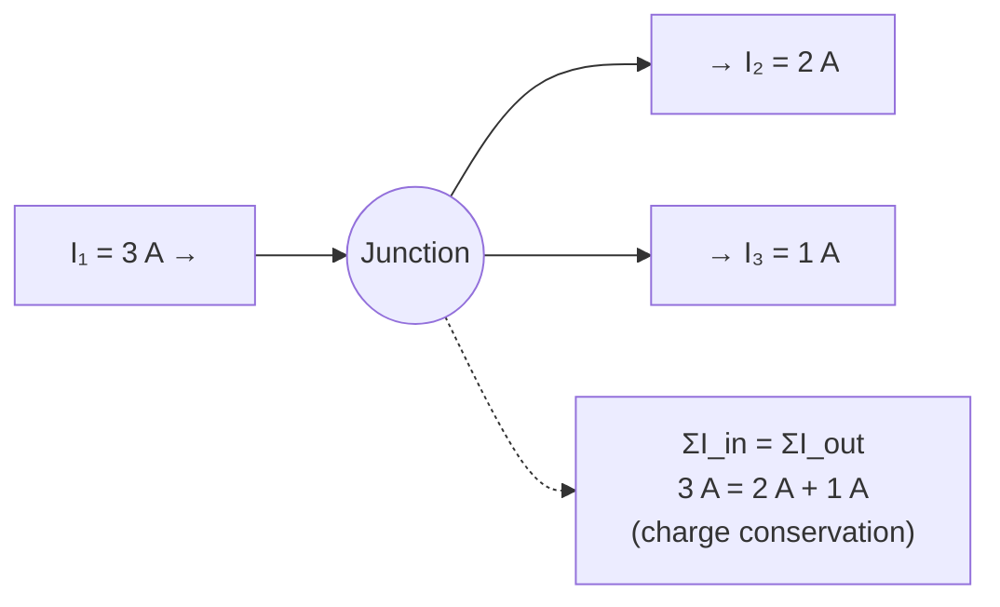

# Kirchhoffs First Law

## Statement

The total current entering any junction (node) in a circuit equals the total current leaving it. Charge is neither created nor destroyed at a junction, so the algebraic sum of currents at a node is zero.

## Equation

$$\Sigma I_{in} = \Sigma I_{out} \qquad \text{or equivalently} \qquad \Sigma I = 0$$

(taking inflows positive, outflows negative)

## Symbols and Units

- `I`: electric current in each branch, amperes `A` (scalar, but with a chosen sign for direction)
- `ΣI_in`: sum of currents flowing into the junction, `A`
- `ΣI_out`: sum of currents flowing out of the junction, `A`

## Conditions

- Applies at any junction in any circuit (DC or instantaneous AC).
- Assumes no charge accumulates at the node (true for ordinary conductors; a charging capacitor's plates are *not* junctions in this sense).
- Steady-state or quasi-steady conditions.

## Physical Meaning

This law is a direct statement of **conservation of electric charge**. Current is the rate of flow of charge; if more charge flowed in than out, charge would build up indefinitely at a point, which does not happen in a normal conductor. It is essential for analysing parallel branches, where the supply current splits and recombines.

## Foundation Link

GCSE teaches that in a parallel circuit "the currents in the branches add up to the main current". A-Level generalises this to any junction with a sign convention, enabling systematic solution of multi-loop networks alongside [[Kirchhoffs-Second-Law]].

## How to Use

1. Label every branch current with an assumed direction.
2. At each junction write $\Sigma(\text{in}) = \Sigma(\text{out})$.
3. Combine with loop equations from [[Kirchhoffs-Second-Law]].
4. A negative answer means the real current is opposite to the assumed direction.

## Derivation or Explanation

From [[Charge]] conservation: the net charge in a tiny volume around a node is constant, so $\frac{dQ}{dt} = 0$, and since $I = \frac{dQ}{dt}$ for each branch, the branch currents must sum to zero.

## Related Quantities

- [[Current]]
- [[Charge]]
- [[Potential-Difference]]

## Related Models

- [[Ohmic-Conductor-Model]]

## Applications

- Analysing parallel resistor networks
- Designing current-divider circuits
- Solving multi-loop circuits with [[Kirchhoffs-Second-Law]]

## Frontier Links

- [[Quantum-Mechanics-Map]] — charge quantisation underlies why charge is exactly conserved.

## Common Mistakes

- Forgetting a branch when summing currents at a node
- Inconsistent sign convention for in vs out
- Treating capacitor plates as a normal junction

## Visuals

### Current conservation at a junction

*Figure: At any junction the current splits so that total current in equals total current out — conservation of charge.*
*Source: Authored for this vault (CC0). No external copyright.*

### From Wikipedia

<!-- wiki-images: yes -->

#### KCL - Kirchhoff's circuit laws

![[_attachments/05_Laws-and-Results/Kirchhoffs-First-Law--wiki-kcl-kirchhoffs-circuit-laws.svg]]
*Figure: from Wikipedia article "Kirchhoff's circuit laws".*
*Source: Wikimedia Commons — [KCL - Kirchhoff's circuit laws.svg](https://commons.wikimedia.org/wiki/File:KCL_-_Kirchhoff's_circuit_laws.svg). Retrieved 2026-05-20.*

#### Kirchhoff voltage law

![[_attachments/05_Laws-and-Results/Kirchhoffs-First-Law--wiki-kirchhoff-voltage-law.svg]]
*Figure: from Wikipedia article "Kirchhoff's circuit laws".*
*Source: Wikimedia Commons — [Kirchhoff voltage law.svg](https://commons.wikimedia.org/wiki/File:Kirchhoff_voltage_law.svg). Retrieved 2026-05-20.*

#### Kirshhoff-example

![[_attachments/05_Laws-and-Results/Kirchhoffs-First-Law--wiki-kirshhoff-example.svg]]
*Figure: from Wikipedia article "Kirchhoff's circuit laws".*
*Source: Wikimedia Commons — [Kirshhoff-example.svg](https://commons.wikimedia.org/wiki/File:Kirshhoff-example.svg). Retrieved 2026-05-20.*

## Source Trace

- Source: OpenStax College Physics; HyperPhysics; Physics LibreTexts — paraphrased, no copied text
- OCR alignment: [[OCR-Physics-A-H556-Specification]]
