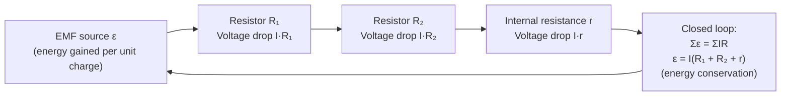

# Kirchhoffs Second Law

## Statement

Around any closed loop in a circuit, the sum of the electromotive forces equals the sum of the potential differences (the products of current and resistance). Equivalently, the algebraic sum of all potential changes around a closed loop is zero.

## Equation

`Σε = ΣIR`   or equivalently   `ΣV = 0` around the loop

## Symbols and Units

- `ε`: electromotive force of each source, volts `V` (scalar, signed by polarity)
- `I`: current in each component, amperes `A`
- `R`: resistance of each component, ohms `Ω`
- `IR`: potential difference across a resistor, volts `V`

## Conditions

- Applies to any closed loop in a circuit.
- Internal resistance of cells must be included as an `Ir` term.
- Steady-state DC, or instantaneous values for slowly varying circuits.

## Physical Meaning

This law is a statement of **conservation of energy**: a unit charge taken once around a complete loop must return to the same potential, so the energy gained from sources (emf) equals the energy delivered to components (potential differences). It allows the unknown currents in multi-loop networks to be solved together with [[Kirchhoffs-First-Law]].

## Foundation Link

GCSE teaches that in a series circuit "the supply voltage is shared between components". A-Level generalises this to signed potential changes around any loop, including emf, internal resistance, and the ability to handle networks with several sources.

## How to Use

1. Assign a current direction to each branch.
2. Choose a loop and a traversal direction.
3. Add emfs (sign by polarity) and subtract `IR` drops (sign by current direction).
4. Set the loop sum to zero and solve with junction equations.

## Derivation or Explanation

The electric field in an electrostatic circuit is conservative, so the work done moving a charge around any closed path is zero: `Σ(qV) = 0`, giving `ΣV = 0`. Dividing by `q` yields `Σε = ΣIR`.

## Related Quantities

- [[Potential-Difference]]
- [[Current]]
- [[Resistance]]
- [[Charge]]
- [[Energy-Quantity|Energy]]

## Related Models

- [[Ohmic-Conductor-Model]]

## Applications

- Solving multi-loop circuits and potential dividers
- Determining internal resistance of a cell
- Combined with [[Kirchhoffs-First-Law]] and [[Ohms-Law]]

## Frontier Links

- [[Relativity-Map]] — in time-varying magnetic fields the loop rule must be extended (induced emf), foreshadowing electromagnetism's link to relativity.

## Common Mistakes

- Wrong sign for an `IR` drop relative to traversal direction
- Omitting internal resistance of the cell
- Forgetting energy conservation is the underlying principle

## Visuals

### Loop voltage balance

*Figure: Around a closed loop, EMFs gained equal voltage drops across resistors — conservation of energy per unit charge.*
*Source: Authored for this vault (CC0). No external copyright.*

## Source Trace

- Source: OpenStax College Physics; HyperPhysics; Physics LibreTexts — paraphrased, no copied text
- OCR alignment: [[OCR-Physics-A-H556-Specification]]
