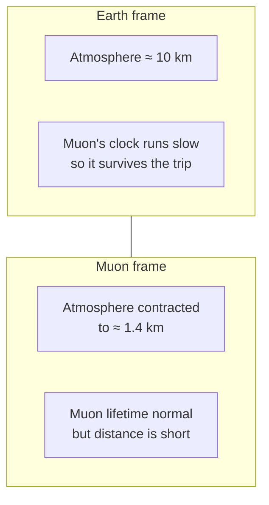

# Length Contraction

## Statement

An object moving relative to an observer is measured to be **shorter along its direction of motion** than the same object at rest. Dimensions perpendicular to the motion are unchanged.

## Equation

$$
l = l_{0}\sqrt{1 - \dfrac{v^{2}}{c^{2}}} = \dfrac{l_{0}}{\gamma}
$$

## Symbols and Units

- Symbol: $l_{0}$ — Meaning: **proper length** — the length of the object measured in the frame where it is *at rest*. Unit: metre (m).
- Symbol: $l$ — Meaning: contracted length measured in a frame where the object moves at speed $v$ along its long axis. Unit: metre (m).
- Symbol: $v$ — Meaning: relative speed of object and observer. Unit: m s$^{-1}$.
- Symbol: $c$ — Meaning: speed of light in vacuum, $\approx 3.00 \times 10^{8}$ m s$^{-1}$. Unit: m s$^{-1}$.
- Symbol: $\gamma = 1/\sqrt{1 - v^{2}/c^{2}}$ — Meaning: Lorentz factor (dimensionless).

## Conditions

- Both frames are inertial.
- $l_{0}$ is measured by an observer at rest with respect to the object.
- Contraction acts **only along the direction of relative motion**. A moving metre rule held perpendicular to its motion is still 1 m long.
- $v < c$.

## Physical Meaning

Length contraction is the spatial partner of [[Time-Dilation]]. Both follow from the same demand: light must travel at speed $c$ in every inertial frame. If clocks tick differently between frames, then rulers must also measure differently — otherwise observers would disagree about the value of $c$.

Like time dilation, the effect is symmetric. Each observer sees *the other's* rulers shrunk.

## Foundation Link

Builds on the GCSE idea that an object has a definite length. Relativity says length depends on who's measuring — and the rest-frame length $l_{0}$ is the largest any observer will ever measure.

## How to Use

1. Identify the rest frame of the object — that gives the proper length $l_{0}$.
2. Identify the relative speed $v$.
3. Compute $\gamma$ and divide: $l = l_{0}/\gamma$.
4. Remember: only the dimension along motion contracts.

## Derivation or Explanation

Consider a muon created in the upper atmosphere travelling at $v \approx 0.99 c$ towards the ground. In the Earth frame the atmosphere is, say, 10 km thick and the muon's lifetime is dilated, so it can cross. In the muon's own frame the muon lives only its rest lifetime $\sim 2.2\,\mu$s, *but* the atmosphere is rushing towards it at $0.99c$ and is **contracted** to about $10/\gamma \approx 1.4$ km — short enough to cross within the rest lifetime. Both observers agree the muon reaches the ground; they disagree on whether it's time or distance that "shrinks".

## Related Quantities

- [[Length-and-Displacement|Length]]
- [[Velocity]]

## Related Models

- Inertial frame
- Rigid body (Newtonian — modified here)

## Applications

- Cosmic-ray muon reaching sea level (paired with [[Time-Dilation]]).
- Length contraction of bunches of charged particles in accelerators — relevant for beam dynamics.
- Conceptually underpins why magnetism can be viewed as a relativistic effect of electrostatics.

## Frontier Links

- [[Relativity-Map]]

## Common Mistakes

- Forgetting the contraction is **only along the direction of motion**. A moving sphere is still measured as round-ish only because perpendicular dimensions don't change (actually it *looks* even rounder due to light-travel effects, but the *measured* shape is an oblate spheroid).
- Swapping $l$ and $l_{0}$. **Proper length is the largest** measured length.
- Thinking the object physically squeezes — it's a measurement-frame effect, not a stress.
- Trying to apply the formula when the object's long axis is perpendicular to its velocity.

## Visuals

### Atmosphere as seen by muon vs. by Earth

*Figure: Both frames agree the muon hits the ground — Earth's frame says time stretches, the muon's frame says distance shrinks.*
*Source: Authored for this vault (CC0). No external copyright.*

### From Wikimedia

<!-- wiki-images: yes -->

#### Contraction along the direction of motion
![[_attachments/05_Laws-and-Results/Length-Contraction--wiki-length-contraction.svg]]
*Figure: The same object measured at rest and while moving — only the dimension along the direction of motion is shortened by the factor 1/γ.*
*Source: Wikimedia Commons — [Length-contraction.svg](https://commons.wikimedia.org/wiki/File:Length-contraction.svg) — CC BY-SA 4.0 — MikeRun. Retrieved 2026-06-27.*

## Source Trace

- Source: [[AQA-Physics-7407-7408-Specification]] §3.12.3
- Section/Page: Turning Points in Physics — Special Relativity (HyperPhysics; OpenStax University Physics)
