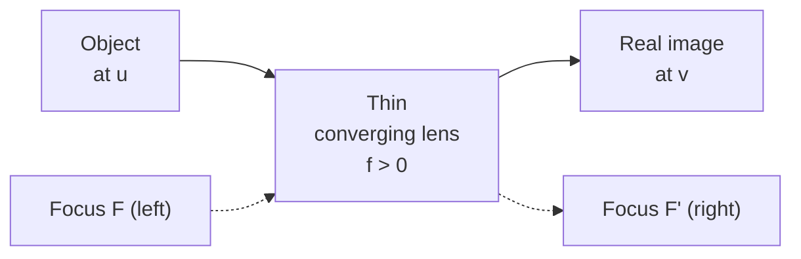

# Lens Equation

## Statement

For a thin lens forming an image of a small object on the principal axis, the object distance, image distance, and focal length are linked by a single reciprocal relation. The same equation works for converging and diverging lenses provided a consistent sign convention is used. The linear (transverse) magnification of the image equals the ratio of image distance to object distance.

## Equation

$$\frac{1}{u} + \frac{1}{v} = \frac{1}{f}$$

$$m = \frac{v}{u} = \frac{h_i}{h_o}$$

## Symbols and Units

- $u$ — object distance from lens centre — metres (m)
- $v$ — image distance from lens centre — metres (m)
- $f$ — focal length of the lens — metres (m)
- $m$ — linear magnification — dimensionless
- $h_o$ — object height — metres (m)
- $h_i$ — image height — metres (m)

## Conditions

- Thin lens: lens thickness is negligible compared with $u$, $v$, $f$.
- Paraxial rays: rays make small angles with the principal axis.
- Monochromatic light (avoid chromatic aberration in calculation).
- "Real is positive" sign convention used here:
	- $u > 0$ for a real object in front of the lens.
	- $v > 0$ for a real image on the far side; $v < 0$ for a virtual image on the same side as the object.
	- $f > 0$ for a converging lens; $f < 0$ for a diverging lens.

## Physical Meaning

The principal focus is where rays parallel to the axis converge after passing through a converging lens, or appear to diverge from for a diverging lens. The focal length $f$ is the distance from the lens to that focus. The equation expresses how moving the object closer to the lens pushes the image further away and changes its size — the lens trades distance for image position in a reciprocal way. The magnification tells us both the size ratio and (with sign) whether the image is inverted.

## Foundation Link

Builds directly on the GCSE [[Ray-Model-of-Light]] and the rules for [[Wave-Refraction]] at a curved surface. At GCSE you draw the three "key rays" through a lens to find an image; the lens equation is the algebraic shortcut that replaces those drawings once the focal length is known.

## How to Use

1. Identify $f$ (with sign) for the lens.
2. Measure or read $u$.
3. Solve $1/v = 1/f - 1/u$ for the image distance.
4. Use $m = v/u$ for size; a negative $v$ flags a virtual image (upright, same side).

## Derivation or Explanation

For paraxial rays, [[Snell-Law]] applied to the two refracting surfaces of a thin lens collapses to a single reciprocal relation between conjugate points — full derivation belongs in an optional [[Method]] page, not here.

## Related Quantities

- [[Lens-Power]]
- [[Refractive-Index]]

## Related Models

- Thin-lens model (paraxial approximation)

## Applications

- [[Physics-of-the-Eye]]
- [[Defects-of-Vision]]
- Cameras, magnifying glasses, eyepieces

## Frontier Links

- Aberrations, adaptive optics, gravitational lensing (see frontier maps)

## Common Mistakes

- Mixing sign conventions mid-calculation.
- Forgetting that virtual images give negative $v$.
- Using $u$ in centimetres but $f$ in metres.

## Visuals

### Thin lens ray diagram (converging)

*Figure: object at distance $u$ left of a converging lens, real image forming at distance $v$ on the right; $F$ and $F'$ mark the two principal foci.*
*Source: Authored for this vault (CC0). No external copyright.*

### From Wikimedia

<!-- wiki-images: yes -->

#### Convex lens forming a real image
![[_attachments/05_Laws-and-Results/Lens-Equation--wiki-convex-lens-image.png]]
*Figure: rays from the object refract through a convex lens to form an inverted real image, the geometry behind $1/u + 1/v = 1/f$.*
*Source: Wikimedia Commons — [Convex lens image formation](https://commons.wikimedia.org/wiki/File:2015-05-25_0820Incoming_parallel_rays_are_focused_by_a_convex_lens_into_an_inverted_real_image_one_focal_length_from_the_lens,_on_the_far_side_of_the.png) — CC BY-SA 4.0 — Lookang / Fu-Kwun Hwang. Retrieved 2026-06-27.*

## Source Trace

- Source: [[AQA-Physics-7407-7408-Specification]] §3.10.1
- Public source: HyperPhysics (Lens Equation); OpenStax College Physics Vol. 3 Ch. 2 (Geometric Optics)
- Section/Page: Optional unit 3.10 — Medical physics — physics of vision
