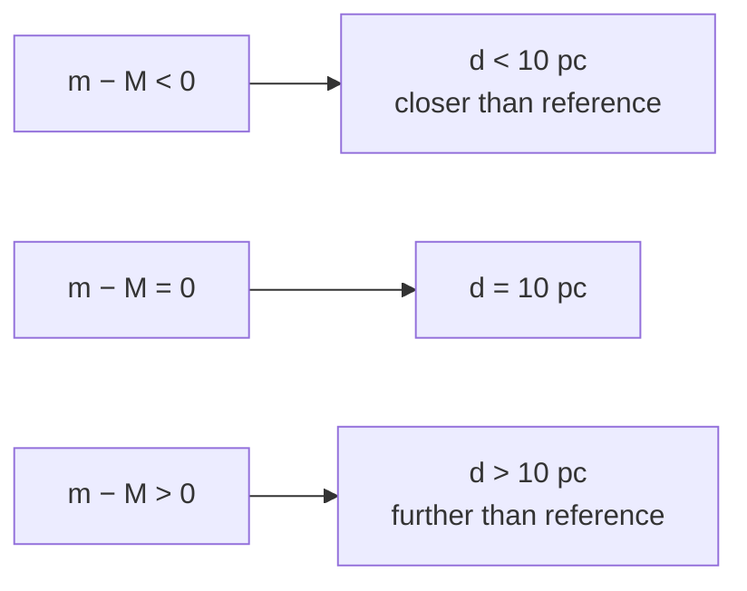

# Magnitude–Distance Equation

## Statement

For a star whose [[Apparent-Magnitude]] is `m` and [[Absolute-Magnitude]] is `M`, the distance `d` to the star (in parsec) satisfies:

`m − M = 5 log₁₀(d / 10)`

The quantity `m − M` is called the **distance modulus**.

## Equation

`m − M = 5 log₁₀(d / 10)`

Equivalently:

`d = 10 × 10^((m − M) / 5)` (parsec)

## Symbols and Units

- Symbol: `m` — Meaning: [[Apparent-Magnitude]] — Unit: dimensionless.
- Symbol: `M` — Meaning: [[Absolute-Magnitude]] — Unit: dimensionless.
- Symbol: `d` — Meaning: distance to the star — Unit: **parsec (pc)**.

## Conditions

- `d` must be in parsec — the equation is calibrated by defining `M` at exactly 10 pc.
- Interstellar absorption (dust dimming) is ignored — for AQA A-level this is treated as negligible.
- The star is treated as a point source whose flux falls as `1 / d²` (inverse-square law).

## Physical Meaning

It is just the inverse-square law of [[Intensity]] expressed on a logarithmic magnitude scale. A factor of 100 in intensity = 5 magnitudes; intensity falls as `1/d²`, so 5 magnitudes of dimming correspond to a factor of 10 in distance — hence the `5 log(d/10)` form.

## Foundation Link

- Inverse-square dimming: `I = L / (4πd²)` from [[Luminosity]] and [[Intensity]].
- Magnitudes are logs of intensity ratios — see [[Apparent-Magnitude]].

## How to Use

1. Measure `m` photometrically.
2. Determine `M` (from spectral class, [[Standard-Candles]], or main-sequence fitting).
3. Compute `d = 10 × 10^((m − M)/5)` parsec, or solve symbolically.

Worked sanity check: if `m = M`, then `m − M = 0`, so `log(d/10) = 0`, giving `d = 10 pc`. That matches the definition of `M`.

## Derivation or Explanation

Two stars of luminosity `L` at distances `d_1`, `d_2` produce intensities `I_1 / I_2 = (d_2 / d_1)²`. The magnitude difference is `m_1 − m_2 = −2.5 log₁₀(I_1/I_2) = 5 log₁₀(d_1 / d_2)`. Setting star 2 at the reference distance of 10 pc with magnitude `M` gives the stated equation.

## Related Quantities

- [[Apparent-Magnitude]]
- [[Absolute-Magnitude]]
- [[Luminosity]]
- [[Intensity]]

## Related Models

- Inverse-square law of radiation.

## Applications

- [[Standard-Candles]] and cosmic distance ladder.
- Estimating distances to clusters and galaxies.

## Frontier Links

- [[Hubbles-Law]]
- [[Astronomical-Distances]]

## Common Mistakes

- Using metres or light years instead of parsecs for `d`.
- Dropping the factor of 10 inside the logarithm.
- Forgetting that bigger magnitude means dimmer, so a positive `m − M` means the star is **further** than 10 pc.

## Visuals

### Distance modulus interpretation

*Figure: Sign of `m − M` tells you whether the star is closer or further than 10 pc.*
*Source: Authored for this vault (CC0). No external copyright.*

## Source Trace

- Source: [[AQA-Physics-7407-7408-Specification]] §3.9.2
- Section/Page: Magnitude–distance relation; parsec; distance modulus.
- Public reference: HyperPhysics "Distance Modulus"; OpenStax Astronomy Ch. 17.
