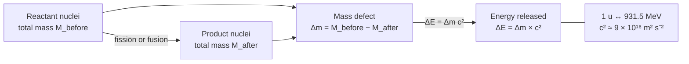

# Mass Energy Equivalence

## Statement

Mass and energy are equivalent: a change in the energy of a system corresponds to a proportional change in its mass, and rest mass can be converted into energy and vice versa.

## Equation

ΔE = Δm c²

(and for rest energy, E₀ = m c²)

## Symbols and Units

- ΔE: energy change — unit joule (J), often MeV in nuclear physics
- Δm: mass change — unit kilogram (kg), often atomic mass units (u)
- c: speed of light in vacuum, 3.00 × 10⁸ m s⁻¹
- Conversions: 1 u ↔ 931.5 MeV; 1 MeV = 1.60 × 10⁻¹³ J

## Conditions

- c is the speed of light in a vacuum; the relation is exact in special relativity.
- Applies to any energy change, but is only measurable when Δm is significant — i.e. in nuclear and particle processes, not in everyday chemical or mechanical ones.

## Physical Meaning

Because c² is huge (≈ 9 × 10¹⁶ m² s⁻²), a tiny mass change releases an enormous energy. In a bound nucleus the [[Mass-Defect]] is the mass "stored" as [[Binding-Energy]]. In annihilation, all rest mass becomes photon energy; in pair production, photon energy becomes rest mass.

## Foundation Link

Builds on [[Conservation-of-Energy]]: energy is still conserved, but the energy "account" now includes rest mass as a form of stored energy.

## How to Use

1. Find the mass change Δm of the process (reactants − products), in kg or u.
2. Multiply by c² (or use 931.5 MeV per u).
3. The result is the energy released (Δm > 0) or absorbed (Δm < 0).

## Derivation or Explanation

Treated as a stated relativistic result at A-Level; no derivation required.

## Related Quantities

- [[Mass]]
- [[Energy-Quantity|Energy]]

## Related Models

- [[The-Nuclear-Atom]]

## Applications

- [[Nuclear-Fission]]
- [[Nuclear-Fusion]]
- [[Carbon-Dating]]

## Frontier Links

- [[Particle-Physics-Map]]
- [[CERN-Science]]

## Common Mistakes

- Forgetting to square c
- Mixing units (using u with c² directly without the 931.5 MeV conversion)
- Thinking mass-energy equivalence violates conservation of energy (it extends it)

## Visuals

### Nuclear process energy chain

*Figure: Mass–energy equivalence in nuclear processes — the mass defect converts to released energy via E = Δmc².*
*Source: Authored for this vault (CC0). No external copyright.*

## Source Trace

- Source: OpenStax College Physics; HyperPhysics; CERN educational material — no copied text
- OCR alignment: [[OCR-Physics-A-H556-Specification]]
