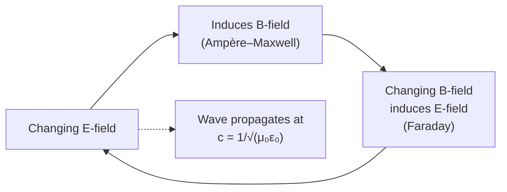

# Maxwell — Speed of Light

## Statement

Maxwell's equations imply that electric and magnetic fields can propagate through a vacuum as a transverse wave whose speed depends only on two electromagnetic constants of free space. That speed equals the measured speed of light, identifying light as an electromagnetic wave.

## Equation

$$c = \dfrac{1}{\sqrt{\mu_{0}\,\varepsilon_{0}}}$$

## Symbols and Units

- c = speed of electromagnetic waves in vacuum, m s⁻¹ (measured value ≈ 3.00 × 10⁸ m s⁻¹)
- μ₀ = permeability of free space, H m⁻¹ (≈ 1.26 × 10⁻⁶ H m⁻¹) — appears in the magnetic field of a current
- ε₀ = permittivity of free space, F m⁻¹ (≈ 8.85 × 10⁻¹² F m⁻¹) — appears in the electric field of a charge

## Conditions

- Propagation through vacuum (no charges or currents present).
- Field strengths low enough that vacuum behaves linearly (always true at A-Level scales).
- In a material, replace μ₀ → μ₀μ_r and ε₀ → ε₀ε_r, giving a slower speed and hence a refractive index n.

## Physical Meaning

ε₀ measures how strongly a stationary charge produces an [[Electric-Field]] in vacuum; μ₀ measures how strongly a current produces a [[Magnetic-Field]]. Maxwell showed that a changing E-field generates a B-field and vice versa, so once you disturb the field the disturbance regenerates itself and travels outward — a self-sustaining electromagnetic wave. The constants ε₀ and μ₀ alone fix how fast it moves.

The historical shock: c had been measured optically (Fizeau, 1849, by timing a beam of light through a rotating toothed wheel) and ε₀, μ₀ had been measured purely from electrostatic and magnetostatic experiments. The numbers agreed — light is electromagnetic.

Hertz then confirmed this in 1887 by generating and detecting radio waves with simple spark-gap circuits, showing they reflect, refract, polarise, and travel at c just as visible light does — and so the [[Electromagnetic-Spectrum]] is a single family.

## Foundation Link

Builds on the GCSE idea that light is a wave with measurable speed, and the A-Level concepts of [[Electric-Field]] and [[Magnetic-Field]].

## How to Use

- Recall and use c = 1/√(μ₀ε₀) to obtain c from tabulated μ₀, ε₀.
- Use c = fλ to switch between frequency and wavelength anywhere on the EM spectrum.
- In a medium with refractive index n, the wave speed becomes v = c/n.

## Derivation or Explanation

Combining Faraday's law (changing B induces E) with Ampère–Maxwell's law (changing E induces B) gives a wave equation for E and B in vacuum whose wave speed comes out as 1/√(μ₀ε₀). Beyond A-Level — see [[Quantum-Mechanics-Map]] for the photon picture.

## Related Quantities

- [[Electric-Field]]
- [[Magnetic-Field]]
- [[Wave-Speed-Equation]]

## Related Models

- Plane electromagnetic wave (E and B perpendicular to each other and to the direction of travel).

## Applications

- [[Electromagnetic-Spectrum]] — radio, microwave, infrared, visible, UV, X-ray, γ-ray are all the same wave at different frequencies.
- All of telecommunications and astronomy depends on Hertz-style EM-wave propagation.

## Frontier Links

- Special relativity takes the constancy of c as a postulate; in [[Quantum-Mechanics-Map]] the EM wave is reinterpreted as a stream of photons (relevant to Newton's old corpuscular picture vs Huygens' wave picture, and to the [[Photoelectric-Effect]]).

## Common Mistakes

- Quoting μ₀ε₀ = c (it equals 1/c², not c).
- Forgetting the square root.
- Using μ₀, ε₀ inside a dielectric or magnetic medium — these constants describe vacuum only.
- Treating "speed of light" as only visible light; the same c applies across the whole [[Electromagnetic-Spectrum]].

## Visuals

### Self-sustaining EM wave

*Figure: A changing E-field makes a B-field, whose change regenerates the E-field. The pattern moves through vacuum at c.*
*Source: Authored for this vault (CC0). No external copyright.*

### From Wikimedia

<!-- wiki-images: yes -->

#### Plane electromagnetic wave
![[_attachments/05_Laws-and-Results/Maxwell-Speed-of-Light--wiki-electromagnetic-wave.svg]]
*Figure: The electric field E and magnetic field B oscillate perpendicular to each other and to the direction of travel — the transverse wave that propagates at c = 1/√(μ₀ε₀).*
*Source: Wikimedia Commons — [Electromagnetic wave EN.svg](https://commons.wikimedia.org/wiki/File:Electromagnetic_wave_EN.svg) — CC0 — Piotr Fita. Retrieved 2026-06-27.*

## Source Trace

- Source: [[AQA-Physics-7407-7408-Specification]] §3.12.1
- Public reference: HyperPhysics; OpenStax College Physics
