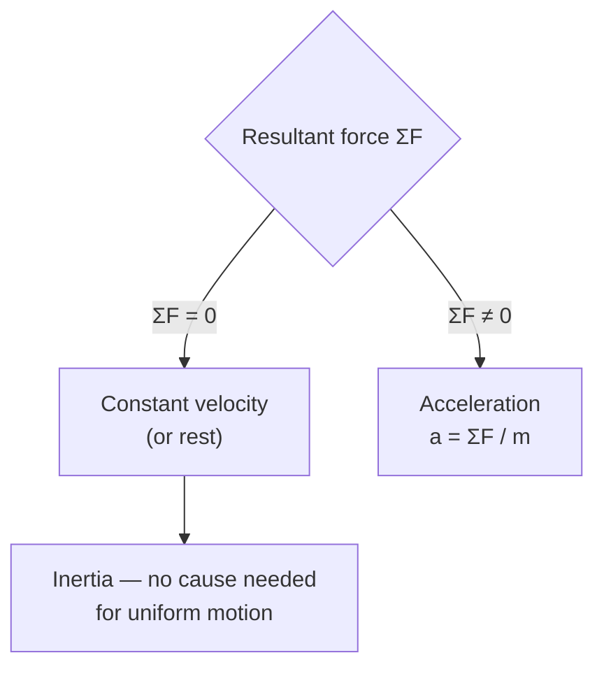

# Newton First Law

## Statement

An object remains at rest, or continues to move in a straight line at constant velocity, unless acted on by a resultant (net) force. In other words, an object's velocity does not change unless a non-zero resultant force acts on it.

## Equation

There is no defining equation. The law corresponds to the condition:

$$\Sigma F = 0 \implies a = 0 \implies v = \text{constant}$$

## Symbols and Units

- `ΣF`: vector sum of all forces (resultant force), newtons `N` (vector)
- `a`: acceleration, metres per second squared `m s⁻²` (vector)
- `v`: velocity, metres per second `m s⁻¹` (vector)

## Conditions

- Measurements must be made in an **inertial reference frame** (one that is not itself accelerating).
- The forces considered must include all real forces (gravity, friction, drag, normal contact, tension).
- Valid for speeds well below the speed of light.

## Physical Meaning

The first law states that uniform motion needs no cause; only a *change* in motion needs a cause. This is the property of **inertia**: matter resists changes to its state of motion. It also defines what we mean by a force — a force is whatever is required to change an object's velocity. On Earth, objects appear to "naturally" stop only because hidden resultant forces (friction, air resistance) act on them.

## Foundation Link

At GCSE the idea is taught as "balanced forces mean steady speed or rest". A-Level sharpens this to vectors: zero *resultant* force means constant *velocity* (constant speed **and** direction), so an object moving in a circle is accelerating even at constant speed.

## How to Use

1. Decide whether the object is in equilibrium (constant velocity or at rest).
2. If so, set the resultant force to zero in each direction.
3. Use [[Resolving-Forces]] to write equilibrium equations and solve for unknown forces.

## Derivation or Explanation

The first law is a special case of [[Newton-Second-Law]] with zero resultant force: $F = ma$ gives $a = 0$ when $F = 0$. Historically it is stated separately because it *defines* inertial frames in which the second law applies.

## Related Quantities

- [[Force]]
- [[Mass]]
- [[Acceleration]]
- [[Momentum]]

## Related Models

- [[Constant-Acceleration-Model]] (with zero acceleration)

## Applications

- [[Resolving-Forces]] for objects in equilibrium
- Seatbelts and headrests: occupants continue moving when a car suddenly stops
- Objects drifting in deep space with negligible resultant force

## Frontier Links

- [[Relativity-Map]] — inertial frames are central to special relativity.

## Common Mistakes

- [[Confusing-Mass-and-Weight]]
- Thinking a moving object must have a forward force acting on it
- Treating constant speed in a circle as "no acceleration"

## Visuals

### Inertia and equilibrium

*Figure: Newton's First Law decision tree: zero resultant force gives constant velocity; non-zero resultant force gives acceleration.*
*Source: Authored for this vault (CC0). No external copyright.*

### From Wikipedia

<!-- wiki-images: yes -->

#### Binary system orbit q=3 e=0

![[_attachments/05_Laws-and-Results/Newton-First-Law--wiki-binary-system-orbit-q3-e0.gif]]
*Figure: from Wikipedia article "Newton's laws of motion".*
*Source: Wikimedia Commons — [Binary system orbit q=3 e=0.gif](https://commons.wikimedia.org/wiki/File:Binary_system_orbit_q=3_e=0.gif). Retrieved 2026-05-20.*

#### Bouncing ball strobe edit

![[_attachments/05_Laws-and-Results/Newton-First-Law--wiki-bouncing-ball-strobe-edit.jpg]]
*Figure: from Wikipedia article "Newton's laws of motion".*
*Source: Wikimedia Commons — [Bouncing ball strobe edit.jpg](https://commons.wikimedia.org/wiki/File:Bouncing_ball_strobe_edit.jpg). Retrieved 2026-05-20.*

#### Breaking String

![[_attachments/05_Laws-and-Results/Newton-First-Law--wiki-breaking-string.png]]
*Figure: from Wikipedia article "Newton's laws of motion".*
*Source: Wikimedia Commons — [Breaking String.PNG](https://commons.wikimedia.org/wiki/File:Breaking_String.PNG). Retrieved 2026-05-20.*

## Source Trace

- Source: OpenStax College Physics; HyperPhysics; Physics LibreTexts — paraphrased, no copied text
- OCR alignment: [[OCR-Physics-A-H556-Specification]]
