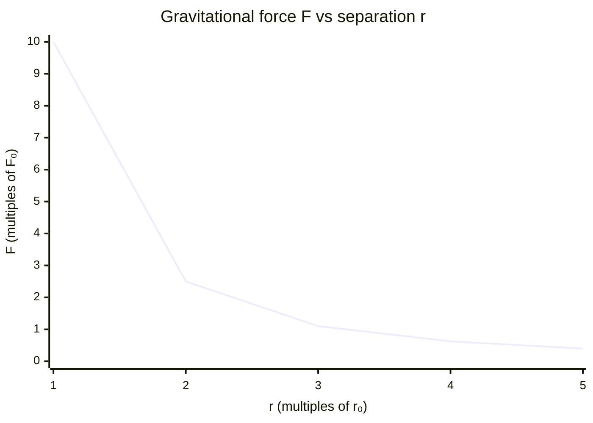

# Newtons Law of Gravitation

## Statement

Every point mass attracts every other point mass with a force directed along the line joining them. The force is proportional to the product of the two masses and inversely proportional to the square of the distance between their centres.

## Equation

`F = G m₁ m₂ / r²`

## Symbols and Units

- `F`: gravitational force of attraction, newtons `N` (vector, attractive)
- `G`: universal gravitational constant, `≈ 6.67 × 10⁻¹¹`, `N m² kg⁻²`
- `m₁, m₂`: the two masses, kilograms `kg`
- `r`: distance between the centres of the masses, metres `m`

## Conditions

- Strictly for **point masses**; spherically symmetric bodies behave as if all mass is at the centre.
- An **inverse-square** law: doubling `r` quarters the force.
- The force is always attractive and acts along the line joining the masses.
- Newtonian limit only; general relativity is needed for very strong fields or extreme precision.

## Physical Meaning

Gravity is a universal attraction between all masses, extremely weak per kilogram but dominant on astronomical scales because mass only adds up (never cancels, unlike charge). It explains why objects fall, why planets orbit, and why `g ≈ 9.8 N kg⁻¹` near Earth's surface. The field strength is `g = GM/r²`, linking this law to free fall and orbital motion.

## Foundation Link

GCSE introduces weight `W = mg` and that masses attract each other. A-Level generalises to the universal inverse-square law, gravitational field strength `g = F/m`, and orbital mechanics, showing GCSE's constant `g` is just the near-surface special case.

## How to Use

1. Identify the two masses and the centre-to-centre distance `r`.
2. Substitute into `F = Gm₁m₂/r²`.
3. For field strength use `g = GM/r²`; for orbits set gravitational force equal to the required centripetal force.
4. Keep `r` in metres and use centre-to-centre distances, not surface separations.

## Derivation or Explanation

Newton inferred the inverse-square form from Kepler's third law: requiring the gravitational force to supply circular-orbit centripetal force `mv²/r` reproduces `T² ∝ r³`.

## Related Quantities

- [[Force]]
- [[Mass]]
- [[Acceleration]]
- [[Energy]]

## Related Models

- [[Constant-Acceleration-Model]] (near-surface special case)

## Applications

- Satellite and planetary orbits
- Calculating `g` on other planets and the Moon
- Tides and gravitational potential energy

## Frontier Links

- [[Relativity-Map]] — general relativity reinterprets gravity as spacetime curvature and corrects Newton in strong fields.

## Common Mistakes

- Using surface separation instead of centre-to-centre distance
- Forgetting the inverse-square (using `1/r` instead of `1/r²`)
- [[Confusing-Mass-and-Weight]]

## Visuals

### Inverse-square force vs distance

*Figure: As separation doubles, the gravitational force falls to one-quarter — the inverse-square law. Values are illustrative ratios, not absolute.*
*Source: Authored for this vault (CC0). No external copyright.*

## Source Trace

- Source: OpenStax College Physics; HyperPhysics; Physics LibreTexts — paraphrased, no copied text
- OCR alignment: [[OCR-Physics-A-H556-Specification]]
