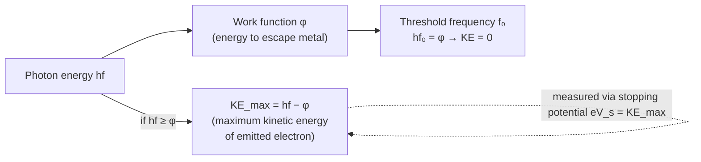

# Photoelectric Equation

## Statement

When a photon is absorbed by a surface electron, the photon's energy is used partly to free the electron from the metal (the work function) and the remainder appears as the electron's maximum kinetic energy. One photon interacts with one electron.

## Equation

$$hf = \varphi + KE_{max}$$

equivalently $hf = \varphi + \frac{1}{2}mv_{max}^2$

## Symbols and Units

- `h`: Planck constant, $\approx 6.63 \times 10^{-34}$, joule seconds `J s`
- `f`: frequency of the incident light, hertz `Hz`
- `hf`: energy of one photon, joules `J`
- `φ`: work function of the metal (minimum energy to remove an electron), joules `J`
- `KE_max`: maximum kinetic energy of an emitted photoelectron, joules `J`
- `m`: electron mass, kilograms `kg`; `v_max`: maximum electron speed, `m s⁻¹`

## Conditions

- One photon delivers its whole energy to one electron (no accumulation).
- Emission occurs only if $f \geq f_0$, the threshold frequency, where $hf_0 = \varphi$.
- The metal surface must be clean; energy may be lost if the electron starts below the surface.

## Physical Meaning

The photoelectric effect cannot be explained by classical waves. Light delivers energy in discrete quanta (photons) of energy $hf$. Below the threshold frequency no electrons are emitted no matter how intense the light, because each photon individually lacks the energy $\varphi$. Increasing intensity only increases the *number* of photons (and so the current), not the energy per electron. This was direct evidence for the [[Photon-Model]] and wave–particle duality.

## Foundation Link

GCSE introduces the electromagnetic spectrum and photon energy increasing with frequency. A-Level adds the quantitative photon energy $E = hf$, the work function, threshold frequency, stopping potential, and the failure of the classical wave model.

## How to Use

1. Compute photon energy $hf$ (convert eV ↔ J if needed: $1 \text{ eV} = 1.6 \times 10^{-19} \text{ J}$).
2. Subtract the work function to find `KE_max`.
3. Find threshold frequency from $f_0 = \varphi/h$.
4. Relate `KE_max` to stopping potential `V_s` via $KE_{max} = eV_s$.

## Derivation or Explanation

Energy conservation for a single photon–electron interaction: input photon energy $hf$ equals energy to escape $\varphi$ plus the surplus carried away as kinetic energy, giving $hf = \varphi + KE_{max}$.

## Related Quantities

- [[Frequency]]
- [[Energy-Quantity|Energy]]
- [[Charge]]

## Related Models

- [[Photon-Model]]

## Applications

- Photocells and light sensors
- Photomultiplier tubes and image sensors
- Solar photovoltaic principles

## Frontier Links

- [[Quantum-Mechanics-Map]] — the foundational evidence for energy quantisation and the quantum theory of light.

## Common Mistakes

- Thinking brighter light always ejects electrons (fails below threshold)
- Mixing joules and electronvolts
- Treating `KE_max` as the kinetic energy of *every* electron rather than the maximum

## Visuals

### Photon energy budget

*Figure: Photoelectric equation energy budget — photon energy splits between escaping the metal and kinetic energy of the emitted electron.*
*Source: Authored for this vault (CC0). No external copyright.*

## Source Trace

- Source: OpenStax College Physics; HyperPhysics; Physics LibreTexts — paraphrased, no copied text
- OCR alignment: [[OCR-Physics-A-H556-Specification]]
