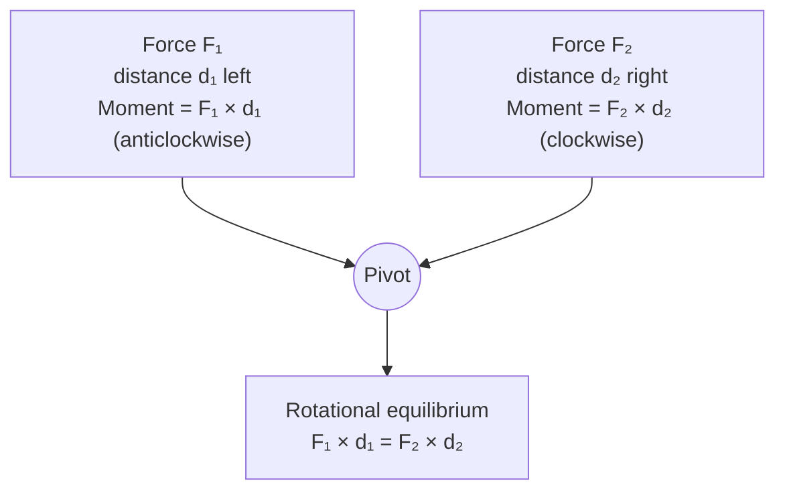

# Principle of Moments

## Statement

For a body in rotational equilibrium, the sum of the clockwise moments about
any point equals the sum of the anticlockwise moments about that same point.

## Equation

$$\Sigma(\text{clockwise moments}) = \Sigma(\text{anticlockwise moments})$$

For a single moment: $M = F \times d$

## Symbols and Units

- M — moment of a force — unit: newton metre (N m)
- F — force — unit: newton (N)
- d — perpendicular distance from the pivot to the line of action of F —
  unit: metre (m)

## Conditions

- The body must be in (or analysed at the point of) equilibrium — no angular
  acceleration.
- The principle holds about *any* chosen point; choosing the point where an
  unknown force acts removes that force from the equation.
- Distances must be measured perpendicular to the line of action of each
  force.

## Physical Meaning

A body does not start to rotate only if the turning effects trying to spin it
one way are exactly balanced by those trying to spin it the other way. This
balance of [[Moment]]s, together with a zero [[Resultant-Force]], defines full
[[Equilibrium]].

## Foundation Link

It builds on the everyday idea of a balanced seesaw: a heavier person sits
closer to the pivot to balance a lighter person sitting further out.

## How to Use

1. Choose a pivot, ideally where an unknown force acts.
2. Identify each force and its perpendicular distance from the pivot.
3. Set total clockwise moments equal to total anticlockwise moments.
4. Solve for the unknown force or distance.

## Derivation or Explanation

Rotational equilibrium requires the net turning effect about the pivot to be
zero. Grouping turning effects by sense (clockwise vs anticlockwise) and
setting the two totals equal is an equivalent statement of "net moment = 0".

## Related Quantities

- [[Moment]]
- [[Force]]
- [[Centre-of-Mass]]

## Related Models

- [[Rigid-Body-Model]]

## Applications

- [[Levers]]

## Frontier Links

- Torque and rotational dynamics (extends beyond A-Level)

## Common Mistakes

- Using the straight-line distance to the force instead of the perpendicular
  distance.
- Forgetting that the weight of a uniform beam acts at its [[Centre-of-Mass]].

## Visuals

### Moment balance on a beam

*Figure: Principle of moments — for rotational equilibrium, total clockwise moment equals total anticlockwise moment about any pivot.*
*Source: Authored for this vault (CC0). No external copyright.*

### From Wikipedia

<!-- wiki-images: yes -->

#### Principle of moments

![[_attachments/05_Laws-and-Results/Principle-of-Moments--wiki-principle-of-moments.jpg]]
*Figure: from Wikipedia article "The Principle of Moments".*
*Source: Wikimedia Commons — [Principle of moments.JPG](https://commons.wikimedia.org/wiki/File:Principle_of_moments.JPG). Retrieved 2026-05-20.*

## Source Trace

OpenStax College Physics; HyperPhysics; The Physics Classroom — no copied text.

OCR alignment: [[OCR-Physics-A-H556-Specification]]
