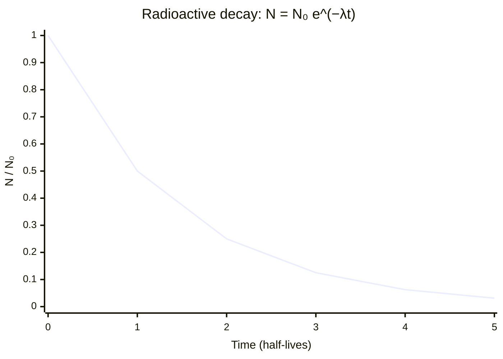

# Radioactive Decay Law

## Statement

Radioactive decay is a random process: each undecayed nucleus has the same fixed probability of decaying per unit time. As a result, the number of undecayed nuclei (and the activity) falls exponentially with time, characterised by a constant half-life.

## Equation

$$N = N_0 e^{-\lambda t}$$

with activity $A = \lambda N$, so $A = A_0 e^{-\lambda t}$ and half-life $t_{1/2} = \frac{\ln 2}{\lambda}$

## Symbols and Units

- `N`: number of undecayed nuclei at time `t`, dimensionless count
- `N₀`: initial number of undecayed nuclei at `t = 0`
- `λ`: decay constant (probability of decay per nucleus per second), per second `s⁻¹`
- `t`: time, seconds `s`
- `A`: activity (rate of decay), becquerels `Bq` (= `s⁻¹`)
- `t½`: half-life, seconds `s`

## Conditions

- Decay is **spontaneous and random**; it is unaffected by temperature, pressure, or chemical state.
- The law is statistical — it predicts behaviour of large numbers of nuclei, not which individual nucleus decays.
- Each nuclide has its own fixed decay constant and half-life.

## Physical Meaning

Because every nucleus decays independently with a fixed probability per second, the *rate* of decay is proportional to the number remaining. This gives the same self-limiting exponential decay as a discharging capacitor (see [[Capacitor-Discharge-Equation]]). The half-life is the time for half of any sample to decay and is independent of the starting amount — a hallmark of exponential decay.

## Foundation Link

GCSE introduces half-life and the random nature of decay using count-rate graphs. A-Level adds the decay constant, the exponential equation, the link `A = λN`, and the logarithmic-graph method for finding `λ` and `t½`.

## How to Use

1. Identify `N₀` (or `A₀`) and either `λ` or `t½`; convert using $\lambda = \frac{\ln 2}{t_{1/2}}$.
2. Substitute into $N = N_0 e^{-\lambda t}$ or $A = A_0 e^{-\lambda t}$.
3. To find `λ` from data, plot $\ln A$ against `t`; the gradient is $-\lambda$.
4. Use the half-life for quick "halving" estimates.

## Derivation or Explanation

The decay rate is proportional to the number present: $\frac{dN}{dt} = -\lambda N$. Integrating this first-order equation gives $N = N_0 e^{-\lambda t}$; setting $N = N_0/2$ yields $t_{1/2} = \frac{\ln 2}{\lambda}$.

## Related Quantities

- [[Energy-Quantity|Energy]]
- [[Charge]]

## Related Models

- [[Photon-Model]] (for accompanying gamma emission)

## Applications

- Radioactive dating (carbon-14, uranium-lead)
- Medical tracers and radiotherapy dose planning
- Nuclear power and waste timescales

## Frontier Links

- [[Quantum-Mechanics-Map]] — decay is a quantum tunnelling process; randomness is intrinsic, not due to ignorance.

## Common Mistakes

- Confusing decay constant `λ` with half-life
- Thinking decay rate can be changed by temperature or chemistry
- Plotting count rate vs time and expecting a straight line instead of using $\ln A$

## Visuals

### Exponential decay curve (N vs t)

*Figure: Number of undecayed nuclei halves every half-life t½. The same exponential shape applies to activity A = A₀ e^(−λt).*
*Source: Authored for this vault (CC0). No external copyright.*

### From Wikipedia

<!-- wiki-images: yes -->

#### NuclearReaction

![[_attachments/05_Laws-and-Results/Radioactive-Decay-Law--wiki-nuclearreaction.svg]]
*Figure: from Wikipedia article "Radioactive decay".*
*Source: Wikimedia Commons — [NuclearReaction.svg](https://commons.wikimedia.org/wiki/File:NuclearReaction.svg). Retrieved 2026-05-20.*

#### Alfa beta gamma radiation

![[_attachments/05_Laws-and-Results/Radioactive-Decay-Law--wiki-alfa-beta-gamma-radiation.svg]]
*Figure: from Wikipedia article "Radioactive decay".*
*Source: Wikimedia Commons — [Alfa beta gamma radiation.svg](https://commons.wikimedia.org/wiki/File:Alfa_beta_gamma_radiation.svg). Retrieved 2026-05-20.*

#### Crookes tube xray experiment

![[_attachments/05_Laws-and-Results/Radioactive-Decay-Law--wiki-crookes-tube-xray-experiment.jpg]]
*Figure: from Wikipedia article "Radioactive decay".*
*Source: Wikimedia Commons — [Crookes tube xray experiment.jpg](https://commons.wikimedia.org/wiki/File:Crookes_tube_xray_experiment.jpg). Retrieved 2026-05-20.*

## Source Trace

- Source: OpenStax College Physics; HyperPhysics; Physics LibreTexts — paraphrased, no copied text
- OCR alignment: [[OCR-Physics-A-H556-Specification]]
